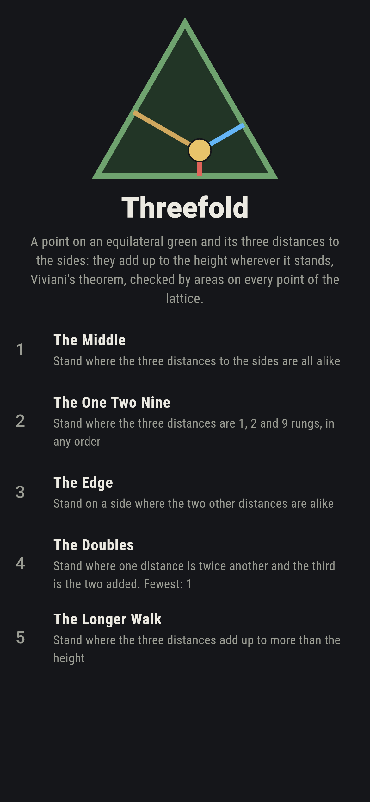
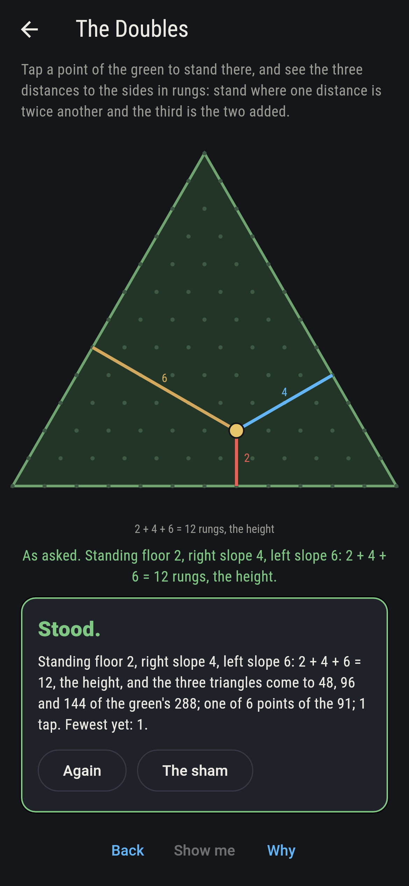
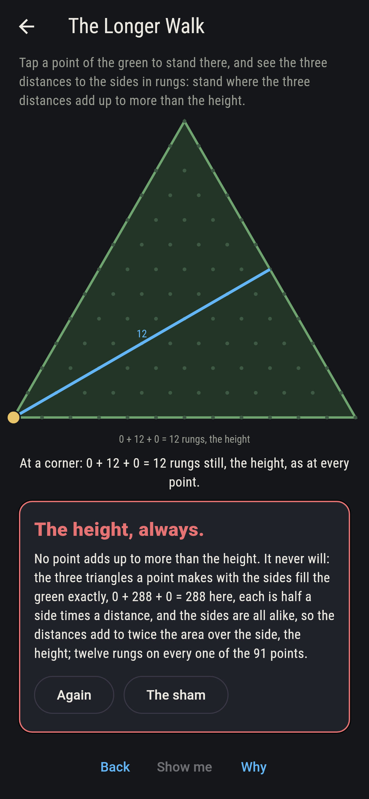
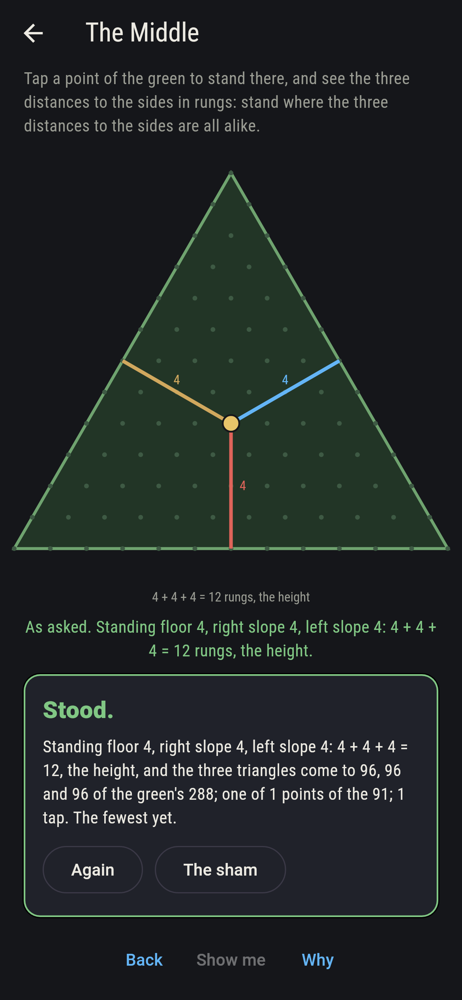
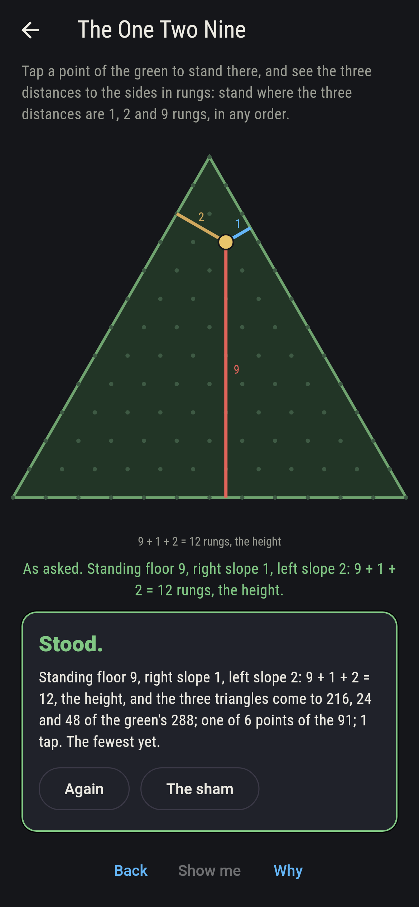
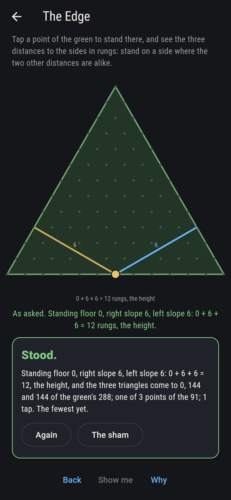
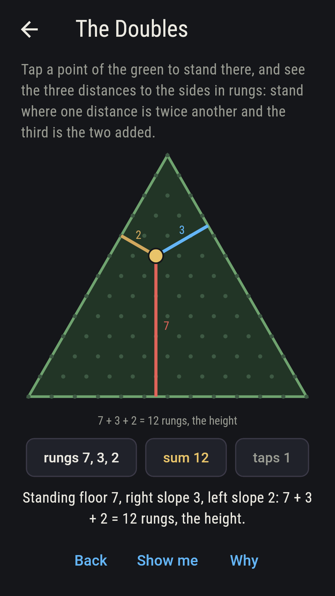
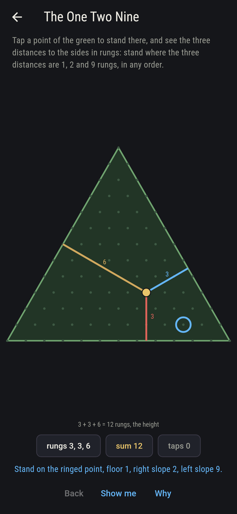
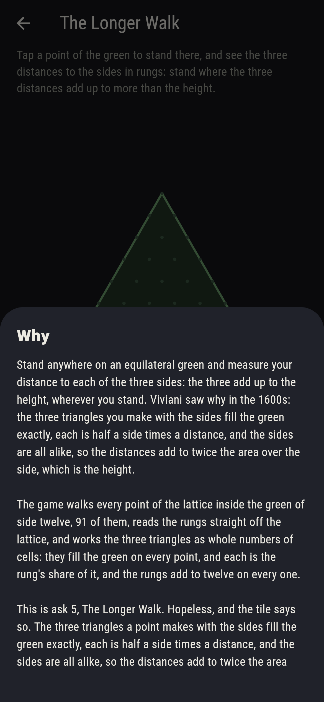

# Threefold


Stand anywhere on an equilateral green and measure your distance to
each of the three sides: the three add up to the height, wherever
you stand. Viviani saw why in the 1600s: the three triangles you
make with the sides fill the green exactly, each is half a side times
a distance, and the sides are all alike, so the distances add to
twice the area over the side, which is the height. Tap a point of
the green to stand there and see the three distances drawn and
measured in rungs, a rung being the height over twelve. The game
walks every point of the lattice inside the green of side twelve, 91
of them, reads the rungs off the lattice, and works the three
triangles as whole numbers of cells: they fill the green on every
point, each its rung's share, and the rungs add to twelve on every
one.

## The asks

1. **The Middle** - stand where the three distances to the sides are all alike
2. **The One Two Nine** - stand where the three distances are 1, 2 and 9 rungs, in any order
3. **The Edge** - stand on a side where the two other distances are alike
4. **The Doubles** - stand where one distance is twice another and the third is the two added
5. **The Longer Walk** - stand where the three distances add up to more than the height

The middle of the green stands four rungs from every side, one point
of the 91, its triangles a third of the green each; six points stand
1, 2 and 9, one for each order; three stand on a side six from each
of the others, the middles of the sides; and six have one distance
twice another and the third the two added, 2, 4 and 6 in every
order, since a + 2a + 3a is twelve only at a of two. The Longer Walk
is labeled hopeless on its tile: the three triangles fill the green
exactly, so the distances add to the height wherever the walker
stands; the sham admits it at a corner, twelve rungs and two of
nought.

## Two voices

The game never asserts what it has not computed, and it computes
everything at least twice:

* **The rungs** are read straight off the lattice, the point's row
  above each side, and they add to twelve on every one of the 91
  points; every count on the sham is that sweep's, and it names the
  points that land each ask by their rungs.
* **The areas** are worked as whole numbers of cells: the three
  triangles a point makes with the sides come to the green's 288 on
  every point, and each is its rung's twelfth of the green, which is
  the whole of Viviani's why; the corners and the middle are checked
  by their coordinates too.

`tool/check_greens.dart` runs the lot and refuses the bake on any
disagreement.

## The checker's ledger

What `dart run tool/check_greens.dart` printed for the build this
README shipped with, word for word:

```
every point of the lattice on the green of side twelve walked, 91 points, 36 of them on the sides and 3 at the corners: the three distances to the sides, read off the lattice in rungs, add up to twelve on every one, and the three triangles each point makes with the sides, worked as whole numbers of cells, fill the green of 288 exactly on every one, each triangle its rung's twelfth; the middle stands 4, 4 and 4 with triangles of 96 each, six points stand 1, 2 and 9, three stand on a side six from each of the others, six have one distance twice another and the third the two added, 2, 4 and 6, and no point adds to more than the height, nor less

 1 The Middle       stand where the three distances to the sides are all alike: 1 of the 91 points lands it
 2 The One Two Nine stand where the three distances are 1, 2 and 9 rungs, in any order: 6 of the 91 points land it
 3 The Edge         stand on a side where the two other distances are alike: 3 of the 91 points land it
 4 The Doubles      stand where one distance is twice another and the third is the two added: 6 of the 91 points land it
 5 The Longer Walk  stand where the three distances add up to more than the height: none of the 91, and the three triangles said so first
```

## Screenshots

| The sham | The doubles | The longer walk admitted |
| --- | --- | --- |
|  |  |  |

| The middle | The one two nine | The edge | Midway, on the small phone | Show me | The why |
| --- | --- | --- | --- | --- | --- |
|  |  |  |  |  |  |

Screenshots are drawn by `test/showcase_test.dart` at real phone
sizes with the app's own painter, then copied into `docs/` as they
came out; every stand in them was taken by a tap, so nothing pictured
is a point the game could not reach. The logo and every launcher icon
come out of `test/mark_test.dart` the same way: the mark is the green
with the walker at 2, 4 and 6 and the three distances drawn.

## Building

```
flutter test          # 41 tests, the sweep among them
dart run tool/check_greens.dart
flutter build apk     # or: flutter build ios
```
