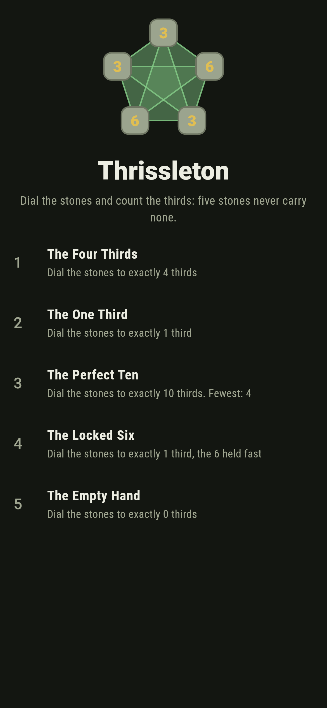
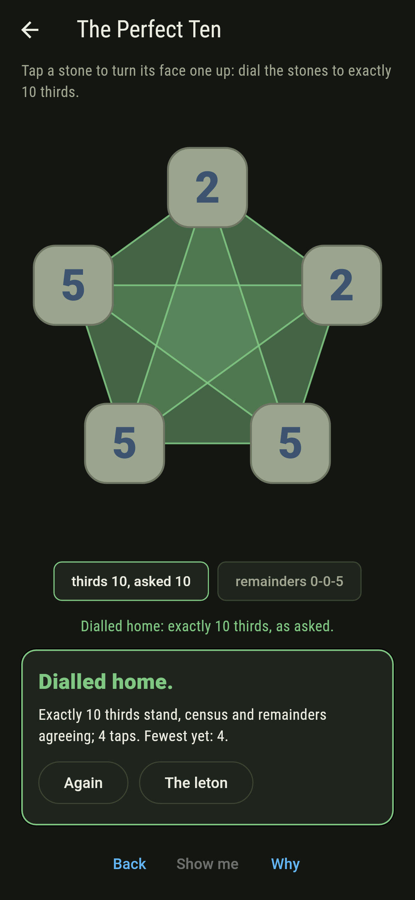
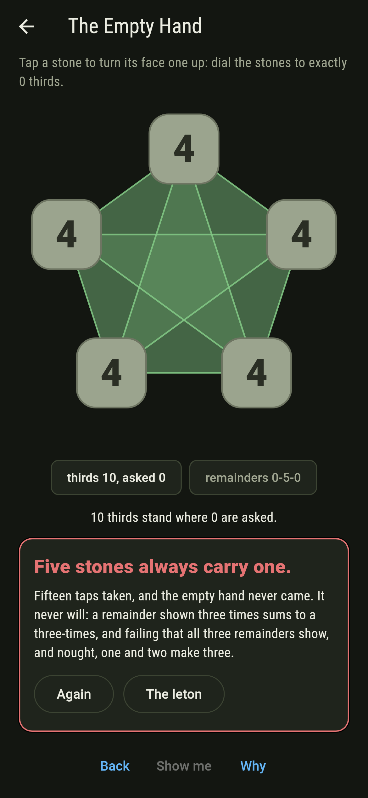
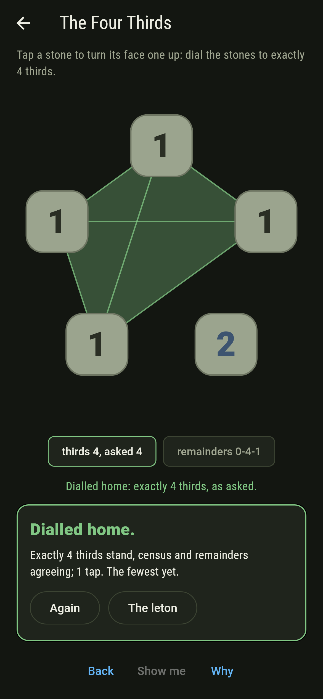
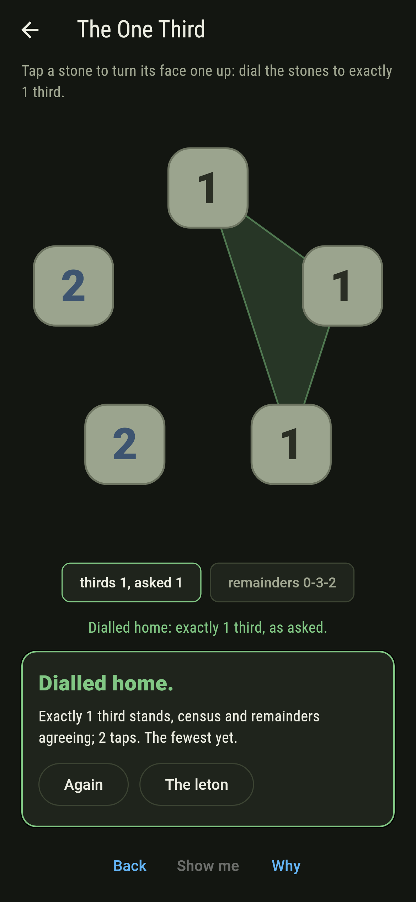
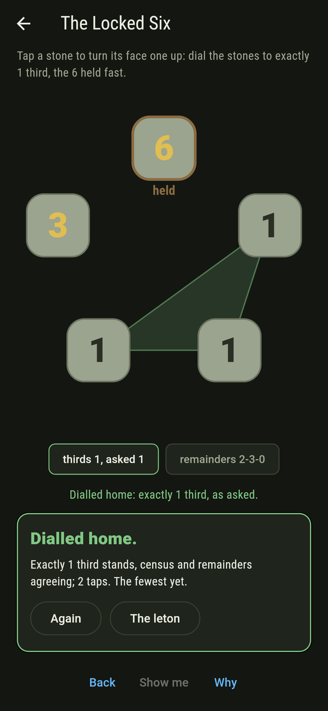
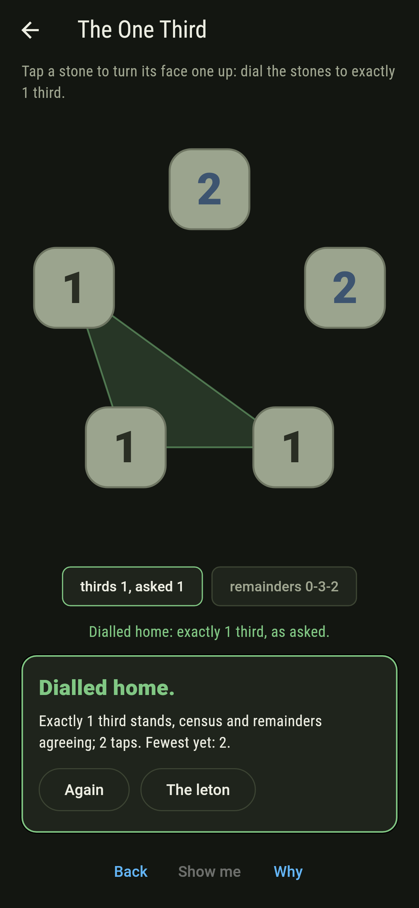
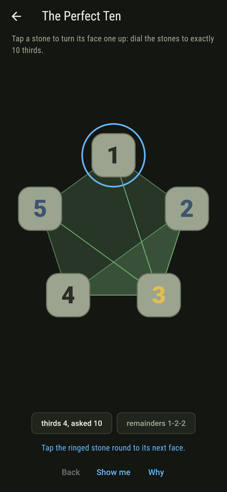
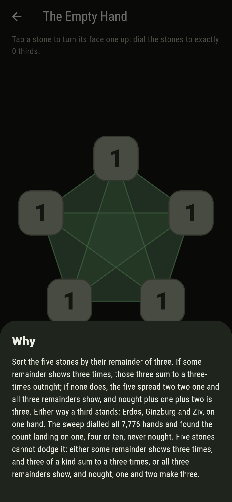

# Thrissleton


Five stones, each showing one to six, and a third is any three
of them summing to a three-times. Erdos, Ginzburg and Ziv's law
says five stones always carry a third; the sweep says something
stranger: the count of thirds only ever lands on one, four or
ten. Tap a stone and its face turns one up; the thirds wash
green as they stand.

## The hands

1. **The Four Thirds** - dial the stones to exactly 4 thirds
2. **The One Third** - dial the stones to exactly 1 third
3. **The Perfect Ten** - dial the stones to exactly 10 thirds
4. **The Locked Six** - dial the stones to exactly 1 third, the 6 held fast
5. **The Empty Hand** - dial the stones to exactly 0 thirds

Four is the common lot and one is as few as any hand carries:
the count never lands on two, three, nor five through nine. The
Perfect Ten happens exactly when every stone shares one
remainder of three, The Locked Six changes nothing the law
cares about, and The Empty Hand is labeled hopeless on its
tile: the two-case argument bars it before a stone is tapped.

## Two voices

The game never asserts what it has not computed, and it computes
everything at least twice:

* **The census** sums every triple face by face and washes the
  thirds green on the stones as they stand.
* **The two-case reading** sorts the stones by remainder of
  three instead: a remainder shown three times sums to a
  three-times outright, and failing that all three remainders
  show, and nought plus one plus two is three. The sweep dials
  all 7,776 hands, and the locked 1,296 besides, and holds the
  quantised count on every one.

`tool/check_thirds.dart` runs the lot and refuses the bake on
any disagreement.

## The checker's ledger

What `dart run tool/check_thirds.dart` printed for the build
this README shipped with, word for word:

```
every hand of five stones dialled, all 7,776, and the locked 1,296 besides: the count of thirds lands only on one, four or ten, ten exactly when one remainder rules, never on nought, and the two-case argument stands on every hand, a remainder shown thrice or all three shown at once

 1 The Four Thirds    dial the stones to exactly 4 thirds: 5760 hands of the sweep land it
 2 The One Third      dial the stones to exactly 1 third: 1920 hands of the sweep land it
 3 The Perfect Ten    dial the stones to exactly 10 thirds: 96 hands of the sweep land it
 4 The Locked Six     dial the stones to exactly 1 third, the 6 held fast: 320 hands of the sweep land it
 5 The Empty Hand     dial the stones to exactly 0 thirds: none of the 7,776, and the two cases said so first
```

## Screenshots

| The leton | The perfect ten | The empty hand admitted |
| --- | --- | --- |
|  |  |  |

| The four thirds | The one third | The locked six | Mid-dial | Show me | The why |
| --- | --- | --- | --- | --- | --- |
|  |  |  |  |  |  |

Screenshots are drawn by `test/showcase_test.dart` at real phone
sizes with the app's own painter, then copied into `docs/` as
they came out; every stone in them was tapped, so nothing
pictured is a hand the game could not reach. The logo and every
launcher icon come out of `test/mark_test.dart` the same way:
the mark is the perfect ten, all ten thirds washed green at
once.

## Building

```
flutter test          # 46 tests, the sweep among them
dart run tool/check_thirds.dart
flutter build apk     # or: flutter build ios
```
