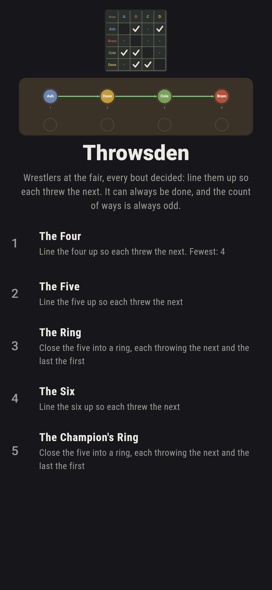
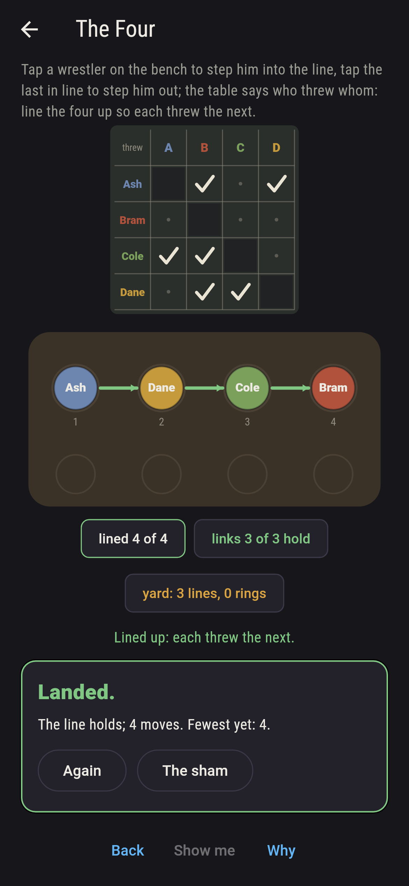
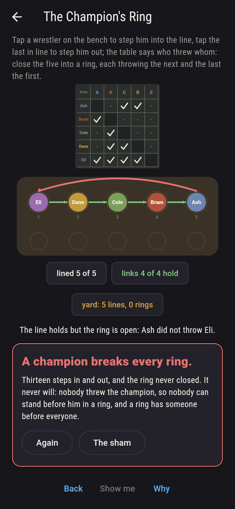
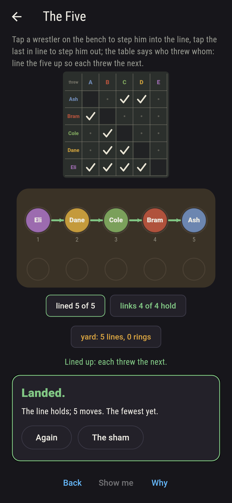
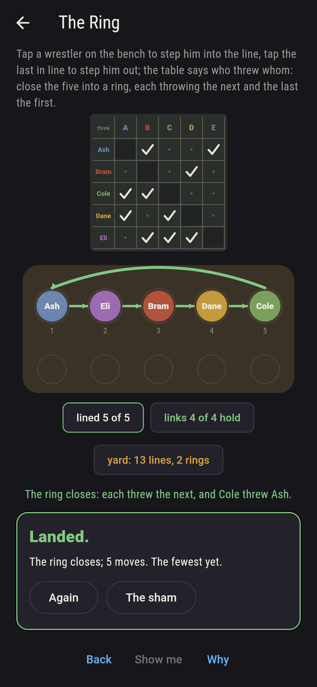
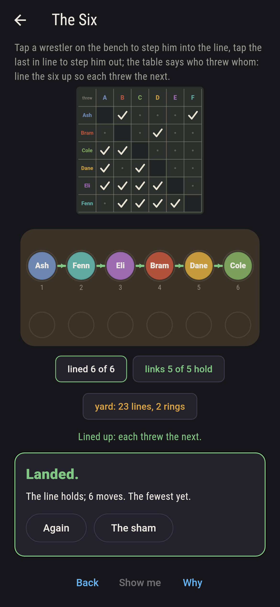
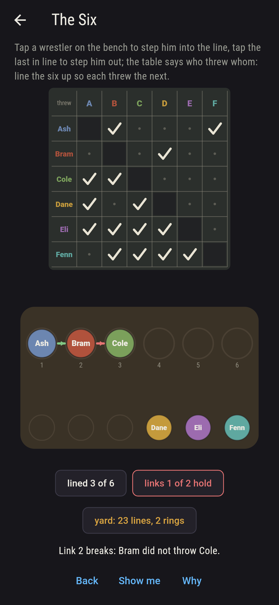
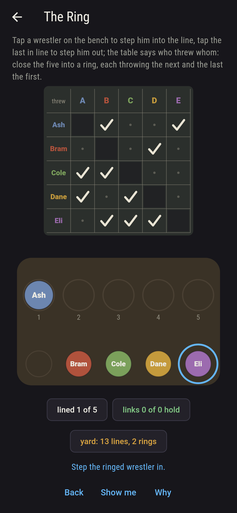
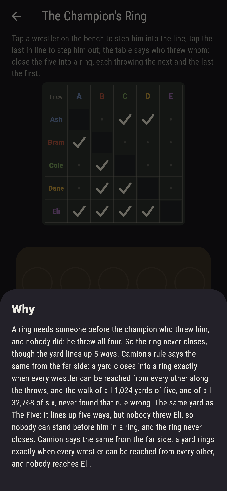

# Throwsden


Wrestlers at the fair, and every pair of them has had a bout, one
throwing the other; the table chalks up who threw whom. Line them
up so that each threw the next. Redei showed in 1934 that this can
always be done, whatever the bouts, and that the number of ways
is always odd; the slotting proof is a thing you can do with your
thumb, one wrestler at a time. Closing the line into a ring, the
last throwing the first, is another matter: Camion's rule says it
can be done exactly when every wrestler can be reached from every
other along the throws, and a champion nobody threw breaks every
ring. Every yard of up to six wrestlers is walked whole here.

## The yards

1. **The Four** - line the four up so each threw the next
2. **The Five** - line the five up so each threw the next
3. **The Ring** - close the five into a ring, each throwing the next and the last the first
4. **The Six** - line the six up so each threw the next
5. **The Champion's Ring** - close the five into a ring, each throwing the next and the last the first

The four line up 3 ways of 24, Bram last in every one; the five
line up 5 ways of 120, Eli first in every one, since he threw all
four; the ring closes 10 ways of 120, two rings counting where you
start; the six line up 23 ways of 720. The Champion's Ring is the
same yard as The Five, asked to close, and it is labeled hopeless
on its tile: nobody threw Eli, so nobody can stand before him.

## Two voices

The game never asserts what it has not computed, and it computes
everything at least twice:

* **The walk** tries every ordering of every yard, 24 or 120 or
  720 of them, and counts the lines and the rings; and it takes
  every yard of three, four, five and six wrestlers whole, 8 and
  64 and 1,024 and 32,768 of them, and finds the count of lines
  odd in every one.
* **Redei's slotting** searches nothing: it takes the wrestlers
  one at a time and puts each in front of the first in the line he
  threw, or at the end, and the line holds, on every yard there
  is. **Camion's rule** reads the rings the same way, by reach
  alone, and agrees with the walk on every yard: a ring closes
  exactly when every wrestler can reach every other.

`tool/check_bouts.dart` runs the lot and refuses the bake on any
disagreement.

## The checker's ledger

What `dart run tool/check_bouts.dart` printed for the build this
README shipped with, word for word:

```
every ordering of every yard walked, and every yard of three, four, five and six wrestlers taken whole, 8 and 64 and 1,024 and 32,768 of them: Redei's slotting lines up every one with no search, the count of lines is odd in every one, 1, 3, 5, 9, 11, 13 or 15 for five wrestlers and never 7, and a ring closes exactly when every wrestler reaches every other, as Camion says, and never in a yard with a champion; the four line up three ways with Bram last, the five line up five ways with Eli first, the ring closes two ways round and the six line up twenty-three

 1 The Four            line the four up so each threw the next: 3 of the 24 orderings land it
 2 The Five            line the five up so each threw the next: 5 of the 120 orderings land it
 3 The Ring            close the five into a ring, each throwing the next and the last the first: 10 of the 120 orderings land it
 4 The Six             line the six up so each threw the next: 23 of the 720 orderings land it
 5 The Champion's Ring close the five into a ring, each throwing the next and the last the first: none of the 120, and the champion said so first
```

## Screenshots

| The sham | The four lined up | The champion's ring admitted |
| --- | --- | --- |
|  |  |  |

| The five | The ring | The six | Mid-line | Show me | The why |
| --- | --- | --- | --- | --- | --- |
|  |  |  |  |  |  |

Screenshots are drawn by `test/showcase_test.dart` at real phone
sizes with the app's own painter, then copied into `docs/` as they
came out; every wrestler in them was stepped in by a tap, so
nothing pictured is a line the game could not reach. The logo and
every launcher icon come out of `test/mark_test.dart` the same
way: the mark is the four lined up, Ash, Dane, Cole and Bram, each
having thrown the next.

## Building

```
flutter test          # 48 tests, the walk among them
dart run tool/check_bouts.dart
flutter build apk     # or: flutter build ios
```
