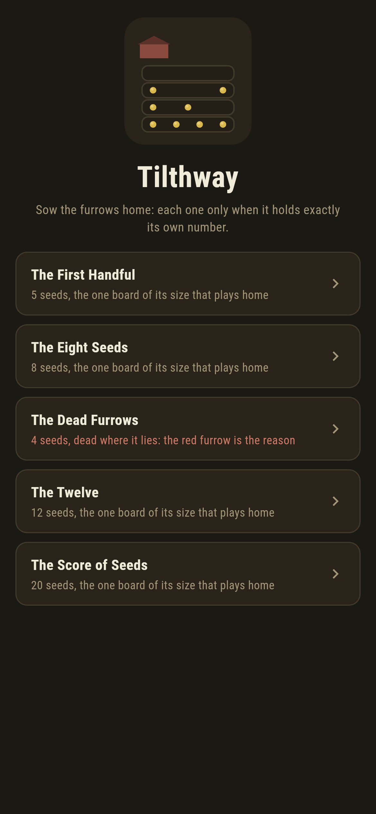
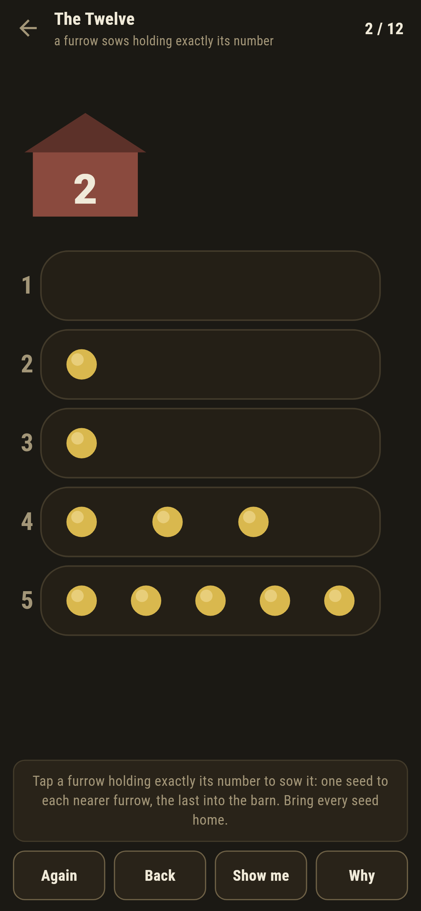
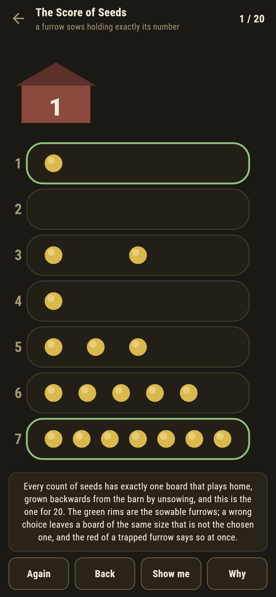
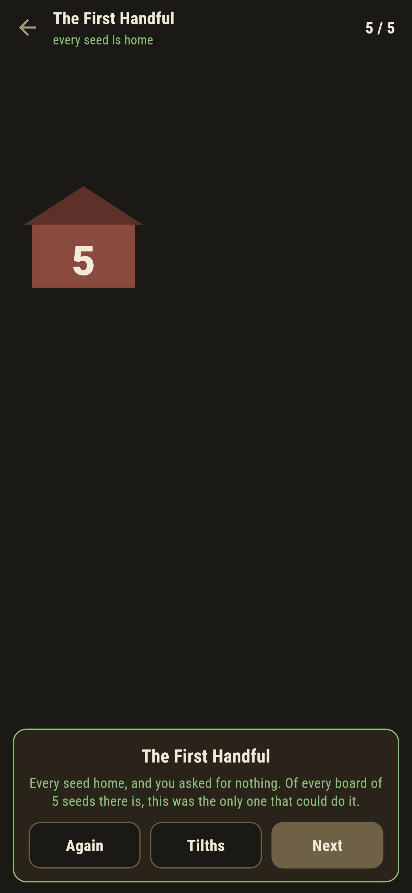
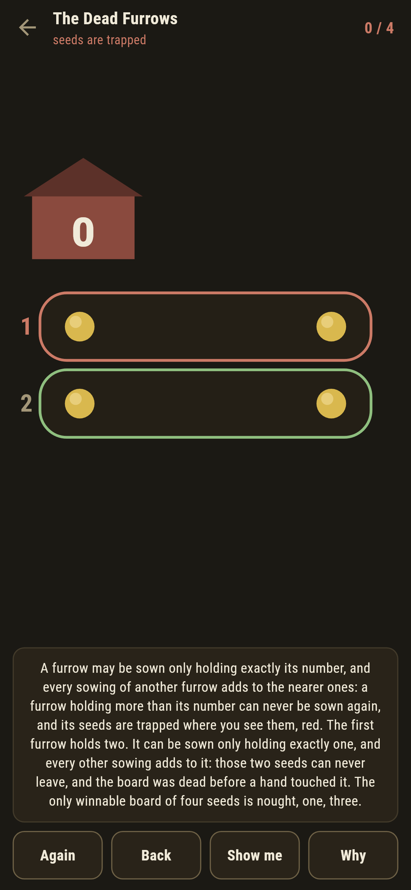

# Tilthway

A sowing solitaire for phones, in Flutter, for Android and iOS.

Furrows below a barn, numbered from the barn out, each holding seeds. A
furrow may be sown only when it holds exactly its own number: one seed
then falls to each nearer furrow and the last into the barn. Bring every
seed home. This is Tchoukaillon, the solitaire cousin of mancala, and
what makes it worth a game is how narrow the way home is.

| | | | |
|---|---|---|---|
|  |  |  |  |

## One board a size

For every count of seeds there is exactly one board that can be played
home, and it can be grown backwards: start from the empty barn-side and
keep unsowing, always into the lowest furrow that would allow it. The
suite does not take that on trust. For every seed count to ten it lays
out every board there is and plays each one, and exactly one wins each
time, the grown one. The five that ship are pinned to their grown boards
by the same sweep.

```
$ make tilths
at every size to ten, exactly one board wins, and it is the unsown one

 1 The First Handful    5 seeds  board 1-1-3  plays home
 2 The Eight Seeds      8 seeds  board 0-2-2-4  plays home
 3 The Dead Furrows     4 seeds  board 2-2  dead where it lies
 4 The Twelve          12 seeds  board 0-0-0-2-4-6  plays home
 5 The Score of Seeds  20 seeds  board 0-2-2-1-3-5-7  plays home
```

## The red furrow

A furrow that comes to hold more than its number is finished: sowing it
is against the rule, and every other sowing only adds to it. Its seeds
are trapped where they lie, and the game rims it red the moment it
happens, with the words under the strip saying to take the sowing back.

The Dead Furrows ships that way on purpose, in the house tradition of
maps nobody can win: its first furrow holds two before a hand ever
touches it, and **Why** walks through why that is the end of the matter.



## Two ways of knowing

The grown board says which boards should win; a live search over the
game tree says which boards do. The suite plays both against each other
at every size to ten, and in the hand they meet too: **Show me** points
at a sowing the search has checked keeps the way home open, and **Why**
rims every sowable furrow and tells the uniqueness story on the board in
front of you.

## Building

```
make deps    # fetch packages
make check   # analyze + every test
make tilths  # prove the one-board-a-size claim and print the ledger
make shots   # render the screenshots and redraw the icons
make apk     # Android release build
make ios     # iOS release build (unsigned)
```

The logo and every app icon are drawn by the game's own painter in
`test/mark_test.dart`. There is no image in this repository that was not
produced by code in it.

## How it is put together

```
lib/tilth/rules.dart     sowing, unsowing, the search, the overfull test
lib/tilth/tilth.dart     a tilth: a name, a board, a verdict
lib/tilth/tilths.dart    the five tilths that ship
lib/tilth/play.dart      a board being sown: the barn count, take-back,
                         the live way-home check
lib/ui/                  the painter, the screens, the mark
tool/check_tilths.dart   the sweep and the ledger above
```

The tests sow and unsow by hand, sweep every board to ten for the
uniqueness, play every live tilth home by following the game's own
pointer, catch the trapped furrow the moment a sowing makes one, and
hold the pictures against the real widget tree. If any of that drifts,
`make check` goes red before anything leaves the machine.
