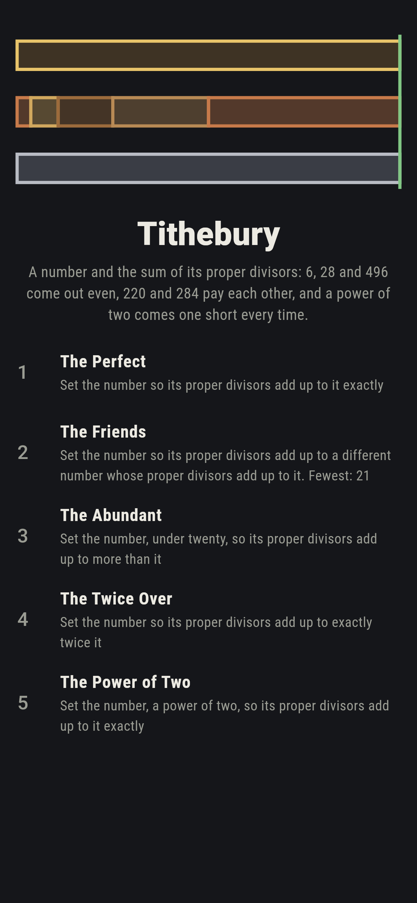
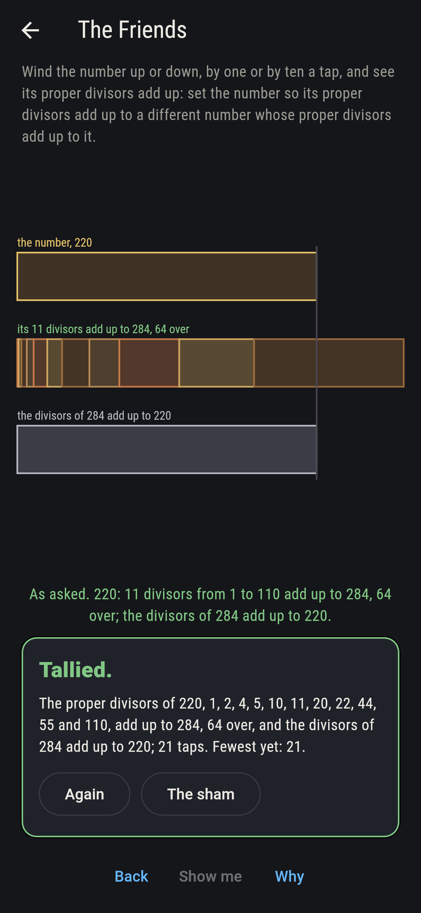
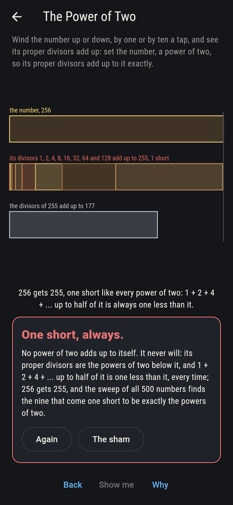
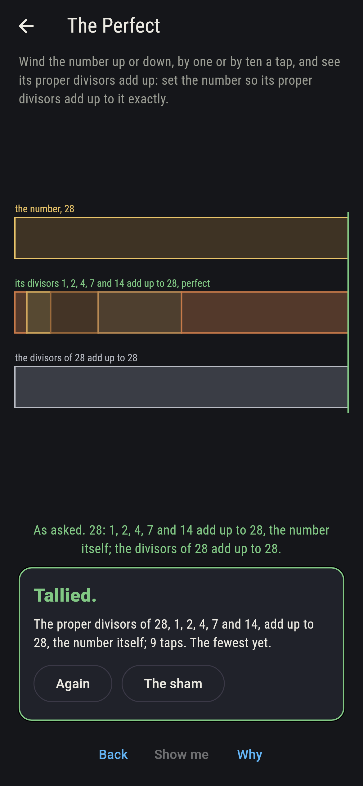
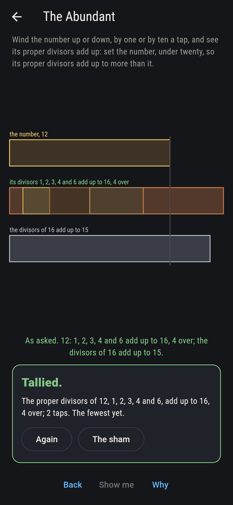
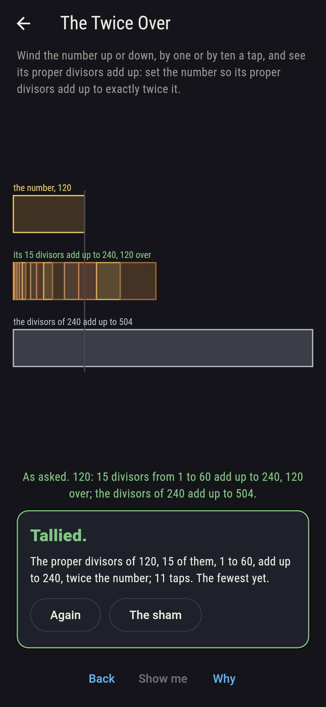
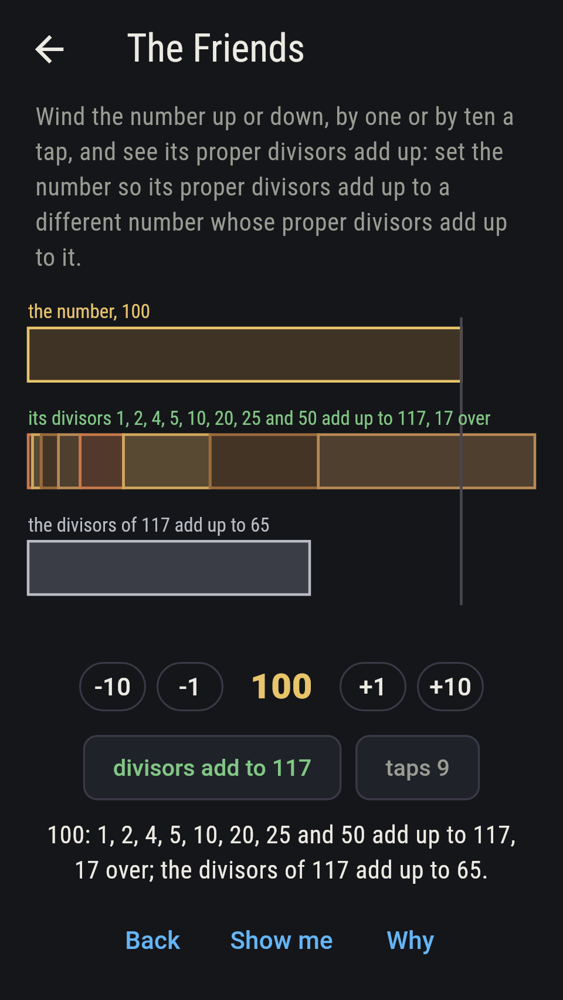
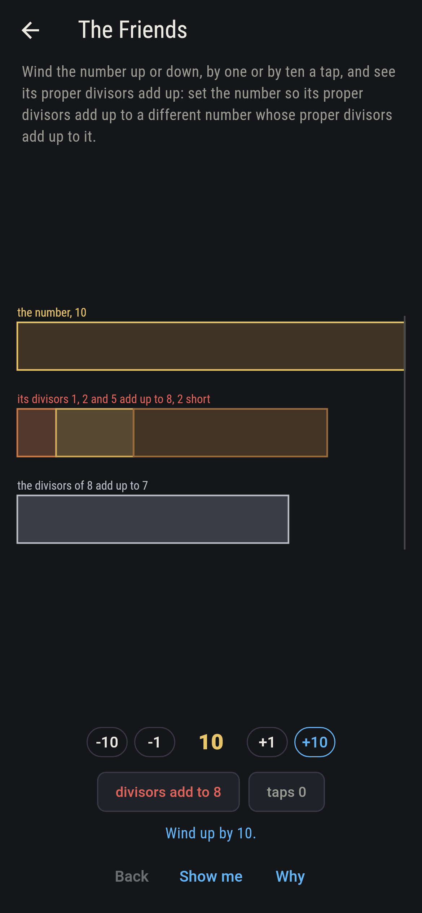
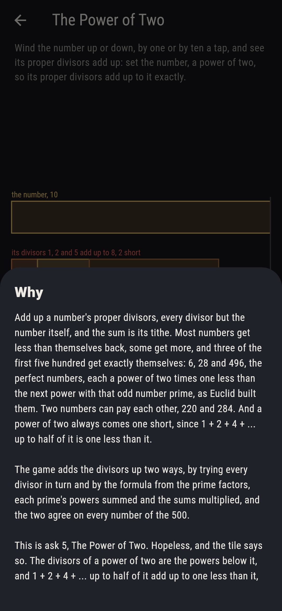

# Tithebury


A number and the sum of its proper divisors. Add up every divisor of
a number but the number itself and you have its tithe: most numbers
get less than themselves back, some get more, and three of the first
five hundred get exactly themselves, 6, 28 and 496, the perfect
numbers, each a power of two times one less than the next power with
that odd number prime, as Euclid built them. Two numbers can pay each
other, 220 and 284. And a power of two always comes one short, since
1 + 2 + 4 + ... up to half of it is one less than it. Wind the number
up or down, by one or by ten a tap, and see its divisors laid end to
end against it. Every number to 500 is swept, the divisors added up
by trying each in turn and by the formula from the prime factors, and
the two agree throughout.

## The asks

1. **The Perfect** - set the number so its proper divisors add up to it exactly
2. **The Friends** - set the number so its proper divisors add up to a different number whose proper divisors add up to it
3. **The Abundant** - set the number, under twenty, so its proper divisors add up to more than it
4. **The Twice Over** - set the number so its proper divisors add up to exactly twice it
5. **The Power of Two** - set the number, a power of two, so its proper divisors add up to it exactly

Six is 1, 2 and 3, twenty-eight is 1, 2, 4, 7 and 14, and 496 is 1,
2, 4, 8, 16, 31, 62, 124 and 248, three of the 500 and no other, and
they are Euclid's, 2 by 3, 4 by 7 and 16 by 31; 220 and 284 pay each
other, and no other number under 500 has a partner; twelve and
eighteen are the abundant numbers under twenty, and of the 500 there
are 121, every one even, the first odd one being 945; 120 gets exactly
twice itself, 240 from fifteen divisors, and the next to do it is 672.
The Power of Two is labeled hopeless on its tile: nine numbers of the
500 come one short, and they are exactly the powers of two from 1 to
256; the sham admits it the moment the player winds to 256, which
gets 255.

## Two voices

The game never asserts what it has not computed, and it computes
everything at least twice:

* **The count** tries every candidate divisor of a number in turn and
  adds up those that go, for every number to 500 and for every tithe
  of one, which runs past the dial; every count on the sham is this
  sweep's, and it finds the perfect numbers, the friends, the abundant
  and the one-short by trying them all.
* **The formula** adds nothing up one by one: from the prime factors,
  each prime's powers summed and the sums multiplied give the sum of
  all divisors, and the number itself comes off; it agrees with the
  count on all 500 and on their tithes, the perfect numbers it finds
  are Euclid's three, and the one-short numbers are exactly the powers
  of two.

`tool/check_tithes.dart` runs the lot and refuses the bake on any
disagreement.

## The checker's ledger

What `dart run tool/check_tithes.dart` printed for the build this
README shipped with, word for word:

```
every number from 1 to 500 swept, its proper divisors added up by trying each in turn and by the formula from the prime factors, and the two agree on all 500 and on all their tithes besides: 6, 28 and 496 add up to themselves and no other does, and they are Euclid's three, 2 by 3, 4 by 7 and 16 by 31; 220 and 284 pay each other, 1, 2, 4, 5, 10, 11, 20, 22, 44, 55 and 110 making 284 and 1, 2, 4, 71 and 142 making 220, and no other number under 500 has a partner; 121 of the 500 get more than themselves back, every one even, the first odd one being 945; 120 gets exactly twice itself, 240 from fifteen divisors, and the next to do it is 672; and nine numbers come one short, exactly the powers of two from 1 to 256, so no power of two adds up to itself

 1 The Perfect       set the number so its proper divisors add up to it exactly: 3 of the 500 numbers land it
 2 The Friends       set the number so its proper divisors add up to a different number whose proper divisors add up to it: 2 of the 500 numbers land it
 3 The Abundant      set the number, under twenty, so its proper divisors add up to more than it: 2 of the 500 numbers land it
 4 The Twice Over    set the number so its proper divisors add up to exactly twice it: 1 of the 500 numbers lands it
 5 The Power of Two  set the number, a power of two, so its proper divisors add up to it exactly: none of the 500, and the one short said so first
```

## Screenshots

| The sham | The friends | The power of two admitted |
| --- | --- | --- |
|  |  |  |

| The perfect | The abundant | The twice over | Midway, on the small phone | Show me | The why |
| --- | --- | --- | --- | --- | --- |
|  |  |  |  |  |  |

Screenshots are drawn by `test/showcase_test.dart` at real phone
sizes with the app's own painter, then copied into `docs/` as they
came out; every number in them was wound to by taps, so nothing
pictured is a setting the game could not reach. The logo and every
launcher icon come out of `test/mark_test.dart` the same way: the
mark is twenty-eight, its divisors laid end to end coming out exactly
even.

## Building

```
flutter test          # 45 tests, the sweep among them
dart run tool/check_tithes.dart
flutter build apk     # or: flutter build ios
```
