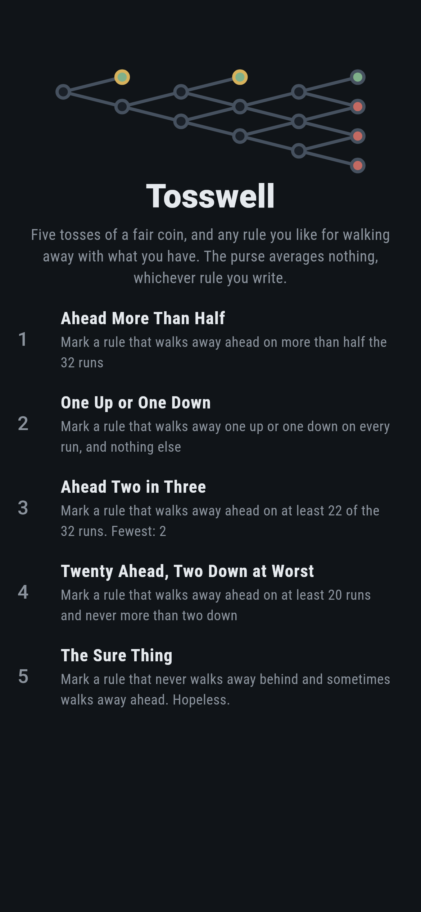
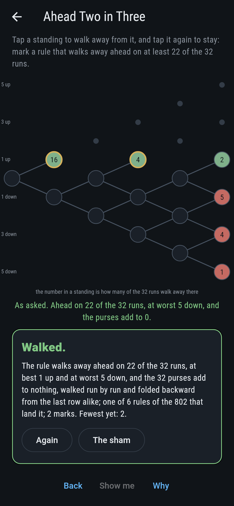
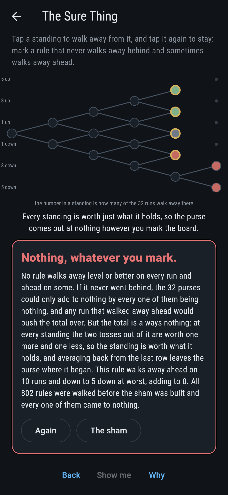
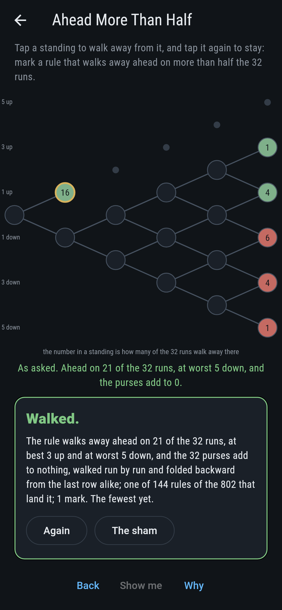
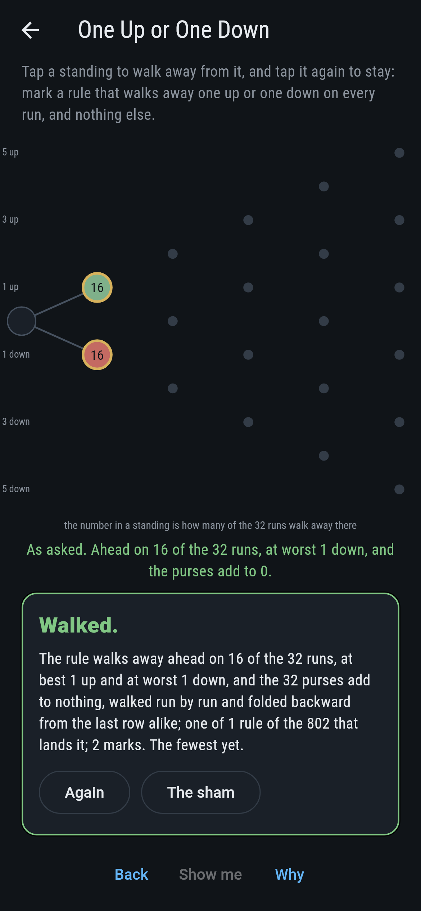
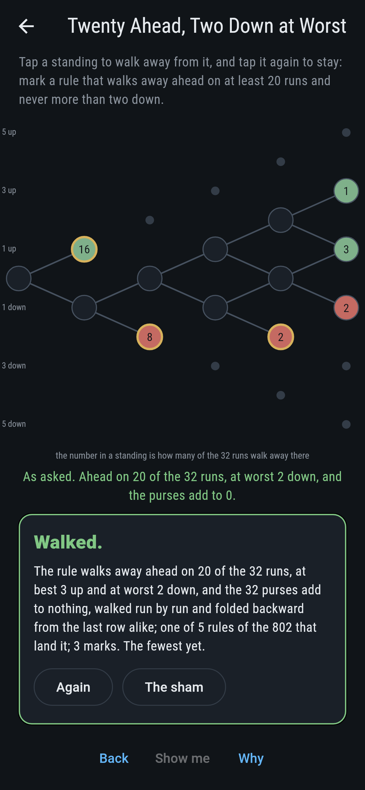
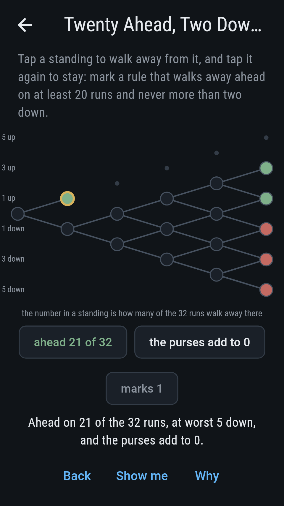
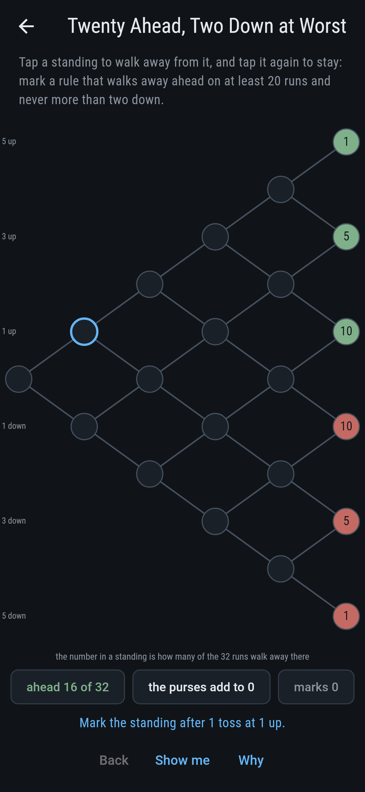
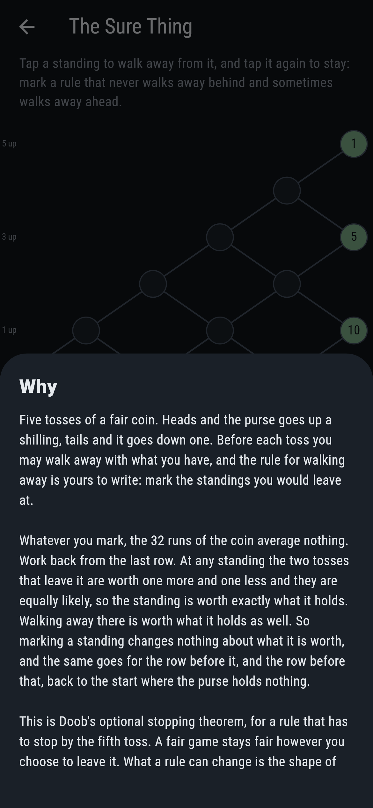

# Tosswell


Five tosses of a fair coin. Heads and the purse goes up a shilling,
tails and it goes down one. Before each toss you may walk away with
what you have, and the rule for walking away is yours to write: the
board draws the standings as a lattice, tosses across and the purse up
and down, and you tap the ones you would leave at.

Whatever you mark, the 32 runs of the coin average nothing.

## The asks

1. **Ahead More Than Half** - mark a rule that walks away ahead on more than half the 32 runs
2. **One Up or One Down** - mark a rule that walks away one up or one down on every run, and nothing else
3. **Ahead Two in Three** - mark a rule that walks away ahead on at least 22 of the 32 runs
4. **Twenty Ahead, Two Down at Worst** - mark a rule that walks away ahead on at least 20 runs and never more than two down
5. **The Sure Thing** - mark a rule that never walks away behind and sometimes walks away ahead

One mark is enough to be ahead on 21 runs of the 32: stop the moment
the first toss goes your way. Two marks get you to 22, which is eleven
in sixteen and the most any rule over five tosses manages. Two other
marks give the plainest picture of the whole business, stopping after
the first toss whichever way it went, so half the runs walk away a
shilling up and half a shilling down. Guarding the downside costs the
upside: three marks hold the worst loss to two down and the ahead count
drops to 20. The Sure Thing says Hopeless on its tile, and the card at
the end of the ask says why on a finger.

## Why the purse averages nothing

Work back from the last row. At any standing the two tosses that leave
it are worth one more and one less and they are equally likely, so the
standing is worth exactly what it holds. Walking away there is worth
what it holds as well. So marking a standing changes nothing about what
that standing is worth, and the same goes for the row before it, and
the row before that, back to the start where the purse holds nothing.

That is Doob's optional stopping theorem, for a rule that has to stop
by the fifth toss. A fair game stays fair however you choose to leave
it. And it is why The Sure Thing is out of reach: a rule that never
went behind could only average nothing by ending at nothing on every
run, so it could never be ahead on any.

What a rule can change is the shape of the thing. You can be ahead on
22 runs of the 32, but the runs that go against you then go a long way
against you, and it comes out level in the end.

## Two voices

The game never asserts what it has not computed, and it computes
everything at least twice:

* **The walking** plays all 32 runs of the coin under the rule and adds
  up what they walk away with.
* **The folding** walks no runs. It starts at the last row, where a
  standing is worth what it holds, and works backward, averaging the
  two tosses out of each standing.

The two are set against each other on all 32,768 ways the fifteen
standings can be marked, and they agree on every one. The folding also
says what each standing is worth on its own, and it is always exactly
what that standing holds.

`tool/check_rules.dart` runs the lot and refuses the bake on any
disagreement.

## The checker's ledger

What `dart run tool/check_rules.dart` printed for the build this README
shipped with, word for word:

```
every rule for walking away taken, all 32,768 ways the 15 standings can be marked, which come to 802 rules that differ in what they do, and each one worked twice: once by walking all 32 runs of the coin and adding up what they walk away with, and once by folding the standings backward from the last row, averaging the two tosses out of each one, which walks no runs at all; the two agree on every marking, and every one of them averages nothing over the 32 runs, so no rule for leaving a fair game changes what it is worth; more than that, every standing folds to exactly what it holds, on every marking there is, which is the theorem itself; what a rule can change is the shape: the most any of them is ahead is 22 runs of the 32, eleven in sixteen, and no rule is ever ahead on more; the rules take 1 at 0, 15 at 1, 79 at 2, 215 at 3, 284 at 4, 162 at 5, 41 at 6, 5 at 7 marks, the one with none being the rule that rides every run to the last toss; and not one of the 802 walks away level or better on every run while walking away ahead on some, which is what averaging nothing forbids

 1 Ahead More Than Half            mark a rule that walks away ahead on more than half the 32 runs: 144 of the 802 rules land it, the cheapest in 1 mark
 2 One Up or One Down              mark a rule that walks away one up or one down on every run, and nothing else: 1 of the 802 rules lands it, the cheapest in 2 marks
 3 Ahead Two in Three              mark a rule that walks away ahead on at least 22 of the 32 runs: 6 of the 802 rules land it, the cheapest in 2 marks
 4 Twenty Ahead, Two Down at Worst mark a rule that walks away ahead on at least 20 runs and never more than two down: 5 of the 802 rules land it, the cheapest in 3 marks
 5 The Sure Thing                  mark a rule that never walks away behind and sometimes walks away ahead: none of the 802, and the averaging says why
```

## Screenshots

| The sham | Ahead two in three | The sure thing |
| --- | --- | --- |
|  |  |  |

| Ahead more than half | One up or one down | Twenty ahead | Midway, on the small phone | Show me | The why |
| --- | --- | --- | --- | --- | --- |
|  |  |  |  |  |  |

Screenshots are drawn by `test/showcase_test.dart` at real phone sizes
with the app's own painter, then copied into `docs/` as they came out;
every mark in them was made by a tap on a standing, so nothing pictured
is a rule the game could not reach. The lattice across the top of the
sham shot is the mark rather than a run of taps. The logo and every
launcher icon come out of `test/mark_test.dart` the same way: the mark
is the rule that takes a shilling after the first toss and again after
the third, ahead on 22 runs of the 32 and still averaging nothing.

## Building

```
flutter test          # 52 tests, the sweep among them
dart run tool/check_rules.dart
flutter build apk     # or: flutter build ios
```
