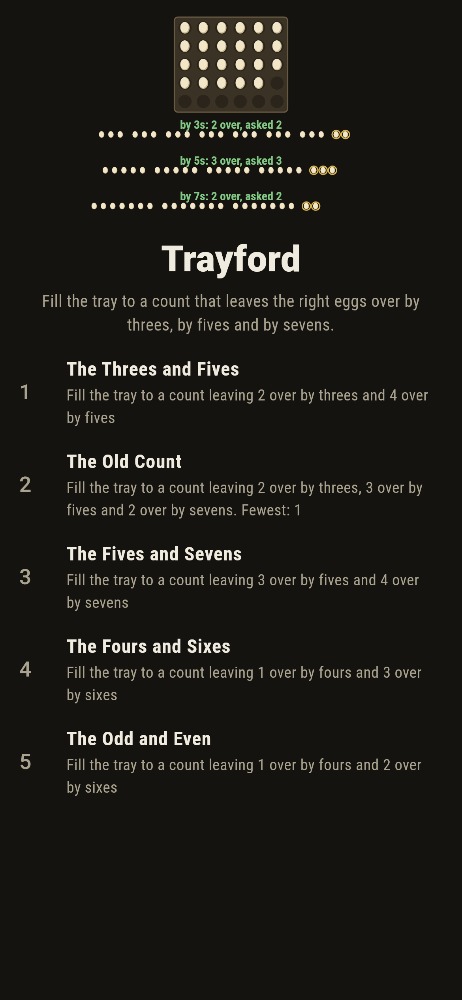
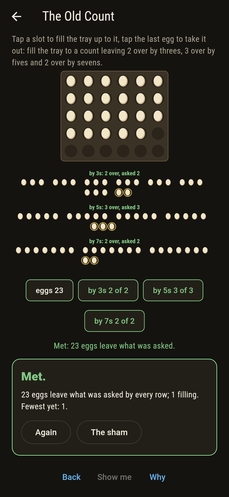
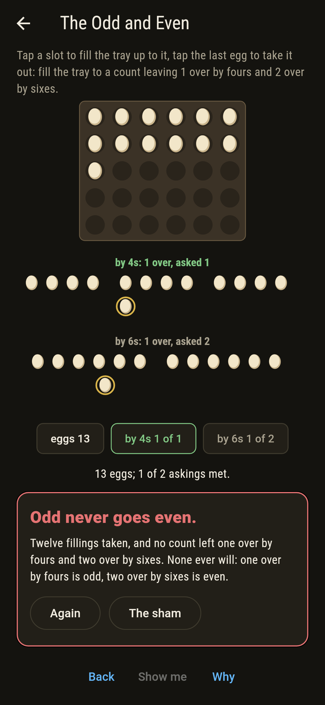
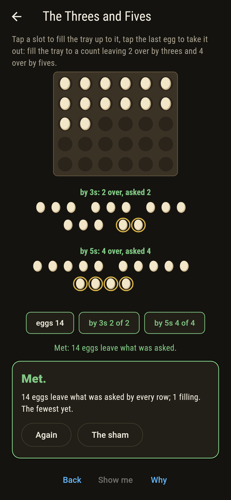
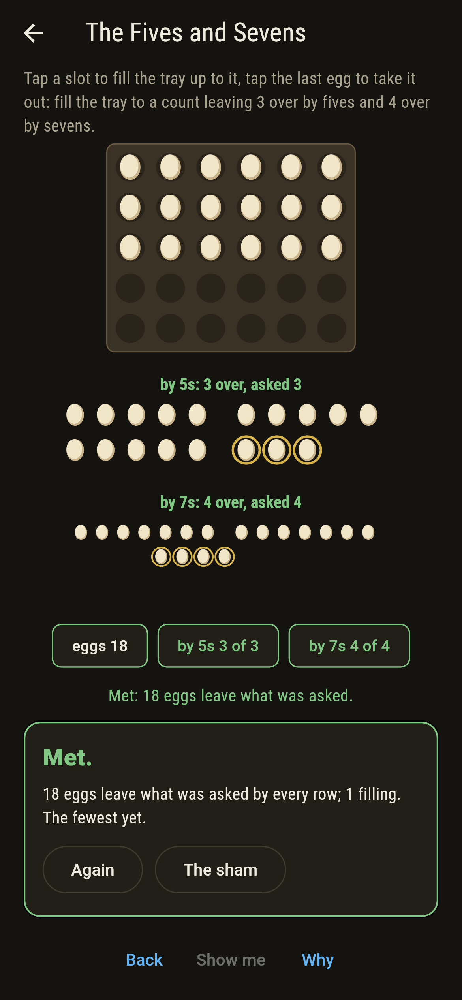
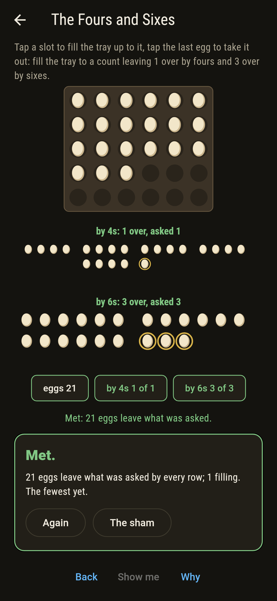
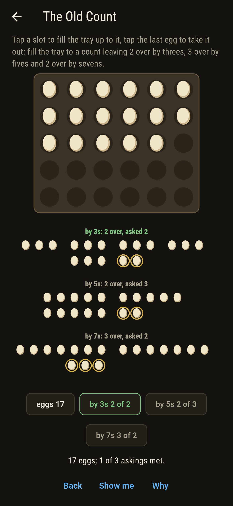
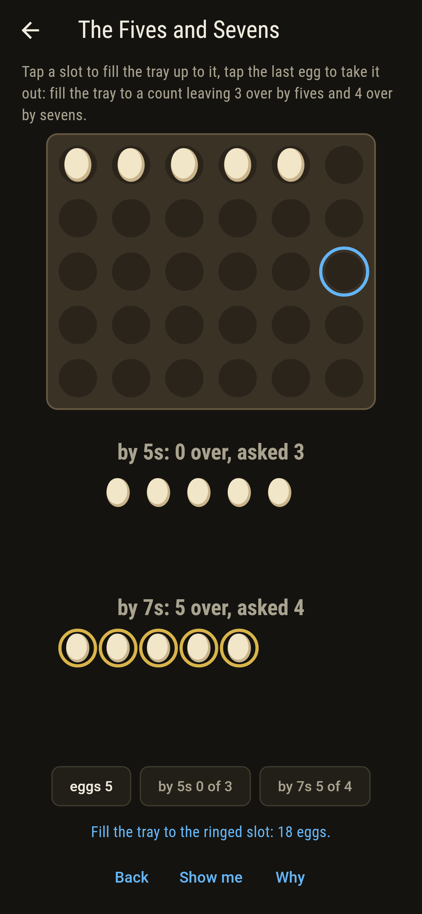
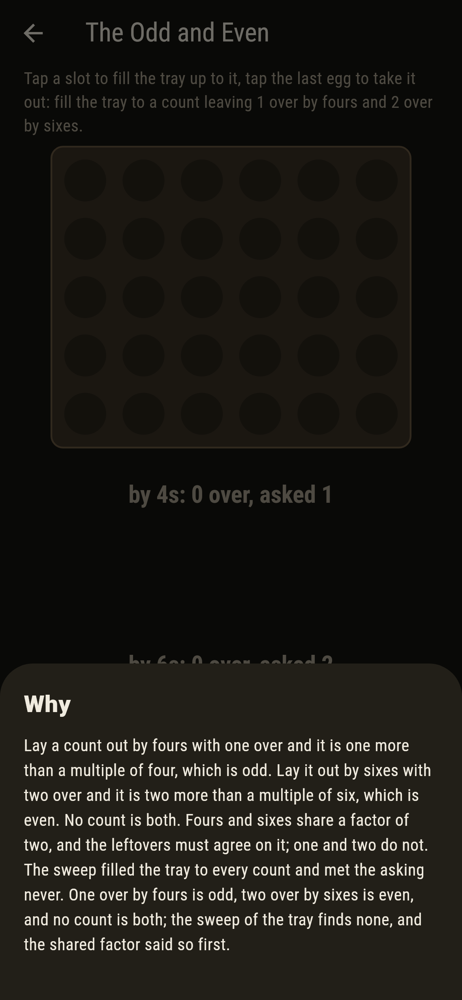

# Trayford


Eggs in a tray, and a count of them wanted that leaves so many
over when laid out by threes, so many by fives, so many by sevens.
That is Sun Tzu's problem, fourth century or so, and the Chinese
remainder theorem is its answer: when the row lengths share no
factor, every asking is met by exactly one count below their
product, built from Bezout's arithmetic with no searching. When
they do share one, the leftovers must agree on it, and one over by
fours never goes with two over by sixes: odd against even.

## The trays

1. **The Threes and Fives** - fill the tray to a count leaving 2 over by threes and 4 over by fives
2. **The Old Count** - fill the tray to a count leaving 2 over by threes, 3 over by fives and 2 over by sevens
3. **The Fives and Sevens** - fill the tray to a count leaving 3 over by fives and 4 over by sevens
4. **The Fours and Sixes** - fill the tray to a count leaving 1 over by fours and 3 over by sixes
5. **The Odd and Even** - fill the tray to a count leaving 1 over by fours and 2 over by sixes

The tray holds thirty. Fourteen and twenty-nine meet the first
asking, fifteen apart; twenty-three is Sun Tzu's own answer, the
one count below a hundred and five; eighteen alone meets the fives
and sevens; nine and twenty-one the fours and sixes, twelve apart,
since those two share a factor. The Odd and Even is labeled
hopeless on its tile, and the why says why in a line.

## Two voices

The game never asserts what it has not computed, and it computes
everything at least twice:

* **The sweep** fills the tray to every count and lays each out by
  every row length, and it does the same for every asking there
  is: all 15, 35 and 105 askings by threes and fives, fives and
  sevens, and threes, fives and sevens, and all 24 by fours and
  sixes.
* **Sun Tzu's construction** builds the count with no searching,
  for each row length the product of the others times its inverse
  over that length times the leftover, all added and taken over the
  span, and it lands on the sweep's one count for every asking with
  coprime rows; for fours and sixes the shared-factor test says
  which askings can be met at all, 12 of the 24, and the sweep
  agrees on every one.

`tool/check_counts.dart` runs the lot and refuses the bake on any
disagreement.

## The checker's ledger

What `dart run tool/check_counts.dart` printed for the build this
README shipped with, word for word:

```
every count of the tray swept for every tray, and every asking there is besides: by threes and fives, fives and sevens, and threes, fives and sevens, each asking is met by exactly one count below the span and it is Sun Tzu's construction to the egg, while by fours and sixes only the 12 askings of 24 whose leftovers agree on the shared two are met at all, twelve apart when they are, and one over by fours with two over by sixes is odd against even and never met

 1 The Threes and Fives  fill the tray to a count leaving 2 over by threes and 4 over by fives: 2 counts in the tray of thirty, 14 and 29
 2 The Old Count         fill the tray to a count leaving 2 over by threes, 3 over by fives and 2 over by sevens: 1 count in the tray of thirty, 23
 3 The Fives and Sevens  fill the tray to a count leaving 3 over by fives and 4 over by sevens: 1 count in the tray of thirty, 18
 4 The Fours and Sixes   fill the tray to a count leaving 1 over by fours and 3 over by sixes: 2 counts in the tray of thirty, 9 and 21
 5 The Odd and Even      fill the tray to a count leaving 1 over by fours and 2 over by sixes: none in the tray nor beyond it, and the shared two said so first
```

## Screenshots

| The sham | The old count met | The odd and even admitted |
| --- | --- | --- |
|  |  |  |

| The threes and fives | The fives and sevens | The fours and sixes | Mid-fill | Show me | The why |
| --- | --- | --- | --- | --- | --- |
|  |  |  |  |  |  |

Screenshots are drawn by `test/showcase_test.dart` at real phone
sizes with the app's own painter, then copied into `docs/` as they
came out; every filling in them was tapped, so nothing pictured is
a tray the game could not reach. The logo and every launcher icon
come out of `test/mark_test.dart` the same way: the mark is Sun
Tzu's twenty-three.

## Building

```
flutter test          # 43 tests, the sweep among them
dart run tool/check_counts.dart
flutter build apk     # or: flutter build ios
```
