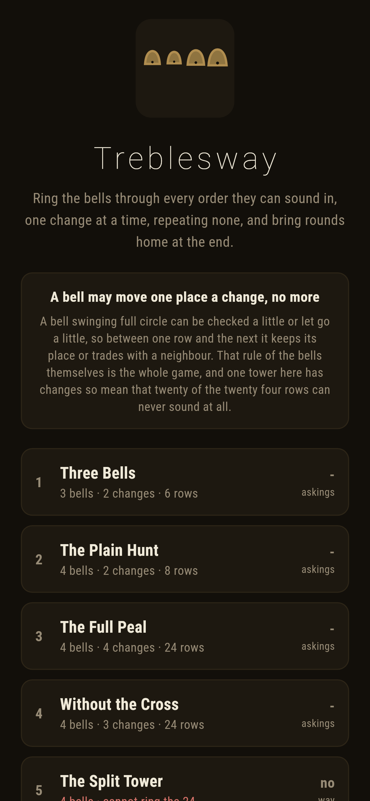
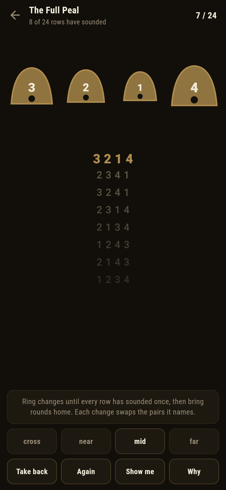
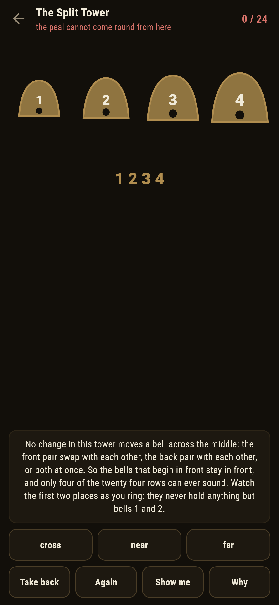
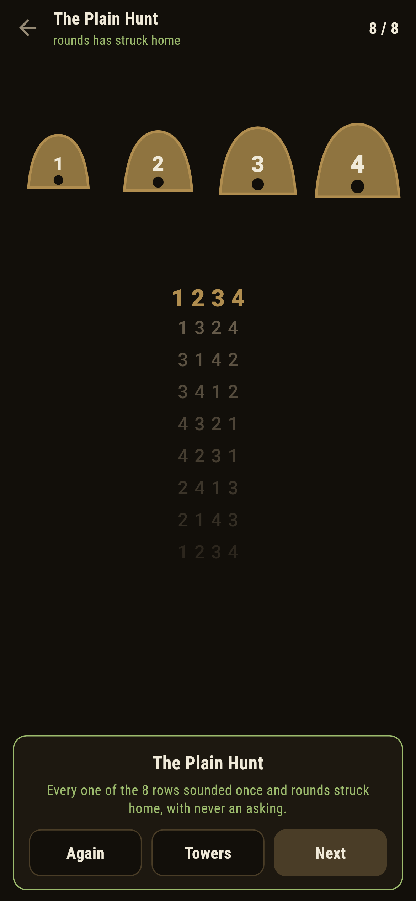
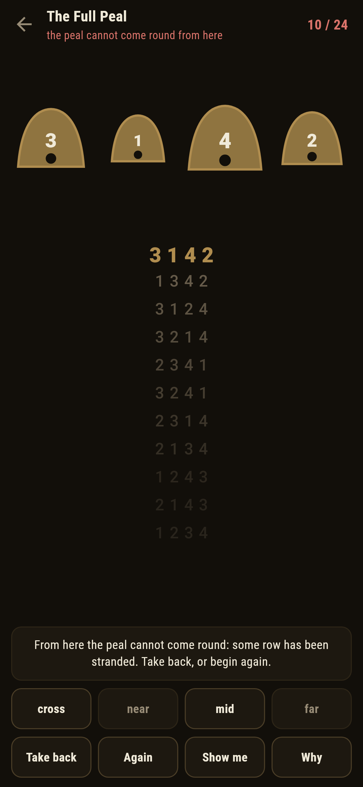

# Treblesway

A change ringing puzzle for phones, in Flutter, for Android and iOS.

Four bells sound in some order, and a change swaps neighbouring pairs. Ring
changes until every order has sounded exactly once, then bring rounds home.
That is the extent, the thing ringers have chased in stone towers for four
hundred years, and on four bells it is twenty four rows and not one more
change than twenty four.

| | | | |
|---|---|---|---|
|  |  |  |  |

## The rule is the bells' own

A bell swinging full circle can be checked a little or let go a little, so
between one row and the next it keeps its place or trades with a neighbour,
and nothing more. Every change in this game is a set of adjacent swaps that
do not touch: the cross swaps both pairs at once, and near, mid and far each
swap one.

The peal is a walk through all twenty four rows that uses each once and comes
home, and whether one exists depends entirely on which changes a tower
allows:

```
$ make peals
 1 Three Bells        3 bells  2 changes  reaches  6 of 6  goal 6  ways     2  written down     2  1ms
 2 The Plain Hunt     4 bells  2 changes  reaches  8 of 24  goal 8  ways     2  written down     2  0ms
 3 The Full Peal      4 bells  4 changes  reaches 24 of 24  goal 24  ways 10792  written down 10792  1034ms
 4 Without the Cross  4 bells  3 changes  reaches 24 of 24  goal 24  ways    88  written down    88  7ms
 5 The Split Tower    4 bells  3 changes  reaches  4 of 24  goal 24  ways     0  written down     0  0ms
```

The full tower has 10,792 ways, counted with direction. Take the cross away
and 88 survive. Keep only the cross and mid and exactly two remain, one each
way round the same circle: that is the plain hunt, the first thing any ringer
learns, and the game ships it as the forced road it is.

## The split tower

One tower allows the cross, near and far, and cannot ring the extent at all.
The label on the list says so, and **Why** gives the reason rather than the
verdict: none of those three changes moves a bell across the middle, so the
bells that begin in front stay in front, and four rows are all the tower can
ever reach of the twenty four. Watch the first two places as you ring; they
never hold anything but bells 1 and 2.


## Stranded is known at once

The game keeps a live answer to whether the peal can still come round from
where it stands, by searching the rows not yet rung after every pull. Ring
greedily and some row gets stranded; the ledger goes red the moment it
happens, not twenty changes later when the dead end arrives.



## Running it

```
make deps    # flutter pub get
make test    # everything
make analyze
make shots   # render the screens into build/showcase, redraw the logo and icons
make peals   # what each tower reaches, and how many ways its goal can be rung
make apk     # release APK
make ios     # release iOS build, unsigned
```

## Tests

`flutter test` runs the tower (changes swapping what they name and undoing
themselves), what each tower reaches (the split tower's invariant watched as
it works, the plain hunt's eight rows), every peal having exactly as many
ways as its label says, and ringing a peal: new rows only, rounds refused
early, the search bringing every ringable peal home, the split tower dead
from the first blow, and a greedy ring dying out loud.

Then the game through the screen: ringing by the change buttons, the
refusals spoken with the row's name, **Take back**, **Again**, **Show me**,
**Why** on three different towers, a stranded peal, and every ringable peal
rung to rounds.

Screenshots come from `test/showcase_test.dart`, and every row in them was
rung by tapping changes. `test/mark_test.dart` draws the logo, the launcher
icons at every density Android asks for and every size the iOS icon set asks
for; there is no image in this repository that was not produced by it.
