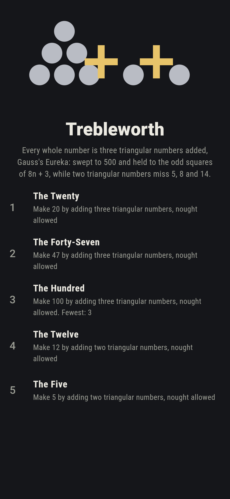
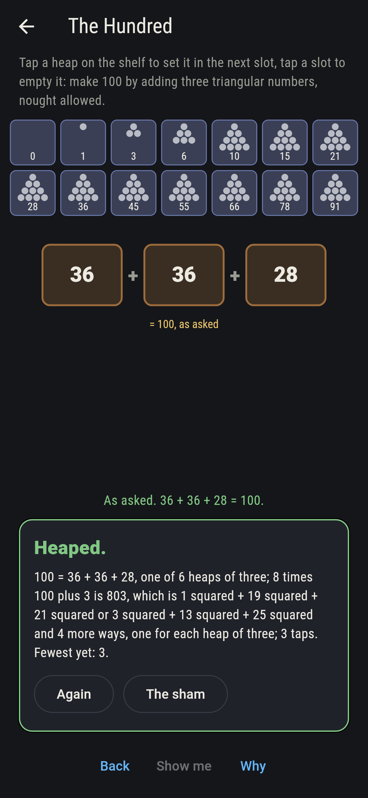
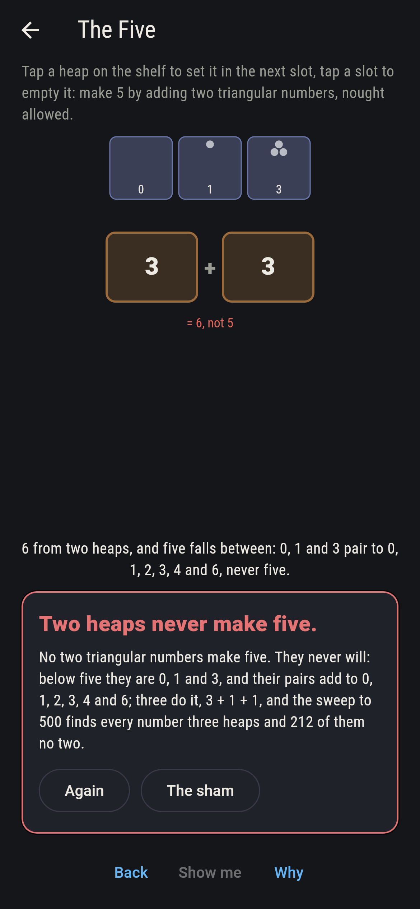
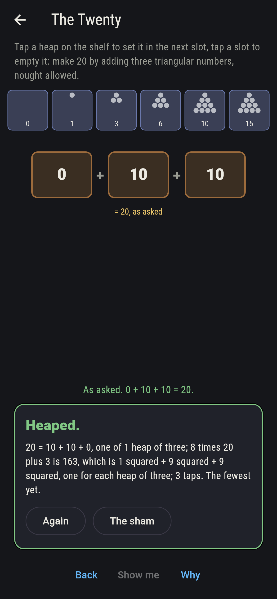
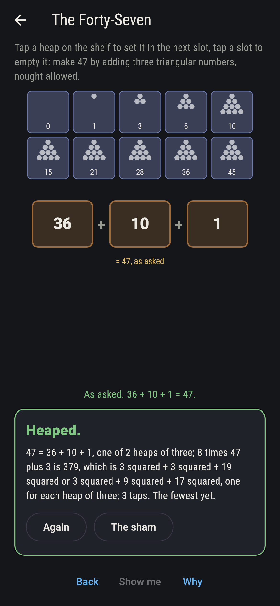
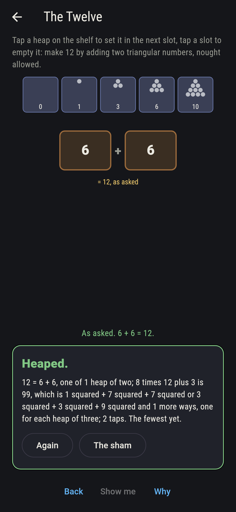
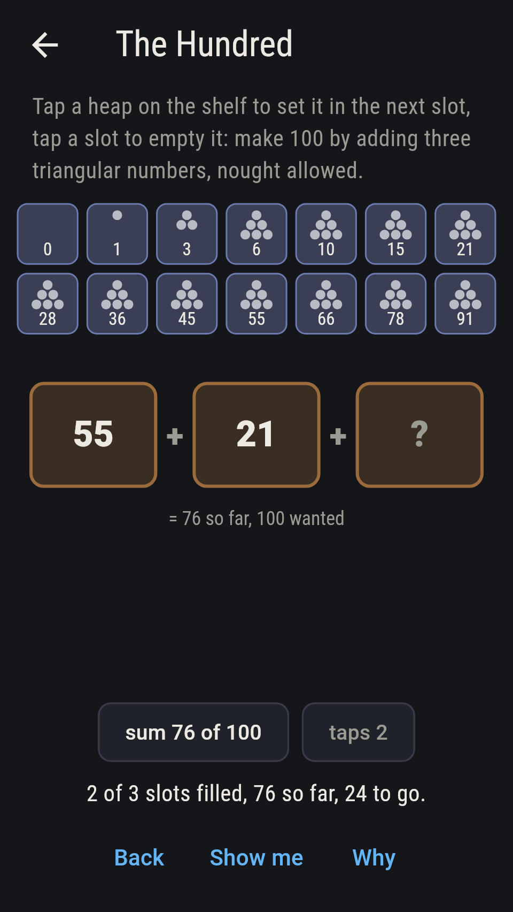
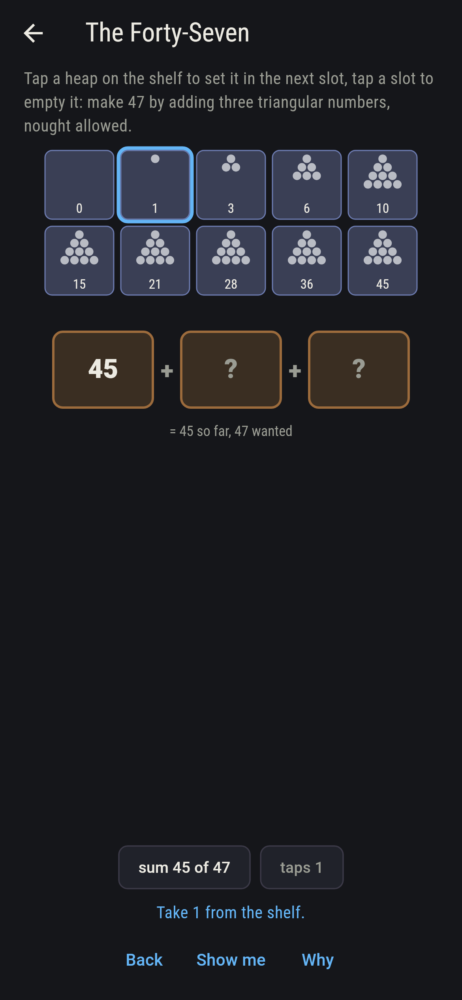
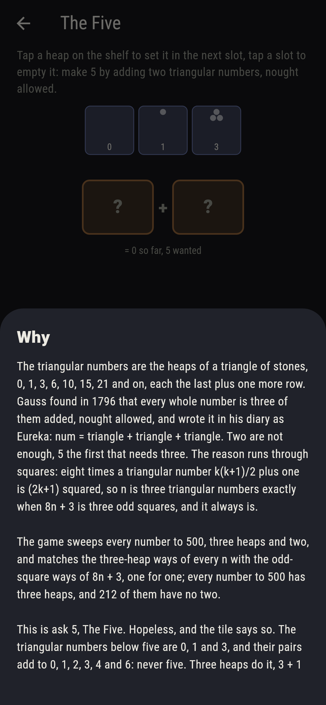

# Trebleworth


Every whole number is three triangular numbers added. The triangular
numbers are the heaps of a triangle of stones, 0, 1, 3, 6, 10, 15, 21
and on, each the last plus one more row, and Gauss found in 1796
that every whole number is three of them added, nought allowed, and
wrote it in his diary as Eureka: num = triangle + triangle +
triangle. Two are not enough, 5 the first that needs three. The
reason runs through squares: eight times a triangular number k(k+1)/2
plus one is (2k+1) squared, so n is three triangular numbers exactly
when 8n + 3 is three odd squares, and it always is. Take heaps from
the shelf into the slots and make the number asked. The game sweeps
every number to 500, three heaps and two, and matches the three-heap
ways of every n with the odd-square ways of 8n + 3, one for one.

## The asks

1. **The Twenty** - make 20 by adding three triangular numbers, nought allowed
2. **The Forty-Seven** - make 47 by adding three triangular numbers, nought allowed
3. **The Hundred** - make 100 by adding three triangular numbers, nought allowed
4. **The Twelve** - make 12 by adding two triangular numbers, nought allowed
5. **The Five** - make 5 by adding two triangular numbers, nought allowed

Twenty is 10 + 10 + 0 and nothing else from three heaps, one of
twelve numbers to 500 with a single way; forty-seven is 45 + 1 + 1
or 36 + 10 + 1, and needs all three; a hundred is three heaps six
ways, from 55 + 45 + 0 to 36 + 36 + 28, while 406 has the most ways
with sixteen; and twelve is 6 + 6 from two, though two heaps miss
212 of the numbers to 500. The Five is labeled hopeless on its tile:
below five the triangular numbers are 0, 1 and 3, and their pairs add
to 0, 1, 2, 3, 4 and 6, never five; the sham admits it at four or six
from two heaps, the nearest there is, and three heaps do it, 3 + 1 +
1.

## Two voices

The game never asserts what it has not computed, and it computes
everything at least twice:

* **The sweep** tries every heap of three triangular numbers, and of
  two, for every number from 0 to 500, and finds every one three
  heaps; every count on the sham is that sweep's, and it names the
  212 numbers two heaps miss, the twelve with a single three-heap way
  and the 406 with the most.
* **The odd squares** count nothing in triangles: for every n to 500
  the ways 8n + 3 is three odd squares are found, and they match the
  three-heap ways one for one, heap for heap by the roots 2k + 1, on
  all 501 numbers, which is the whole of the why.

`tool/check_heaps.dart` runs the lot and refuses the bake on any
disagreement.

## The checker's ledger

What `dart run tool/check_heaps.dart` printed for the build this
README shipped with, word for word:

```
every number from 0 to 500 swept for its heaps of three triangular numbers, nought allowed, and of two: every one is three heaps, 406 the most ways with sixteen and twelve numbers one way alone, 0, 1, 2, 4, 5, 8, 11, 14, 20, 29, 50 and 53; the heaps of three of every n match the ways 8n + 3 is three odd squares, one for one by the roots 2k + 1, on all 501; two heaps miss 212 of the 501, 5, 8, 14, 17 and 19 first; twenty is 10 + 10 + 0 alone, forty-seven 45 + 1 + 1 or 36 + 10 + 1 and no two heaps, a hundred six ways, twelve is 6 + 6 from two, and five is 3 + 1 + 1 from three but no two, the pairs of 0, 1 and 3 adding to 0, 1, 2, 3, 4 and 6

 1 The Twenty      make 20 by adding three triangular numbers, nought allowed: 1 heap of the shelf lands it
 2 The Forty-Seven make 47 by adding three triangular numbers, nought allowed: 2 heaps of the shelf land it
 3 The Hundred     make 100 by adding three triangular numbers, nought allowed: 6 heaps of the shelf land it
 4 The Twelve      make 12 by adding two triangular numbers, nought allowed: 1 heap of the shelf lands it
 5 The Five        make 5 by adding two triangular numbers, nought allowed: no heap of the shelf, and the six pairs said so first
```

## Screenshots

| The sham | The hundred | The five admitted |
| --- | --- | --- |
|  |  |  |

| The twenty | The forty-seven | The twelve | Midway, on the small phone | Show me | The why |
| --- | --- | --- | --- | --- | --- |
|  |  |  |  |  |  |

Screenshots are drawn by `test/showcase_test.dart` at real phone
sizes with the app's own painter, then copied into `docs/` as they
came out; every heap in them was taken by a tap, so nothing pictured
is a heaping the game could not reach. The logo and every launcher
icon come out of `test/mark_test.dart` the same way: the mark is
three heaps of stones, 3, 1 and 1, the five's three.

## Building

```
flutter test          # 43 tests, the sweep among them
dart run tool/check_heaps.dart
flutter build apk     # or: flutter build ios
```
