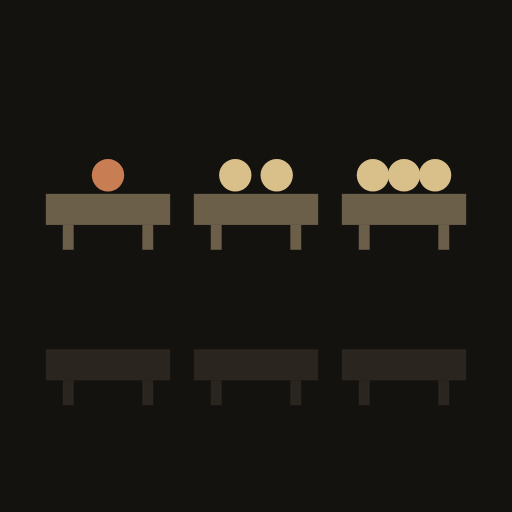
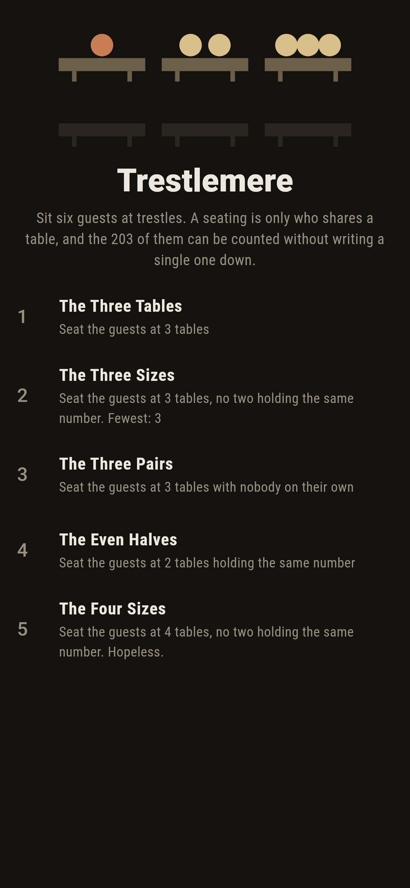
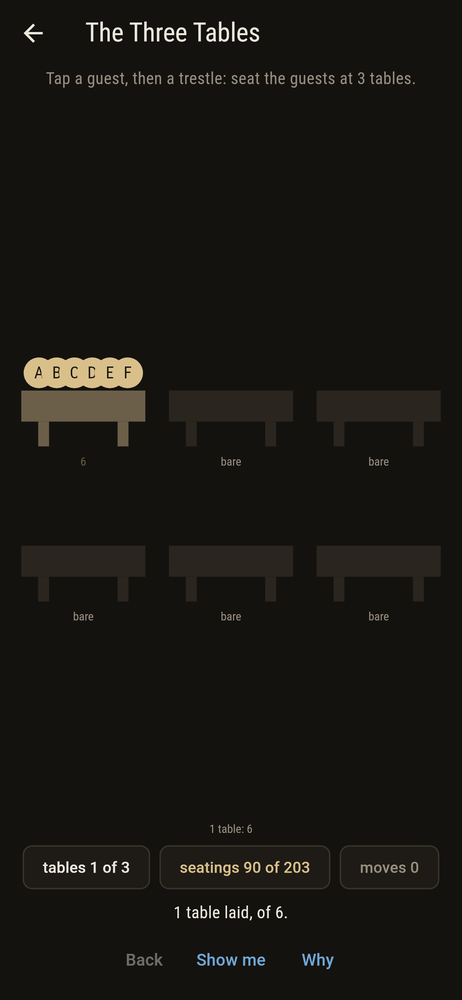
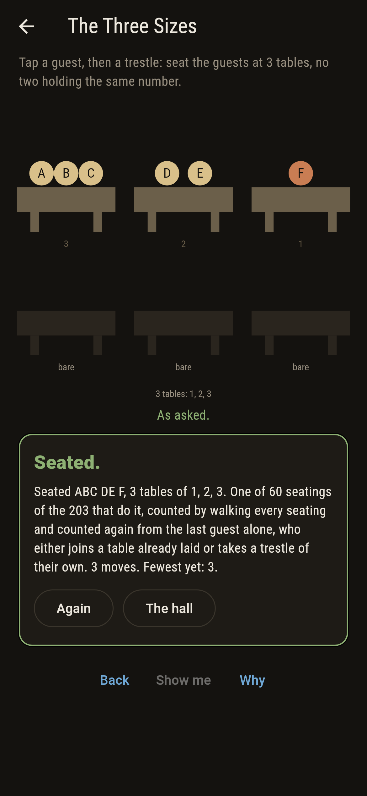
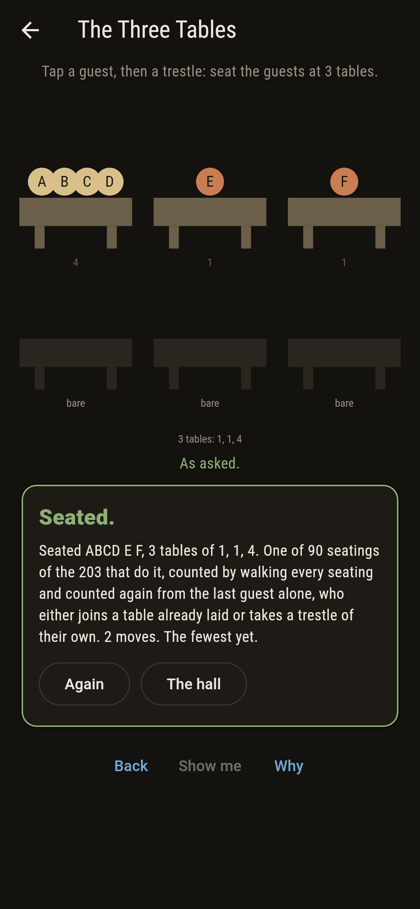
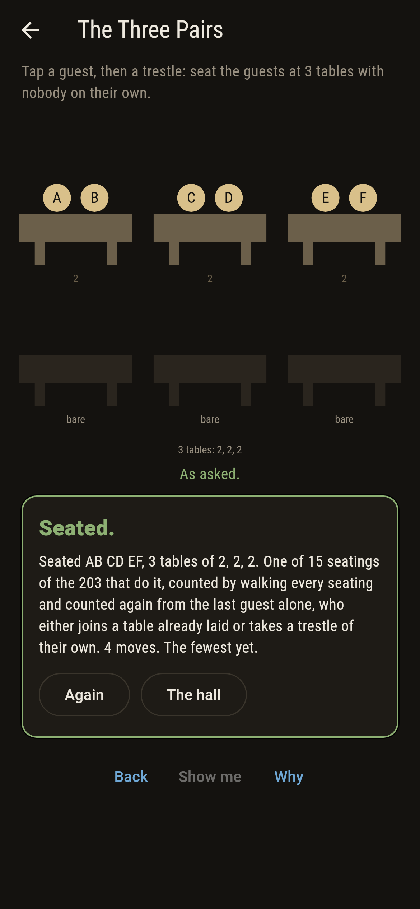
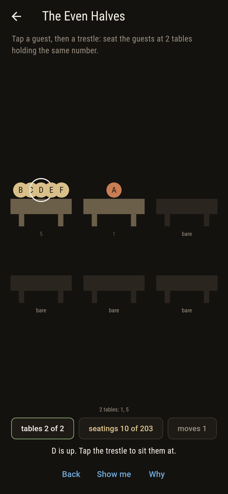
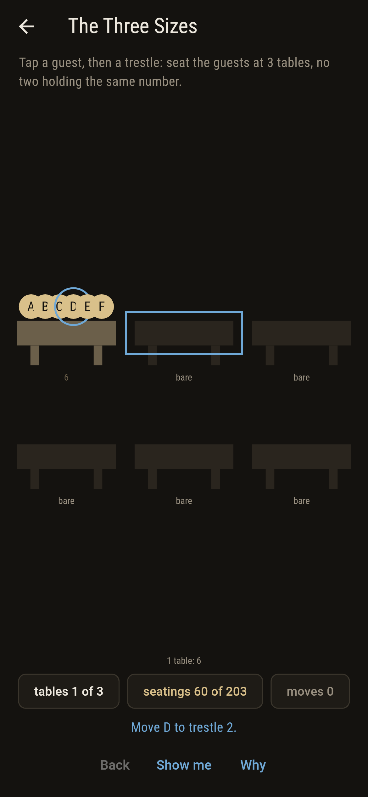
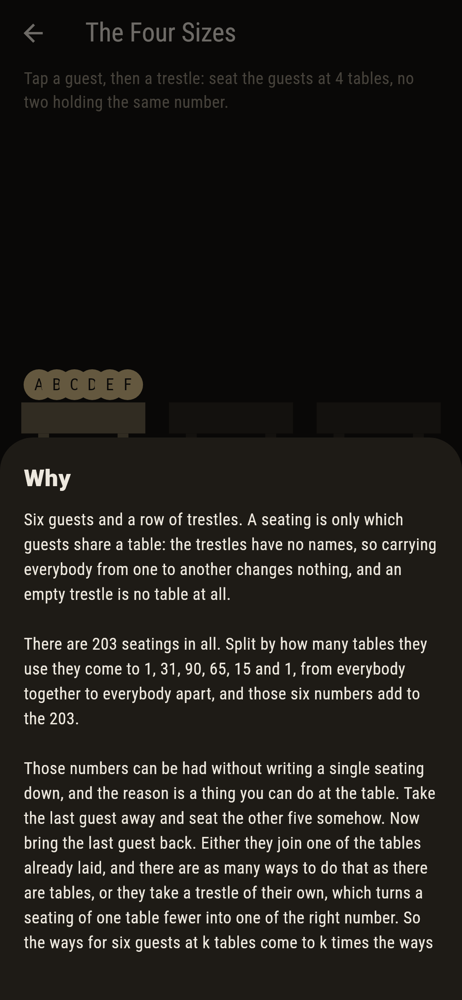
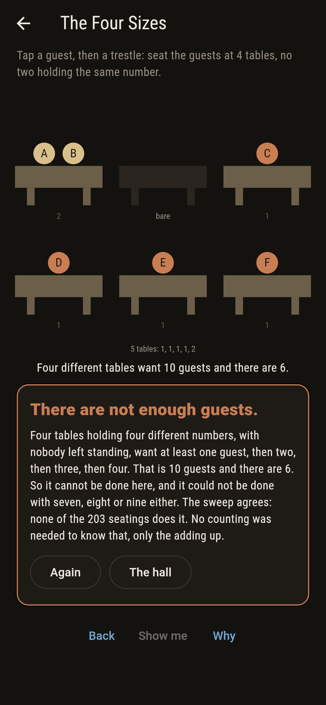

# Trestlemere



Six guests and a row of trestles. A seating is only which guests
share a table: the trestles have no names, so carrying everybody
from one to another changes nothing, and a trestle nobody sits at is
no table at all. There are 203 seatings, and split by how many
tables they use they come to 1, 31, 90, 65, 15 and 1, from everybody
together to everybody apart. Those numbers can be had without
writing a single seating down, and the reason is a thing you can do
at the table. Take the last guest outside and seat the other five
somehow. Bring them back in. Either they join one of the tables
already laid, and there are as many ways to do that as there are
tables, or they take a trestle of their own, which turns a seating
of one table fewer into one of the right number. So the ways for six
guests at k tables come to k times the ways for five at k, plus the
ways for five at k less one. Stirling counted these. The game walks
every seating and does the counting as well, and holds the two
against each other at every table count and at every smaller supper
from none up to six.

## The asks

1. **The Three Tables** - seat the guests at 3 tables
2. **The Three Sizes** - seat the guests at 3 tables, no two holding the same number
3. **The Three Pairs** - seat the guests at 3 tables with nobody on their own
4. **The Even Halves** - seat the guests at 2 tables holding the same number
5. **The Four Sizes** - seat the guests at 4 tables, no two holding the same number

They land 90, 60, 15, 10 and none of the 203, and the nearest is 2,
3, 4 and 3 moves from the opening, which puts everybody at one
trestle. Three is where the room is widest, which is why the first
ask is the loosest. After that each ask adds a condition and the
count falls, and each of the shapes turns out to be forced: three
different sizes adding to six can only be 1, 2 and 3; three tables
with nobody alone can only be 2, 2 and 2; two tables of a size can
only be 3 and 3. The Four Sizes is labeled hopeless on its tile, and
no counting is needed to see it. Four tables holding four different
numbers, none of them empty, want at least 1 and 2 and 3 and 4
guests. That is ten, and there are six.

## Two voices

The game never asserts what it has not computed, and it computes
everything at least twice:

* **The walk** writes every seating out, one at a time, by taking the
  guests in turn and putting each either at a table already laid or
  at a fresh trestle. It checks that every seating comes out once and
  once only and that each seats all six. Every count on the tile and
  the card is its.
* **The counting** seats nobody. It works the row from the last guest
  alone, by the rule above, and never holds a seating in its hand at
  all. The two agree at every table count, and again at every smaller
  supper from none up to six, so the agreement is not one lucky row.

`tool/check_tables.dart` runs the lot and refuses the bake on any
disagreement.

Almsford in this collection also puts stones in piles, but it is
about majorization, which asks when one pile shape dominates
another. This asks how many shapes there are at all, and counts them
twice. Tablesham seats people too, round one table rather than
across several, and its question is who sits next to whom.

## The checker's ledger

What `dart run tool/check_tables.dart` printed for the build this
README shipped with, word for word:

```
every way of seating 6 guests at trestles walked, 203 of them, a seating being only which guests share a table, since the trestles have no names and an empty one is no table at all: every seating came out once and once only, and each seats all 6; split by how many tables they use they come to 1, 31, 90, 65, 15, 1, from everybody together to everybody apart, and those add to 203; a second voice seats nobody at all and gets the same numbers from the last guest alone, who either joins one of the tables laid or takes a trestle of their own, so the ways at k tables come to k times the ways for one guest fewer at k, plus the ways for one guest fewer at k less one, which is Stirling counting of the second kind; the two agree at every table count, and again at every smaller supper from none up to 6; three tables of different sizes have to be one, two and three and there are 60 such seatings, three tables with nobody alone have to be two, two and two and there are 15, and two tables of the same size have to be three and three and there are 10; four tables of four different sizes would want 1 and 2 and 3 and 4 guests, which is 10, and there are 6, so none of the 203 does it and no supper of fewer than 10 ever could

 1 The Three Tables seat the guests at 3 tables: 90 of the 203 seatings do it, the nearest 2 moves away
 2 The Three Sizes  seat the guests at 3 tables, no two holding the same number: 60 of the 203 seatings do it, the nearest 3 moves away
 3 The Three Pairs  seat the guests at 3 tables with nobody on their own: 15 of the 203 seatings do it, the nearest 4 moves away
 4 The Even Halves  seat the guests at 2 tables holding the same number: 10 of the 203 seatings do it, the nearest 3 moves away
 5 The Four Sizes   seat the guests at 4 tables, no two holding the same number: none of the 203, and the adding up said so first
```

## Screenshots

| The hall | An ask as it opens | The three sizes |
| --- | --- | --- |
|  |  |  |

| The three tables | The three pairs | A guest up | Show me | The why | Not enough guests |
| --- | --- | --- | --- | --- | --- |
|  |  |  |  |  |  |

A guest sitting on their own is drawn in rust, and a trestle nobody
sits at is drawn as bare boards, since an empty table is no table at
all and does not count towards the ask.

Screenshots are drawn by `test/showcase_test.dart` at real phone
sizes with the app's own painter, then copied into `docs/` as they
came out; every guest in them was moved there a tap at a time, so
nothing pictured is a seating the game could not reach. The logo and
every launcher icon come out of `test/mark_test.dart` the same way:
the mark is the six at three tables of one, two and three, which is
the only shape three different tables can take.

## Building

```
flutter test          # 56 tests, both voices among them
dart run tool/check_tables.dart
flutter build apk     # or: flutter build ios
```
