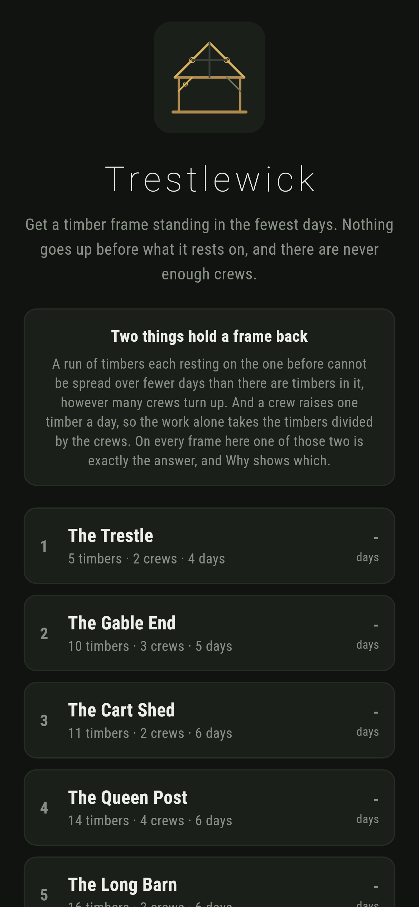
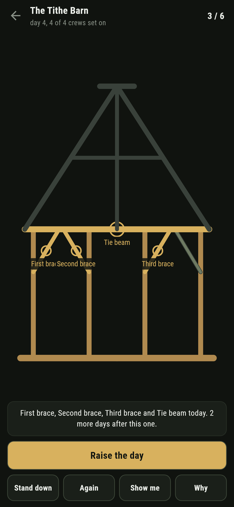
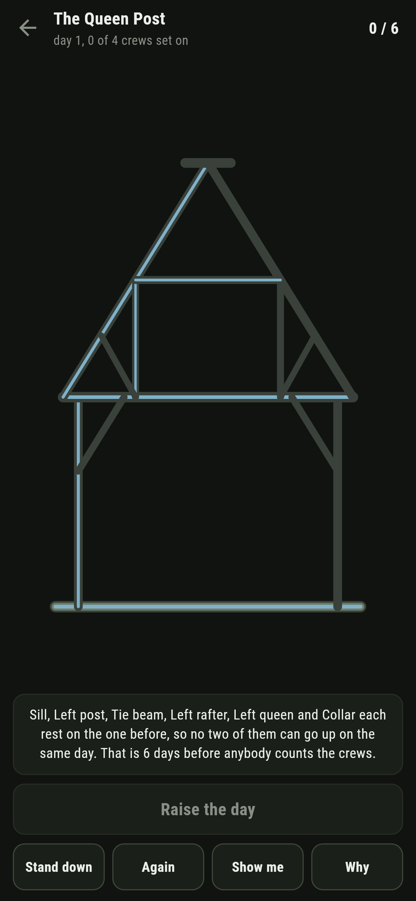
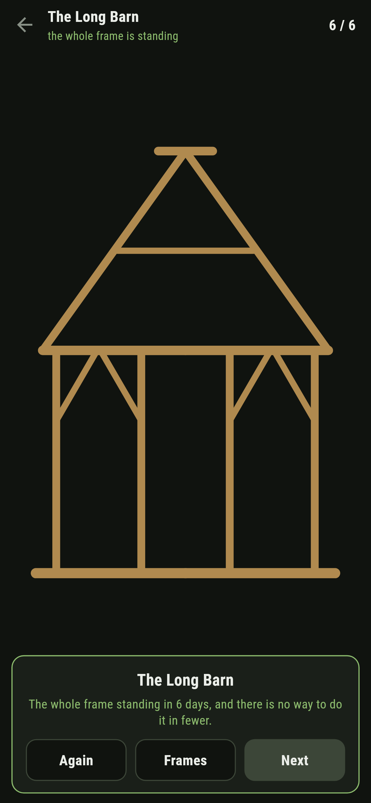
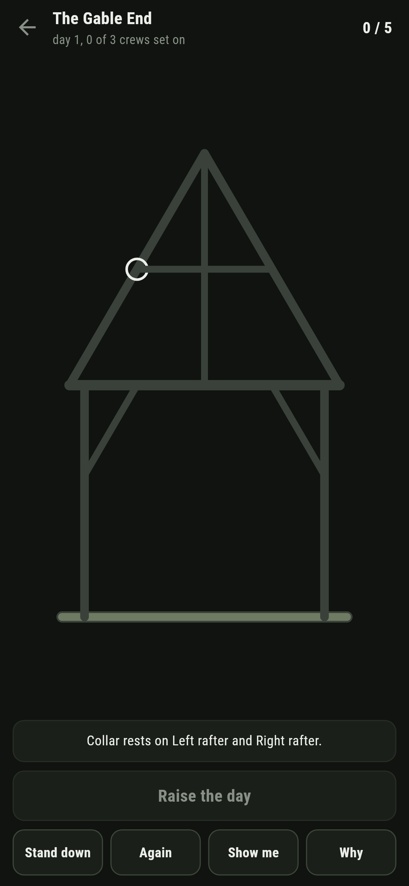

# Trestlewick

A building puzzle for phones, in Flutter, for Android and iOS.

Get a timber frame standing in the fewest days. Nothing goes up before what it
rests on, and there are never enough crews, so every day is a choice about
which few timbers to raise.

| | | | |
|---|---|---|---|
|  |  |  |  |

## Two things hold a frame back

A run of timbers each resting on the one before cannot be spread over fewer
days than there are timbers in it, however many crews turn up. And a crew
raises one timber a day, so the work alone takes the timbers divided by the
crews, rounded up.

Neither of those searches anything, and on every frame here one of the two is
exactly the answer. **Why** shows which, and when it is the run it draws it
straight up the frame:


That is the whole of the level design. A frame where neither floor is tight
would leave the game saying take my word for it, so those get thrown away.

```
$ make frames
 1 The Trestle       5 timbers  2 crews  days 4  written down 4  longest run 4  by work 3  in order 4  the run says so
 2 The Gable End    10 timbers  3 crews  days 5  written down 5  longest run 5  by work 4  in order 6  the run says so
 3 The Cart Shed    11 timbers  2 crews  days 6  written down 6  longest run 4  by work 6  in order 6  the work says so  IN ORDER IS ENOUGH
 4 The Queen Post   14 timbers  4 crews  days 6  written down 6  longest run 6  by work 4  in order 6  the run says so  IN ORDER IS ENOUGH
 5 The Long Barn    16 timbers  3 crews  days 6  written down 6  longest run 5  by work 6  in order 7  the work says so
 6 The Tithe Barn   18 timbers  4 crews  days 6  written down 6  longest run 6  by work 5  in order 7  the run says so
```

## The answer itself

Each day some of the timbers that are ready go up, and no more than there are
crews. That leaves a state that is nothing but the set of timbers standing, so
the working out is done over sets of timbers and each set is answered once and
read thereafter. Eighteen timbers is a quarter of a million sets at the very
most, and far fewer really come up.

The same working out answers "how many days from here", which is a different
question from the one it answered at the start and free once the first is done.
That is what lets the game say the moment a day has been wasted, and what makes
**Show me** still right after a bad day rather than reading off a plan made
before anybody started.

## What the game says



A timber tapped before its turn says what it rests on and points at one of
them. Tapping more timbers than there are crews says so. And at the end of any
day that has cost something, the line under the frame says how many days it can
now be up in against how many it takes.

On three of the six frames, raising whatever happens to be ready in the order
the timbers are written down takes a day longer than it needs to.

## Running it

```
make deps    # flutter pub get
make test    # everything
make analyze
make shots   # render the screens into build/showcase, redraw the logo and icons
make frames  # the fewest days for each frame, and the two floors under it
make apk     # release APK
make ios     # release iOS build, unsigned
```

## Tests

`flutter test` runs the frame (nothing up before what it rests on, every
shipped frame standing up, and one that rests on itself not doing), the floors
(a ladder taking as many days as it has rungs however many crews, a heap taking
the work divided by the crews, neither floor ever above the answer, and the
longest run really being a run), the way it lays out actually being raisable,
every frame that ships, and raising one.

Then the game through the screen: putting the crews on a timber, taking them
off, a timber that is waiting, one already up, more timbers than crews, raising
an empty day, being told a day has been wasted, **Stand down**, **Again**,
**Show me**, **Why** both ways round, and all six frames raised in the fewest
days there are.

Screenshots come from `test/showcase_test.dart`, and every timber standing in
them was raised by tapping it. `test/mark_test.dart` draws the logo, the
launcher icons at every density Android asks for and every size the iOS icon
set asks for; there is no image in this repository that was not produced by it.
