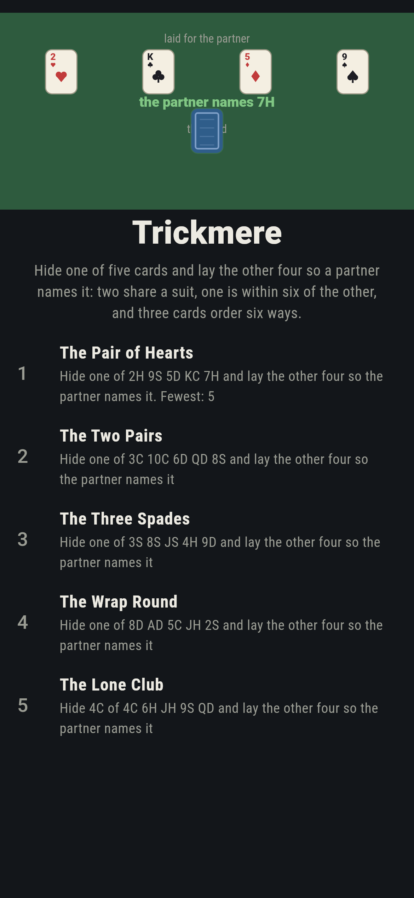
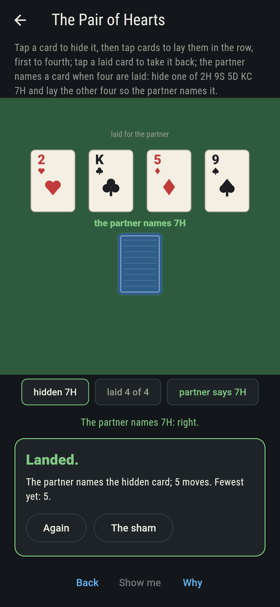
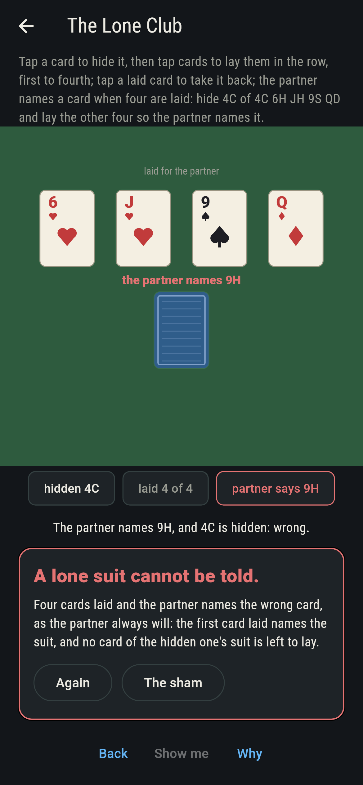
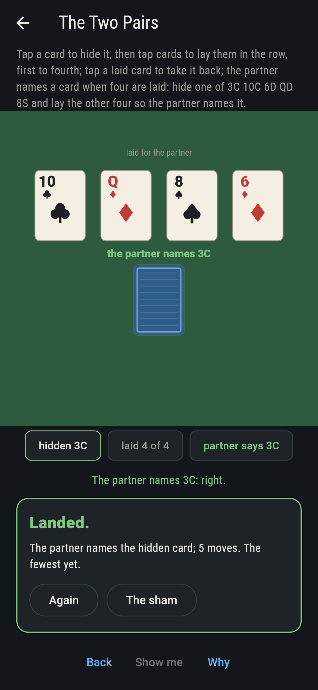
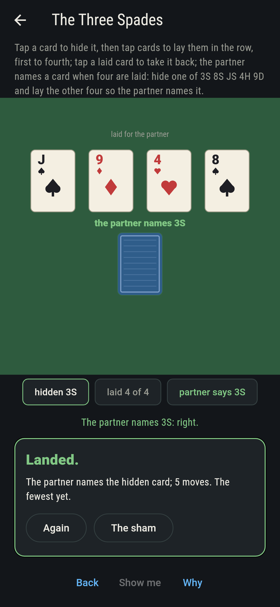
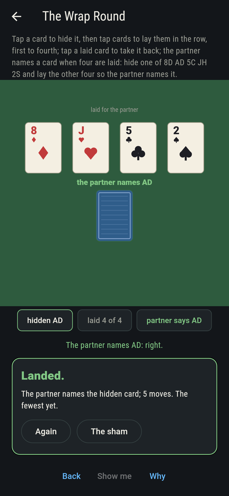
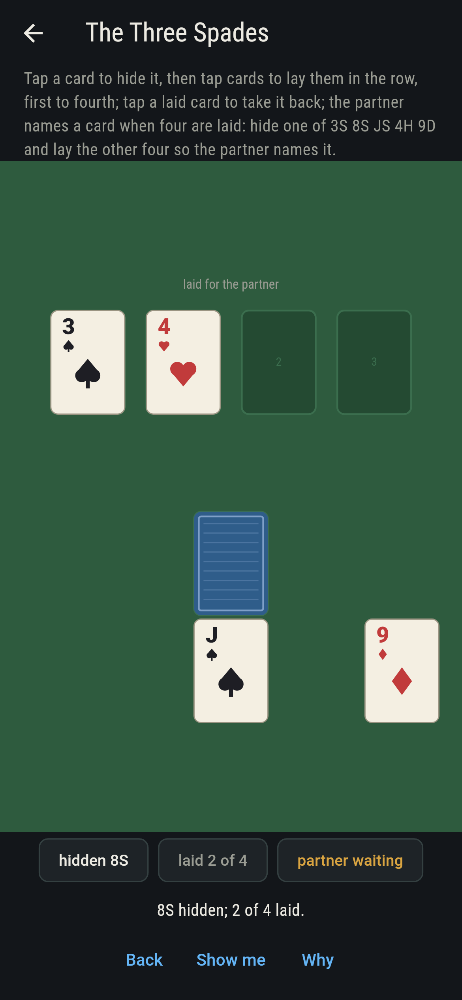
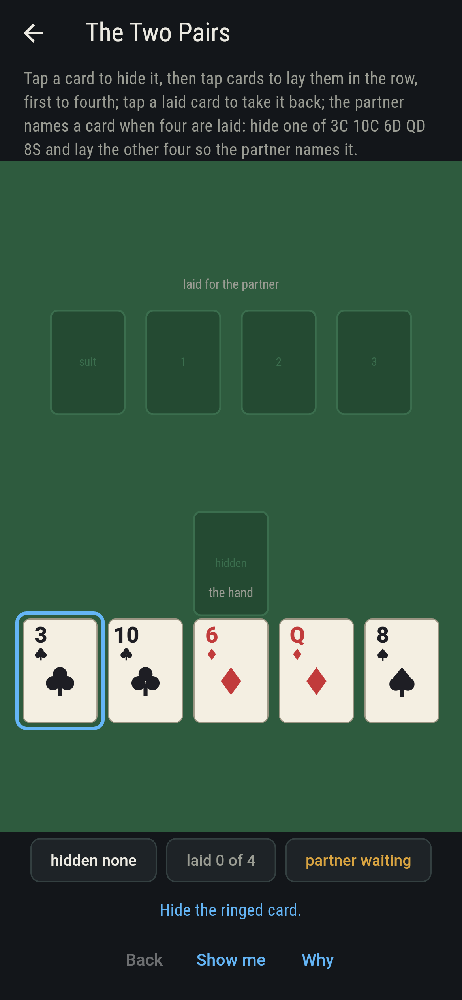
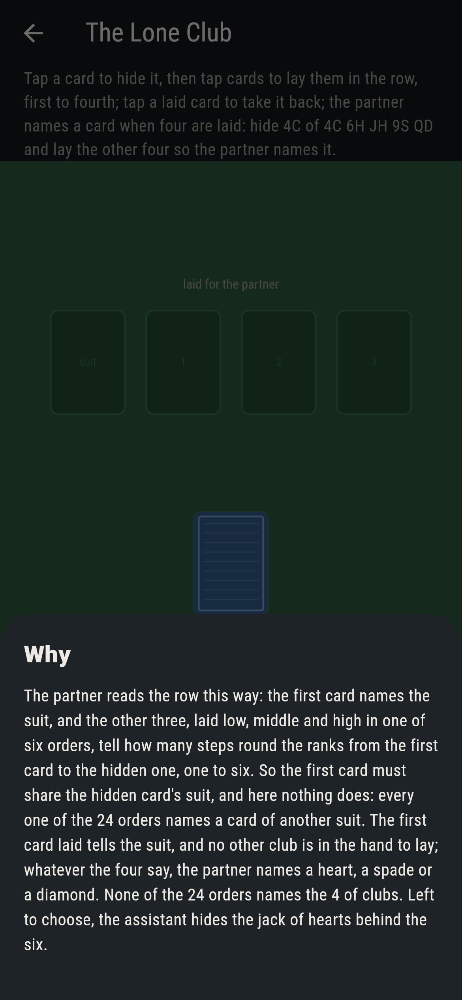

# Trickmere


Five cards are dealt from a full deck. You, the assistant, hide
one and lay the other four in a row, and your partner, who has
seen nothing else, names the hidden card. Fitch Cheney's trick,
from 1950, always works, and the reason is three small facts: of
five cards two share a suit; of any two ranks, one is within six
steps of the other going round through the king to the ace; and
three cards can be laid low, middle and high in six orders. So
hide the one of the pair that is within six steps, show its mate
first to tell the suit, and lay the other three in the order that
tells the steps. Every layout of every hand here is swept, and the
rule is run on all 2,598,960 hands of the deck. Hide the only card
of its suit and no row can say so.

## The hands

1. **The Pair of Hearts** - hide one of 2H 9S 5D KC 7H and lay the other four so the partner names it
2. **The Two Pairs** - hide one of 3C 10C 6D QD 8S and lay the other four so the partner names it
3. **The Three Spades** - hide one of 3S 8S JS 4H 9D and lay the other four so the partner names it
4. **The Wrap Round** - hide one of 8D AD 5C JH 2S and lay the other four so the partner names it
5. **The Lone Club** - hide 4C of 4C 6H JH 9S QD and lay the other four so the partner names it

The partner reads a row so: the first card names the suit; the
other three, low, middle and high in one of six orders, tell one
to six; the hidden card is that many steps up from the first,
round through the king to the ace. The pair of hearts lays one way
of the 120 layouts, the two pairs two, the three spades three, the
wrap round one, the ace being six steps up from the 8 the long way
round. The Lone Club is labeled hopeless on its tile: the 4 of
clubs must be hidden, and no club is left to say so.

## Two voices

The game never asserts what it has not computed, and it computes
everything at least twice:

* **The sweep** hides each of the five in turn and lays the other
  four in every order, 120 layouts, and reads the partner on each;
  every count on the sham is that sweep's. The six orders are
  checked to tell one to six and back on all 22,100 threes of the
  deck, and every two ranks to stand within six steps one way.
* **The assistant's rule** searches nothing, and it is run on all
  2,598,960 hands of five from the whole deck: on every one it
  hides a card and lays four the partner names, and on every hand
  here its layout is among the sweep's.

`tool/check_tricks.dart` runs the lot and refuses the bake on any
disagreement.

## The checker's ledger

What `dart run tool/check_tricks.dart` printed for the build this
README shipped with, word for word:

```
every layout of every hand swept, five cards to hide and twenty-four orders of the rest, and the assistant's rule held to it, then to the whole deck: on every one of the 2,598,960 hands of five the rule hides a card and lays four the partner names, since two of five share a suit, any two ranks stand within six steps round one way, and three cards laid in one of six orders tell one to six, checked on all 22,100 threes of the deck; the pair of hearts lays one way, the two pairs two, the three spades three, the wrap round one, and the lone club, hidden by order, no way at all

 1 The Pair of Hearts hide one of 2H 9S 5D KC 7H and lay the other four so the partner names it: 1 of the 120 layouts lands it
 2 The Two Pairs      hide one of 3C 10C 6D QD 8S and lay the other four so the partner names it: 2 of the 120 layouts land it
 3 The Three Spades   hide one of 3S 8S JS 4H 9D and lay the other four so the partner names it: 3 of the 120 layouts land it
 4 The Wrap Round     hide one of 8D AD 5C JH 2S and lay the other four so the partner names it: 1 of the 120 layouts lands it
 5 The Lone Club      hide 4C of 4C 6H JH 9S QD and lay the other four so the partner names it: none of the 24, and the first card said so first
```

## Screenshots

| The sham | The pair of hearts laid | The lone club admitted |
| --- | --- | --- |
|  |  |  |

| The two pairs | The three spades | The wrap round | Mid-lay | Show me | The why |
| --- | --- | --- | --- | --- | --- |
|  |  |  |  |  |  |

Screenshots are drawn by `test/showcase_test.dart` at real phone
sizes with the app's own painter, then copied into `docs/` as they
came out; every card in them was hidden or laid by a tap, so
nothing pictured is a table the game could not reach. The logo and
every launcher icon come out of `test/mark_test.dart` the same
way: the mark is the pair of hearts laid, the 7 hidden behind the
2 and three cards telling five.

## Building

```
flutter test          # 44 tests, the sweep among them
dart run tool/check_tricks.dart
flutter build apk     # or: flutter build ios
```
