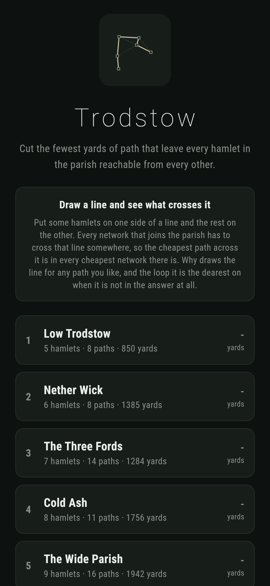
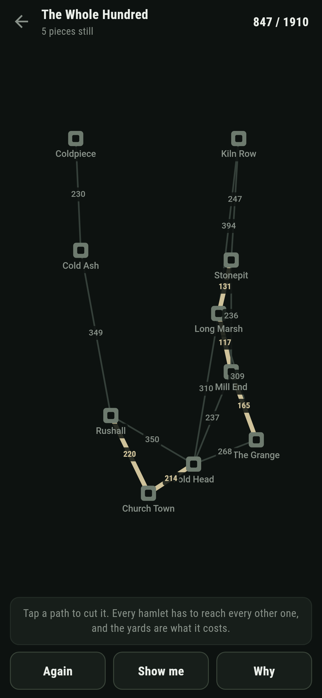
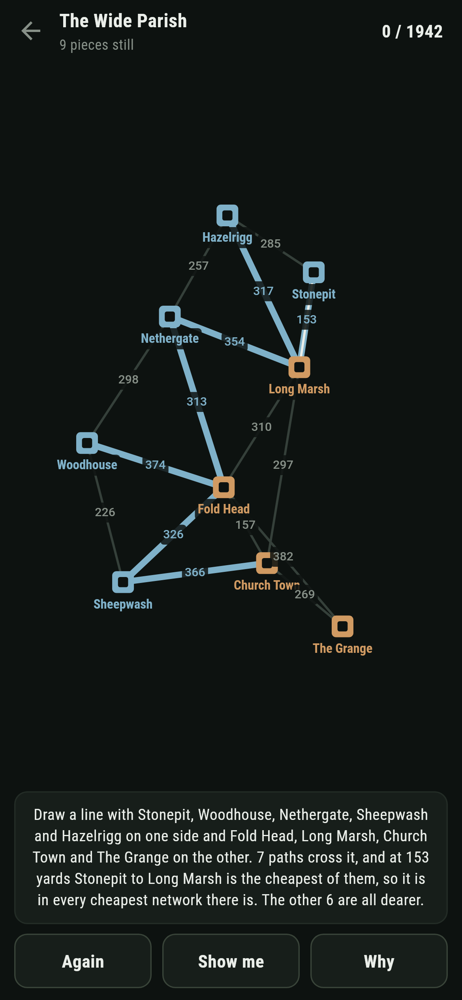
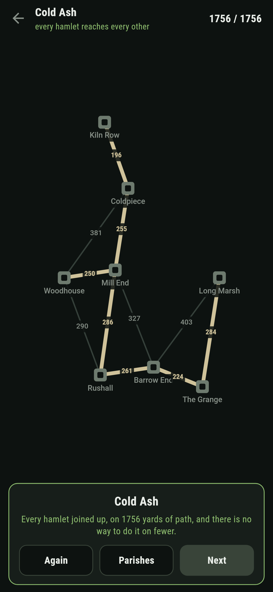
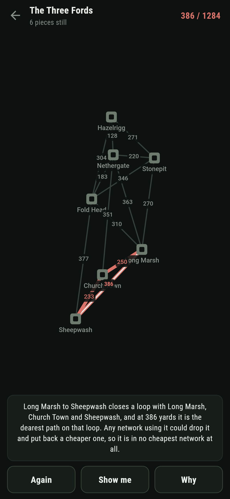

# Trodstow

A path cutting puzzle for phones, in Flutter, for Android and iOS.

Cut the fewest yards of path that leave every hamlet in the parish reachable
from every other. The yards on each path are what it would cost, and there is
always more than one way to join things up.

| | | | |
|---|---|---|---|
|  |  |  |  |

## The game explains every path it picks, and why

Put some hamlets on one side of a line and the rest on the other. Every network
that joins the parish has to cross that line somewhere. So if one crossing path
is cheaper than every other crossing path, it is in every cheapest network
there is: swap it for whichever crossing path some other network uses, and that
network still joins everything and costs less.

**Why** draws that line for any path in the answer, tints the two sides, and
lights up everything that crosses:


The same argument upside down explains the paths that are not in the answer. A
path that closes a loop and is the dearest on that loop is in no cheapest
network at all, because any network using it could drop it and put back a
cheaper path from the same loop:



Between them those two cover every path on the map, which is why this game can
answer "why that one" rather than only "how much".

## The number, three ways

```
$ make parishes
 1 Low Trodstow       5 hamlets   8 paths  cheapest 850  written down 850  by growing 850  by trying every set 850  shortest way 1148  4 of 4 proved by the line they cross
 2 Nether Wick        6 hamlets   8 paths  cheapest 1385  written down 1385  by growing 1385  by trying every set 1385  shortest way 1448  5 of 5 proved by the line they cross
 3 The Three Fords    7 hamlets  14 paths  cheapest 1284  written down 1284  by growing 1284  by trying every set 1284  shortest way 1707  6 of 6 proved by the line they cross
 4 Cold Ash           8 hamlets  11 paths  cheapest 1756  written down 1756  by growing 1756  by trying every set 1756  shortest way 2072  7 of 7 proved by the line they cross
 5 The Wide Parish    9 hamlets  16 paths  cheapest 1942  written down 1942  by growing 1942  by trying every set 1942  shortest way 2292  8 of 8 proved by the line they cross
 6 The Whole Hundred  10 hamlets  15 paths  cheapest 1910  written down 1910  by growing 1910  by trying every set 1910  shortest way 2342  9 of 9 proved by the line they cross
```

Cheapest first, taking any path that joins two pieces of the parish that are
not joined yet. Then again from the other end: start at one hamlet and keep
adding the cheapest path that reaches somewhere new. Then a third time by
trying every set of paths there is, which is slow and stupid on purpose. All
three agree on every parish that ships, and a test walks every path of every
answer to check the line it crosses really does have it as the cheapest.

No two paths in any parish cost the same, which is what makes the answer the
only one and every reason exactly true rather than nearly.

## Two other methods, one right and one wrong

Every hamlet's own cheapest path is in the answer, whatever else is. Take the
line with that hamlet on one side and the whole rest of the parish on the
other: its cheapest path is the cheapest across that line, so the same argument
puts it in. That is a free head start on any parish and a test checks it holds
on all of them.

Cutting the paths that get everybody to one place by the shortest way is a
reasonable thing to want and it is not this question. On every parish here it
comes out dearer, and `make find` threw away the ones where it did not.

## Running it

```
make deps      # flutter pub get
make test      # everything
make analyze
make shots     # render the screens into build/showcase, redraw the logo and icons
make parishes  # the cheapest network three ways, and every path proved
make find      # scatter hamlets and keep the parishes worth playing
make apk       # release APK
make ios       # release iOS build, unsigned
```

## Tests

`flutter test` runs the parish (when a set of paths joins it all, when one
would close a loop, and the yards), the three ways of working it out agreeing
on every parish, why a path is in (the cut property checked on every path of
every answer, and every path across the line really crossing it), why a path is
out (the loop, and the loop really being a loop), the two other methods, and
joining one up.

Then the game through the screen: cutting a path, filling it in, a path that
would close a loop, being told the cheapest has been thrown away, **Again**,
**Show me**, **Why** both ways round, a parish joined up the dear way, and all
six joined for the cheapest there is.

Screenshots come from `test/showcase_test.dart`, and every path cut in them was
cut by tapping it. `test/mark_test.dart` draws the logo, the launcher icons at
every density Android asks for and every size the iOS icon set asks for; there
is no image in this repository that was not produced by it.
