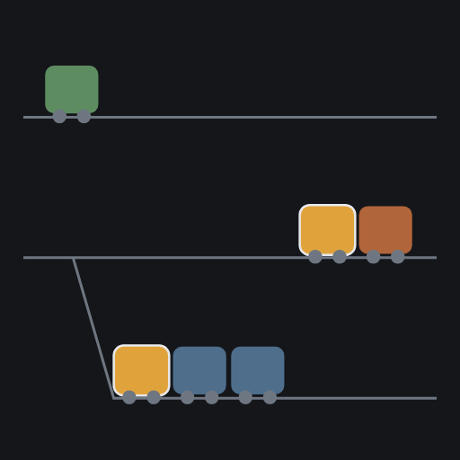
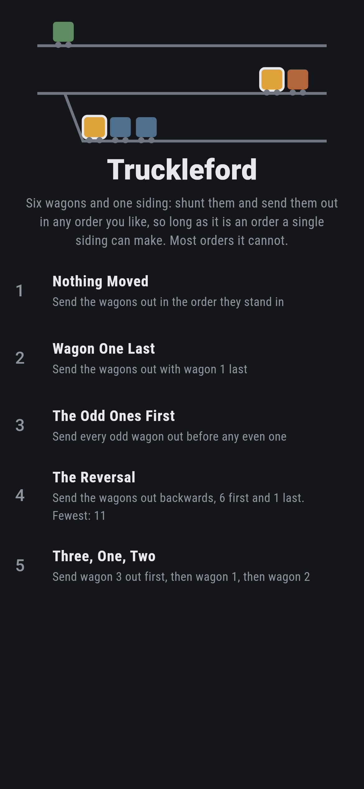
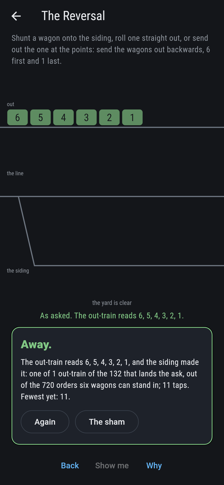
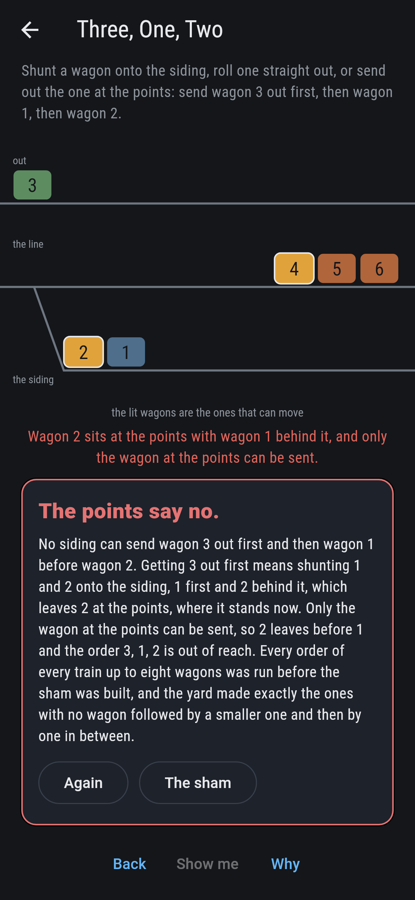
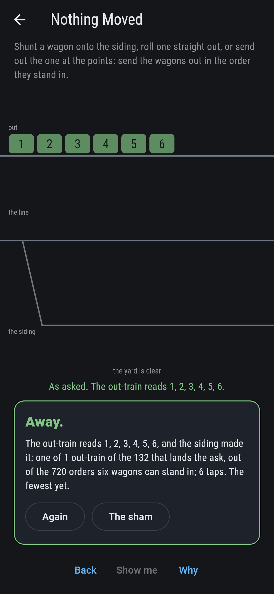
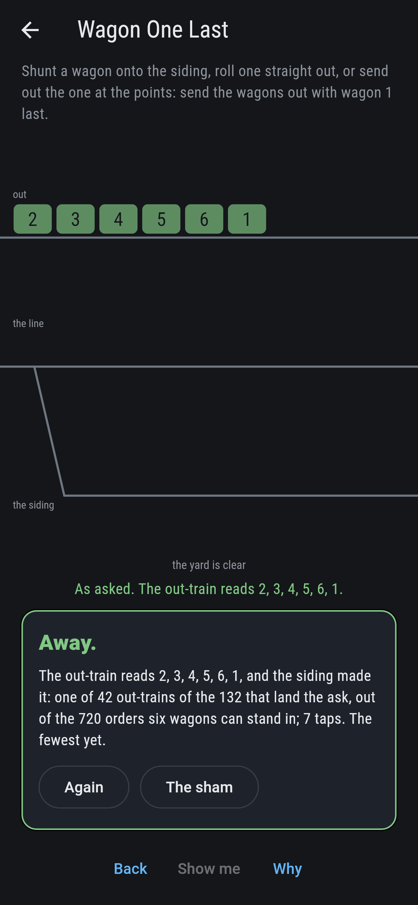
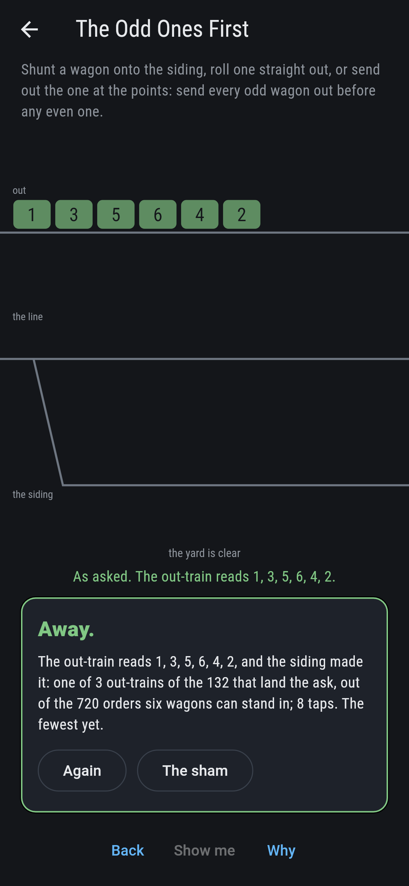
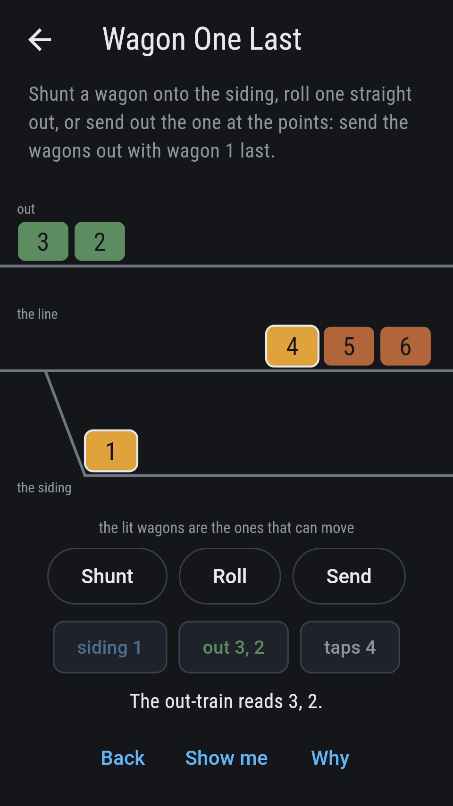
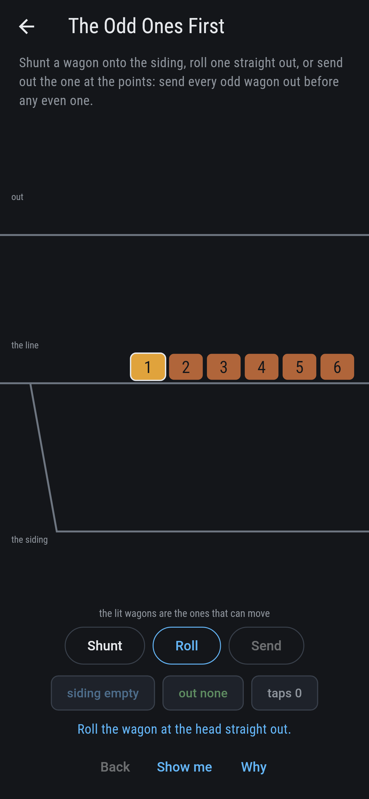
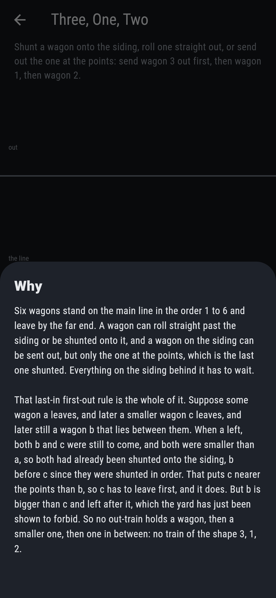

# Truckleford



Six wagons stand on the main line in the order 1 to 6, and there is one
siding. A wagon can roll straight past the siding and out, or be
shunted onto it; a wagon on the siding can be sent out, but only the
one at the points, which is the last one shunted. Everything behind it
waits. Three levers, and the out-train comes out in whatever order you
worked for. Not every order, though: of the 720 orders six wagons can
stand in, one siding can make 132.

## The asks

1. **Nothing Moved** - send the wagons out in the order they stand in
2. **Wagon One Last** - send the wagons out with wagon 1 last
3. **The Odd Ones First** - send every odd wagon out before any even one
4. **The Reversal** - send the wagons out backwards, 6 first and 1 last
5. **Three, One, Two** - send wagon 3 out first, then wagon 1, then wagon 2

Nothing Moved is the cheapest run there is, six taps with nothing
shunted, and the only out-train the yard makes in six. The Reversal is
the dearest, eleven taps, five wagons on the siding and the sixth
rolled past them. 42 of the 132 out-trains leave wagon 1 until last,
which is the Catalan number for the five wagons that then go out ahead
of it. Three of them send 1, 3 and 5 out before 2, 4 and 6, and all
three begin 1, 3, 5. Three, One, Two is labeled hopeless on its tile,
and the card at the end of the ask says why on a finger.

## Why the siding cannot make every order

Say some wagon a leaves, and later a smaller wagon c leaves, and later
still a wagon b lying between them. When a left, b and c were both
still to come and both smaller than a, so both had already been shunted
onto the siding, b before c, since wagons are shunted in the order they
stand. That leaves c nearer the points than b, so c has to go out
first, and it does. But b is bigger than c and went out after it, which
is exactly what the yard has just been shown to forbid.

So no out-train holds a wagon, then a smaller one, then one in between:
nothing of the shape 3, 1, 2. Every other order the siding can make.
Donald Knuth set this down in 1968, in the first volume of The Art of
Computer Programming; the counts for one wagon up to eight are 1, 2, 5,
14, 42, 132, 429, 1430, the Catalan numbers.

## Two voices

The game never asserts what it has not computed, and it computes
everything at least twice:

* **The yard** runs the order wagon by wagon. It takes the next wagon
  the out-train wants, shunting whatever stands in the way onto the
  siding, and either it comes out or it does not.
* **The shape** never touches a yard. It reads the order looking for a
  wagon followed later by a smaller one and later still by one in
  between.

The two are set against each other on every order of every train from
one wagon to eight, 46,233 orders, and they agree on all of them.

`tool/check_yards.dart` runs the lot and refuses the bake on any
disagreement.

## The checker's ledger

What `dart run tool/check_yards.dart` printed for the build this README
shipped with, word for word:

```
every order of every train from one wagon to eight taken, 46,233 orders in all, and each one read twice: once by running it through the yard wagon by wagon, shunting whatever is in the way onto the siding, and once by looking through the order for a wagon followed later by a smaller one and later still by one in between, which never touches a yard: the two agree on every order; the yard makes 1 of the 1 at 1, 2 of the 2 at 2, 5 of the 6 at 3, 14 of the 24 at 4, 42 of the 120 at 5, 132 of the 720 at 6, 429 of the 5,040 at 7, 1,430 of the 40,320 at 8 wagons, which are the Catalan numbers, and the orders it cannot make are exactly the ones holding that shape; on the six wagons the game plays with, 132 out-trains of the 720 can be made and the other 588 cannot; the taps they take run from 6 to 11, 1 at 6, 15 at 7, 50 at 8, 50 at 9, 15 at 10, 1 at 11, which are the Narayana numbers, the six-tap train being the one where every wagon rolls straight past the siding and the eleven-tap train the one where every wagon but the last is shunted; and 6 of the 720 orders begin 3, 1, 2, the yard making none of them

 1 Nothing Moved      send the wagons out in the order they stand in: 1 of the 132 out-trains lands it, the cheapest in 6 taps
 2 Wagon One Last     send the wagons out with wagon 1 last: 42 of the 132 out-trains land it, the cheapest in 7 taps
 3 The Odd Ones First send every odd wagon out before any even one: 3 of the 132 out-trains land it, the cheapest in 8 taps
 4 The Reversal       send the wagons out backwards, 6 first and 1 last: 1 of the 132 out-trains lands it, the cheapest in 11 taps
 5 Three, One, Two    send wagon 3 out first, then wagon 1, then wagon 2: none of the 132, and the points say why
```

## Screenshots

| The sham | The reversal | Three, one, two |
| --- | --- | --- |
|  |  |  |

| Nothing moved | Wagon one last | The odd ones first | Midway, on the small phone | Show me | The why |
| --- | --- | --- | --- | --- | --- |
|  |  |  |  |  |  |

Screenshots are drawn by `test/showcase_test.dart` at real phone sizes
with the app's own painter, then copied into `docs/` as they came out;
every wagon in them was moved by working a lever, so nothing pictured
is a yard the game could not reach. The logo and every launcher icon
come out of `test/mark_test.dart` the same way: the mark is four taps
into a run, wagons 1, 2 and 3 on the siding and wagon 4 rolled straight
out.

## Building

```
flutter test          # 51 tests, the sweep among them
dart run tool/check_yards.dart
flutter build apk     # or: flutter build ios
```
