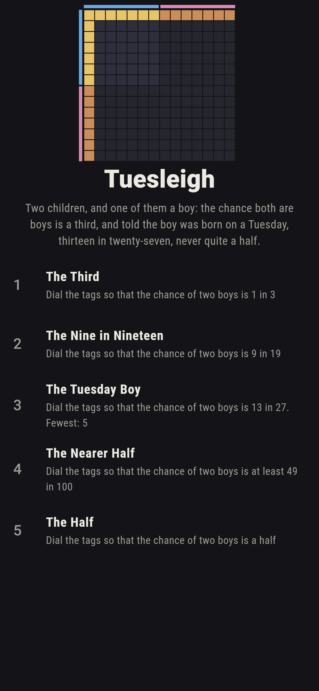
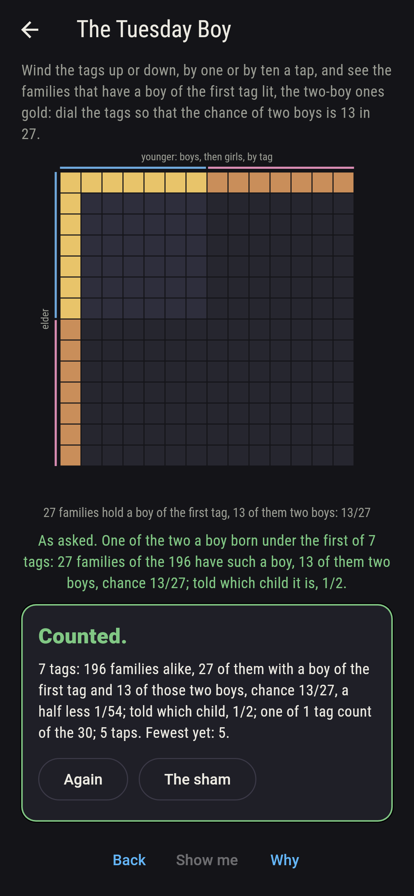
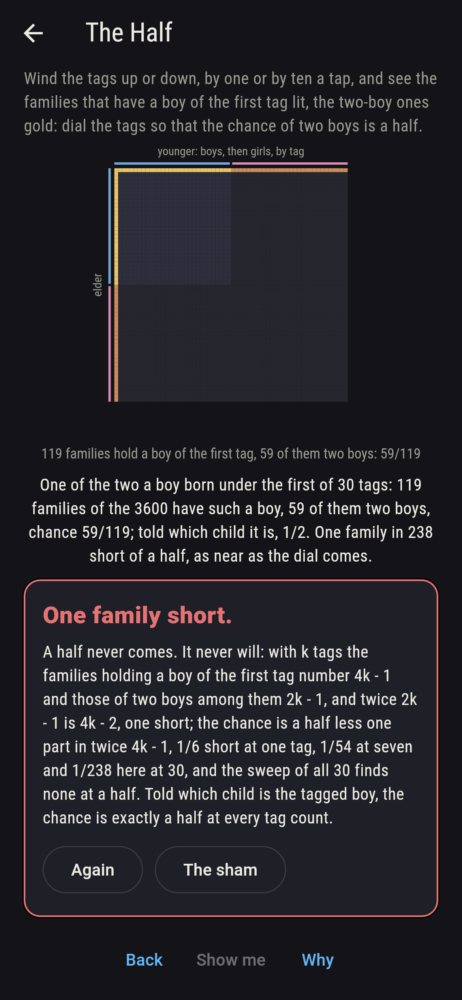
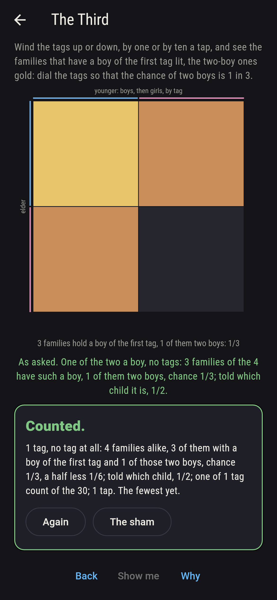
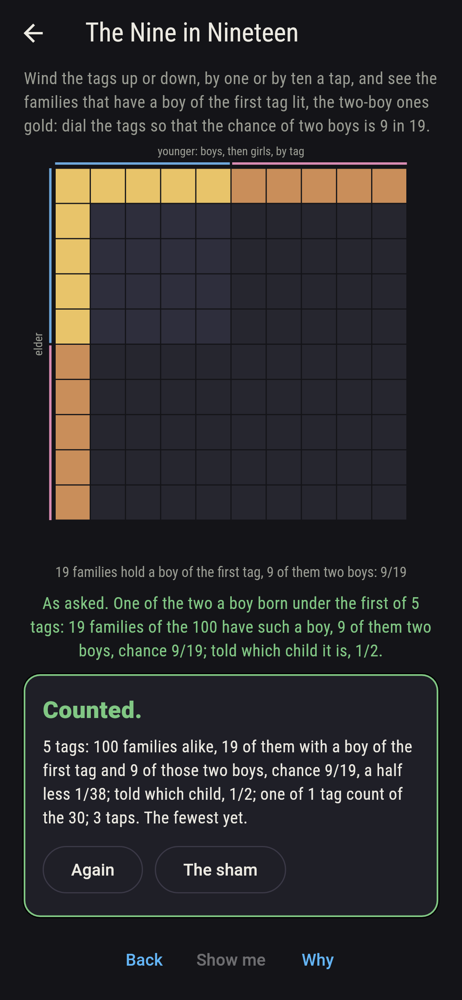
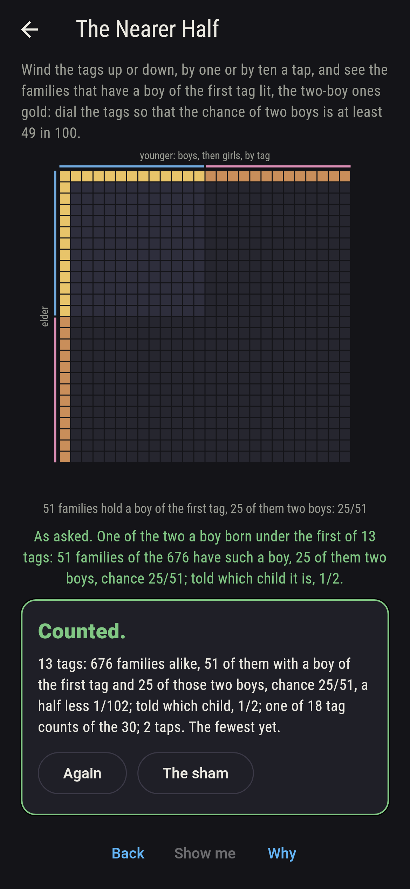
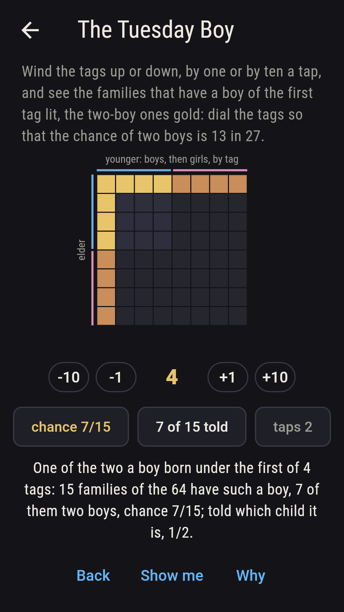
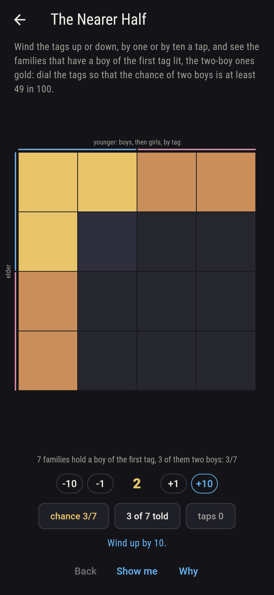
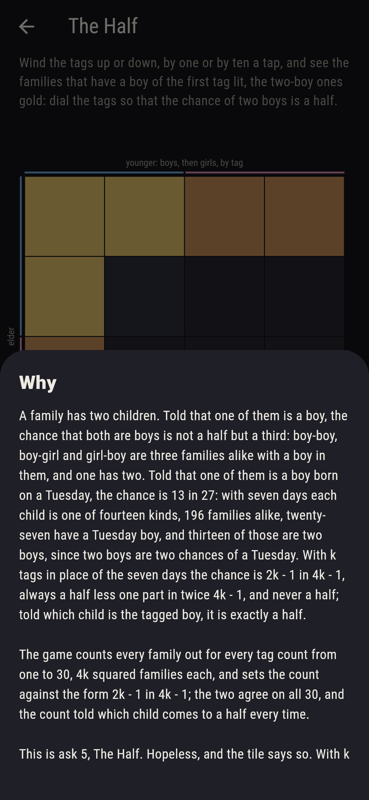

# Tuesleigh


A family has two children. Told that one of them is a boy, the
chance that both are boys is not a half but a third: boy-boy,
boy-girl and girl-boy are three families alike with a boy in them,
and one has two. Told that one of them is a boy born on a Tuesday,
the chance is 13 in 27: with seven days each child is one of
fourteen kinds, 196 families alike, twenty-seven have a Tuesday boy,
and thirteen of those are two boys, since two boys are two chances
of a Tuesday. With k tags in place of the seven days the chance is
2k - 1 in 4k - 1, always a half less one part in twice 4k - 1, and
never a half; told which child is the tagged boy, it is exactly a
half. Wind the tags up or down and see the families that hold a boy
of the first tag lit, the two-boy ones gold. The game counts every
family out for every tag count from one to thirty, 4k squared
families each, and sets the count against the form; the two agree
on all 30, and the count told which child comes to a half every
time.

## The asks

1. **The Third** - dial the tags so that the chance of two boys is 1 in 3
2. **The Nine in Nineteen** - dial the tags so that the chance of two boys is 9 in 19
3. **The Tuesday Boy** - dial the tags so that the chance of two boys is 13 in 27
4. **The Nearer Half** - dial the tags so that the chance of two boys is at least 49 in 100
5. **The Half** - dial the tags so that the chance of two boys is a half

One tag is no tag at all, and gives the bare third; two give 3/7,
three 5/11, five 9/19, seven 13/27, thirteen 25/51 and thirty
59/119, rising with every tag. Thirteen tags first pass 49 in a
hundred, and every count from thirteen to thirty does, eighteen of
the 30; 365 tags, a birthday, would give 729/1,459, one part in
2,918 short of a half. The Half is labeled hopeless on its tile: the
families with a boy of the tag number 4k - 1, the two-boy ones among
them 2k - 1, and twice 2k - 1 is one short of 4k - 1; the sham
admits it at the dial's end, thirty tags, or after fifteen taps.

## Two voices

The game never asserts what it has not computed, and it computes
everything at least twice:

* **The count** lays every family out, the elder one of 2k kinds and
  the younger one of 2k, 4k squared families alike, keeps the ones
  with a boy of the first tag and counts the two-boy ones among
  them; every chance on the sham is that count's, and the same count
  told which child is the tagged boy comes to a half at every tag
  count.
* **The form** counts nothing: 2k - 1 in 4k - 1, and it agrees with
  the count on all 30 tag counts; from it the chance is checked to
  rise with every tag and to fall short of a half by exactly one part
  in twice 4k - 1, so never to reach it, and the named chances, a
  third, 9/19, 13/27, 25/51 and 59/119, are pinned to their tag
  counts.

`tool/check_families.dart` runs the lot and refuses the bake on any
disagreement.

## The checker's ledger

What `dart run tool/check_families.dart` printed for the build this
README shipped with, word for word:

```
every family of two children counted out for every tag count from one to 30, each child a boy or a girl under one of k tags and 4k squared families alike, and among those with a boy of the first tag the share with two boys set against the form 2k - 1 in 4k - 1, the two agreeing on all 30; the chance is a third at one tag, 3/7 at two, 5/11 at three, 9/19 at five, 13/27 at seven, 25/51 at thirteen and 59/119 at thirty, rising with every tag and always a half less one part in twice 4k - 1, never a half; told which child is the tagged boy the chance is a half at every tag count; and 365 tags, a birthday, would give 729/1,459, one part in 2,918 short

 1 The Third            dial the tags so that the chance of two boys is 1 in 3: 1 of the 30 tag counts lands it
 2 The Nine in Nineteen dial the tags so that the chance of two boys is 9 in 19: 1 of the 30 tag counts lands it
 3 The Tuesday Boy      dial the tags so that the chance of two boys is 13 in 27: 1 of the 30 tag counts lands it
 4 The Nearer Half      dial the tags so that the chance of two boys is at least 49 in 100: 18 of the 30 tag counts land it
 5 The Half             dial the tags so that the chance of two boys is a half: none of the 30, and the one family short said so first
```

## Screenshots

| The sham | The Tuesday boy | The half admitted |
| --- | --- | --- |
|  |  |  |

| The third | The nine in nineteen | The nearer half | Midway, on the small phone | Show me | The why |
| --- | --- | --- | --- | --- | --- |
|  |  |  |  |  |  |

Screenshots are drawn by `test/showcase_test.dart` at real phone
sizes with the app's own painter, then copied into `docs/` as they
came out; every tag count in them was wound to by taps, so nothing
pictured is a count the game could not reach. The logo and every
launcher icon come out of `test/mark_test.dart` the same way: the
mark is the fourteen-by-fourteen grid of families under seven tags,
the twenty-seven with a Tuesday boy lit and the thirteen of two boys
gold.

## Building

```
flutter test          # 43 tests, the sweep among them
dart run tool/check_families.dart
flutter build apk     # or: flutter build ios
```
