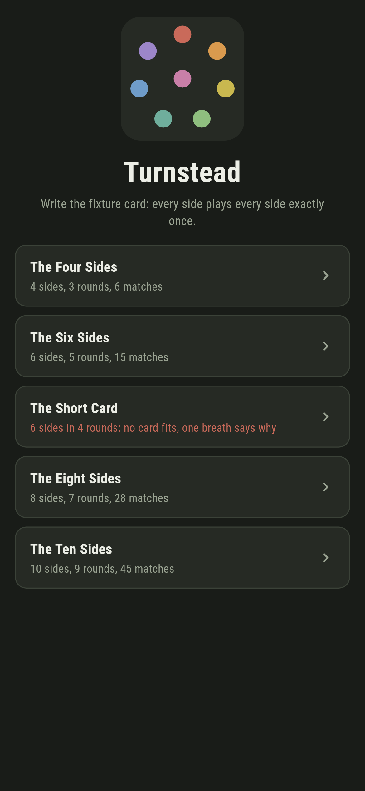
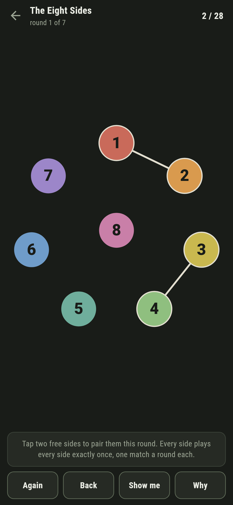
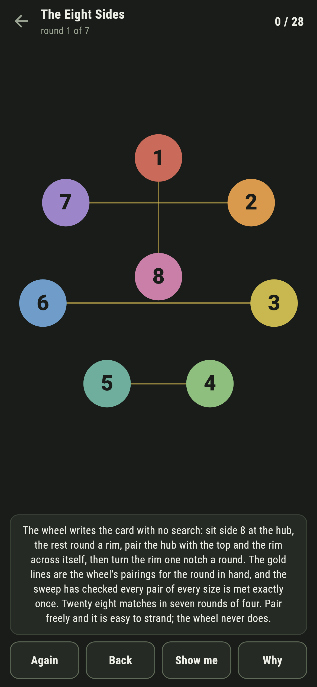
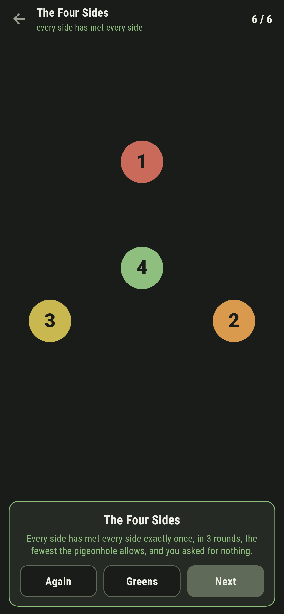
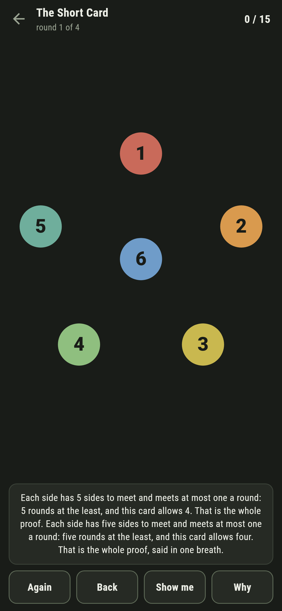

# Turnstead

A fixture-card puzzle for phones, in Flutter, for Android and iOS.

An even number of sides on the green, and one card to write: every side
plays every other exactly once, one match per side per round. Pair them
round by round. It is easy to start and easy to strand, and behind it
stand two of the tidiest facts in scheduling.

| | | | |
|---|---|---|---|
|  |  |  |  |

## The pigeonhole floor, said in one breath

Each side has sides-less-one opponents and meets at most one a round: a
card can never use fewer than sides-less-one rounds. The Short Card
allows six sides four rounds, and that one breath is its whole
impossibility; the search agrees, and quickly, because the same
pigeonhole prunes it.

```
$ make greens
the wheel writes every card from four to twelve sides, every pair exactly once

 1 The Four Sides   4 sides in 3 rounds  the card writes
 2 The Six Sides    6 sides in 5 rounds  the card writes
 3 The Short Card   6 sides in 4 rounds  no card fits
 4 The Eight Sides  8 sides in 7 rounds  the card writes
 5 The Ten Sides    10 sides in 9 rounds  the card writes
```

## The wheel reaches the floor

The floor is exact, and the proof is a machine: sit one side at the hub,
the rest round a rim; pair the hub with the top of the rim and the rim
across itself; then turn the rim one notch and do it again. Every pair
is brought together by a fresh turning, so nothing repeats, and the
sweep checks every card from four to twelve sides pair by pair. **Why**
strings the wheel's pairings for the round in hand across the green as
gold ghosts, so the machine can be copied or ignored as you please.


## Stranding is called as it lands

Pair freely and the card can strand with every rule obeyed: the rounds
left simply cannot cover the pairs left. The game keeps a live answer by
search, pigeonhole-pruned so even the refutations come back in
milliseconds, and the moment a pairing strands the card the ledger goes
red, with Back to unwind it, across round boundaries when it must.



## Building

```
make deps    # fetch packages
make check   # analyze + every test
make greens  # the wheel proved, then the ledger
make shots   # render the screenshots and redraw the icons
make apk     # Android release build
make ios     # iOS release build (unsigned)
```

The logo and every app icon are drawn by the game's own painter in
`test/mark_test.dart`. There is no image in this repository that was not
produced by code in it.

## How it is put together

```
lib/green/rules.dart     the wheel, and the pruned completion search
lib/green/green.dart     a green: sides, rounds allowed, the verdict
lib/green/greens.dart    the five greens that ship
lib/green/play.dart      a card being written: rounds, pairings, the
                         live answer
lib/ui/                  the painter, the screens, the mark
tool/check_greens.dart   the ledger above
```

The tests sweep the wheel at every size, prove one round short never
writes, time the refutations, write every writable card by following
the game's own pointer, and hold the pictures against the real widget
tree. If any of that drifts, `make check` goes red before anything
leaves the machine.
