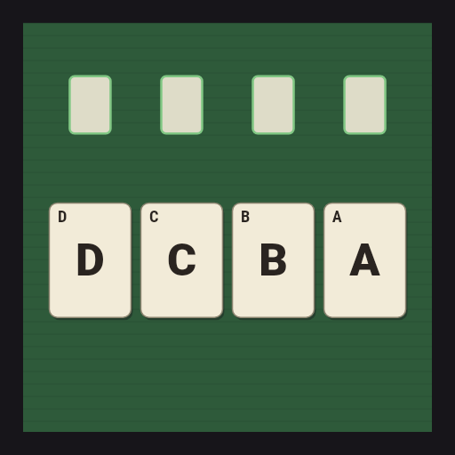
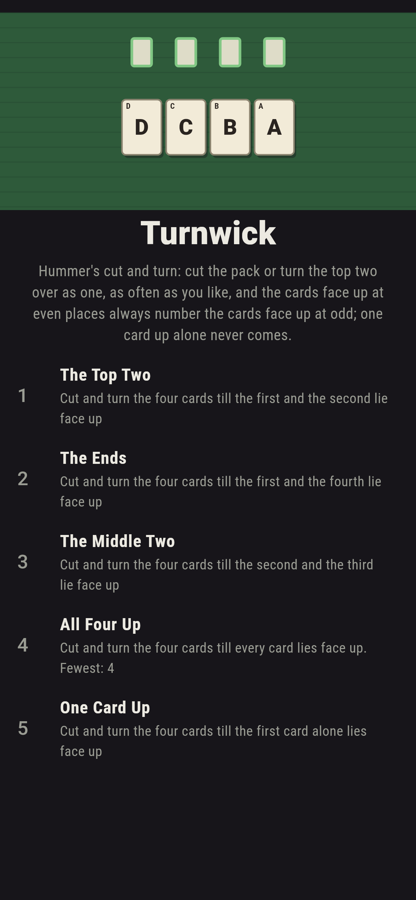
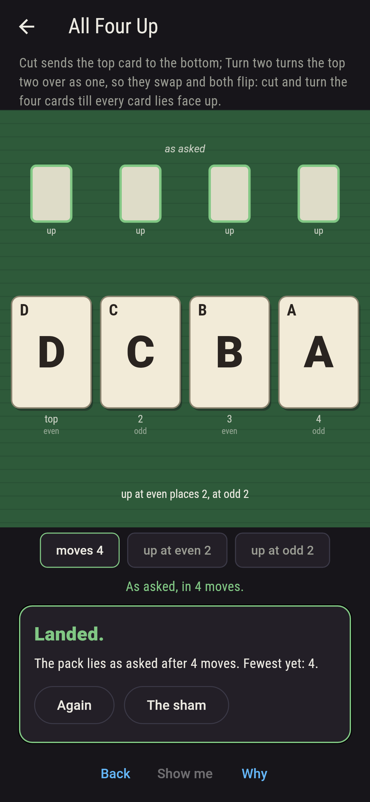
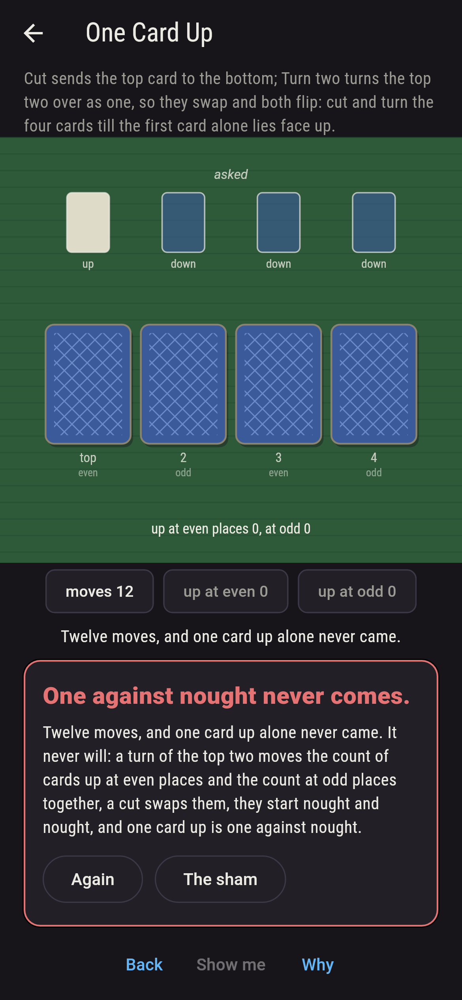
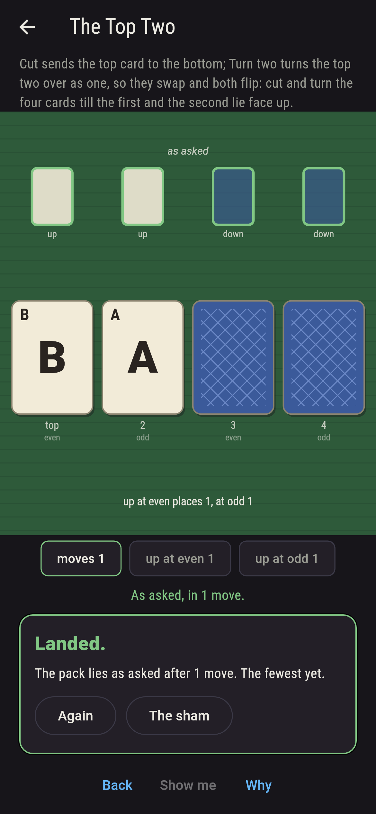
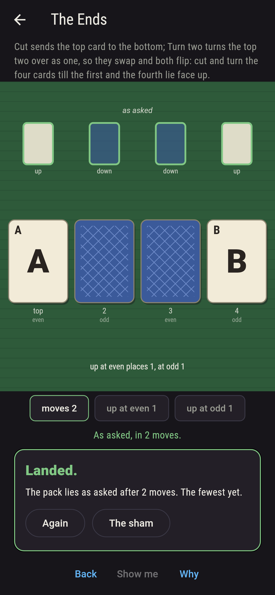
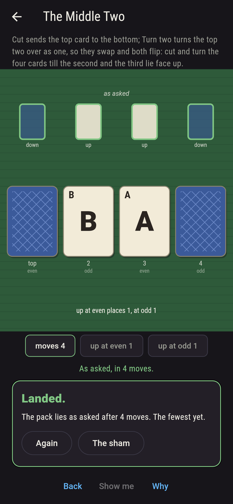
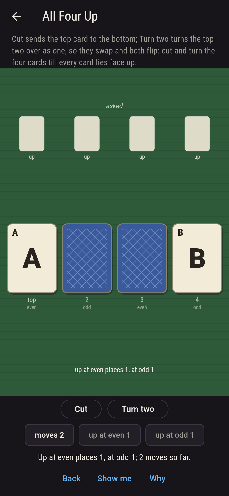
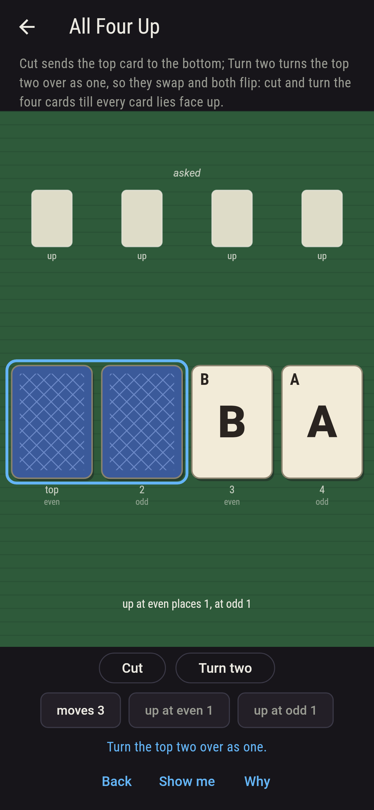
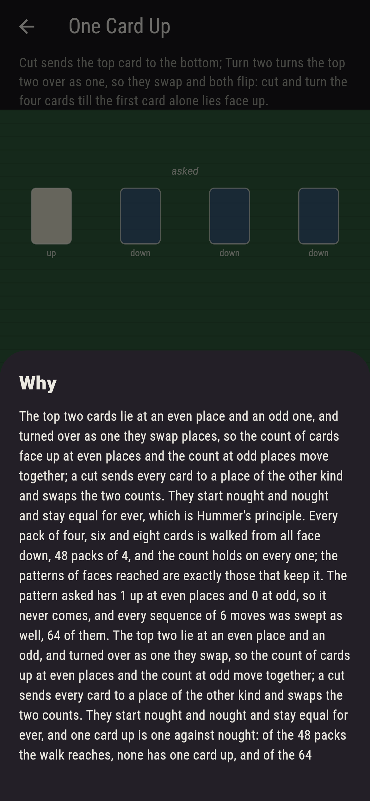

# Turnwick



Bob Hummer's cut and turn. A small pack lies face down, and two
moves are allowed as often as you like: cut, which sends the top
card to the bottom, and turn two, which turns the top two cards over
as one, so they swap places and both flip. Reach the pattern of
faces asked. The top two cards lie at an even place and an odd one,
and turned over as one they swap, so the count of cards face up at
even places and the count at odd places move together; a cut sends
every card to a place of the other kind and swaps the two counts;
they start nought and nought and stay equal for ever, which is
Hummer's principle, and it is why one card up alone never comes.
The game walks every pack of four, six and eight cards from all
face down and finds the count holding on every one, and the
patterns reached exactly those that keep it.

## The patterns

1. **The Top Two** - cut and turn the four cards till the first and the second lie face up
2. **The Ends** - cut and turn the four cards till the first and the fourth lie face up
3. **The Middle Two** - cut and turn the four cards till the second and the third lie face up
4. **All Four Up** - cut and turn the four cards till every card lies face up
5. **One Card Up** - cut and turn the four cards till the first card alone lies face up

The top two come of one turn; the ends of a turn and a cut; the
middle two of a turn and three cuts; all four of turn, cut, cut,
turn; each one sequence of the two, four, sixteen and sixteen of
that many moves. One Card Up is labeled hopeless on its tile, and
the why counts even against odd.

## Two voices

The game never asserts what it has not computed, and it computes
everything at least twice:

* **The walk** starts from all face down and makes both moves on
  every pack it reaches, four, six and eight cards, 48, 1,440 and
  80,640 packs, and finds the fewest moves to every pattern of
  faces; the sweep makes every sequence of so many moves for the
  patterns on the sham. Every count on the sham is theirs.
* **Hummer's count** needs no walk: on every pack reached, a turn of
  the top two is checked to move the count of cards up at even
  places and the count at odd places together, and a cut to swap
  them; every pack reached keeps the two equal; and the patterns of
  faces that keep them equal are counted, 6 of 16 for four cards,
  20 of 64 for six and 70 of 256 for eight, and are exactly the
  patterns the walk reaches.

`tool/check_turnings.dart` runs the lot and refuses the bake on any
disagreement.

## The checker's ledger

What `dart run tool/check_turnings.dart` printed for the build this
README shipped with, word for word:

```
every pack of four, six and eight cards walked from all face down, by cuts and turns, 4 cards 48 packs and 6 patterns of 16, 6 cards 1,440 packs and 20 patterns of 64, 8 cards 80,640 packs and 70 patterns of 256: on every pack reached the cards face up at even places number the cards face up at odd, a turn of the top two moving both counts together and a cut swapping them, and the patterns of faces reached are exactly the patterns that keep the count; every sequence of moves swept for the sham, the top two up in one move 1 way of 2, the ends in two 1 of 4, the middle two in four 1 of 16, all four up in four 1 of 16, and one card up alone never

 1 The Top Two    cut and turn the four cards till the first and the second lie face up: 1 move at the fewest, 1 sequence of the 2
 2 The Ends       cut and turn the four cards till the first and the fourth lie face up: 2 moves at the fewest, 1 sequence of the 4
 3 The Middle Two cut and turn the four cards till the second and the third lie face up: 4 moves at the fewest, 1 sequence of the 16
 4 All Four Up    cut and turn the four cards till every card lie face up: 4 moves at the fewest, 1 sequence of the 16
 5 One Card Up    cut and turn the four cards till the first card alone lies face up: never, and Hummer's count said so first
```

## Screenshots

| The sham | All four up | One card up admitted |
| --- | --- | --- |
|  |  |  |

| The top two | The ends | The middle two | Mid-turning | Show me | The why |
| --- | --- | --- | --- | --- | --- |
|  |  |  |  |  |  |

Screenshots are drawn by `test/showcase_test.dart` at real phone
sizes with the app's own painter, then copied into `docs/` as they
came out; every move in them was made by a tap, so nothing pictured
is a pack the game could not reach. The logo and every launcher icon
come out of `test/mark_test.dart` the same way: the mark is all
four up, the pattern as asked.

## Building

```
flutter test          # 45 tests, the walk among them
dart run tool/check_turnings.dart
flutter build apk     # or: flutter build ios
```
