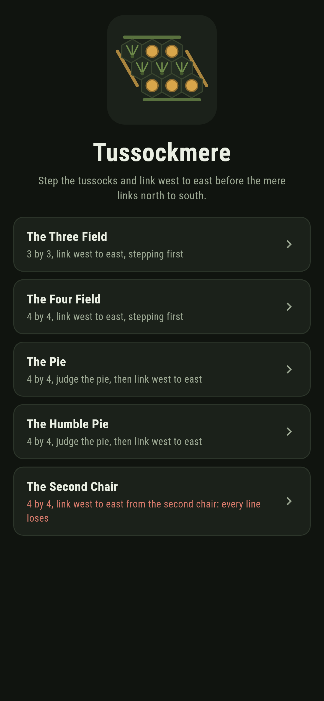
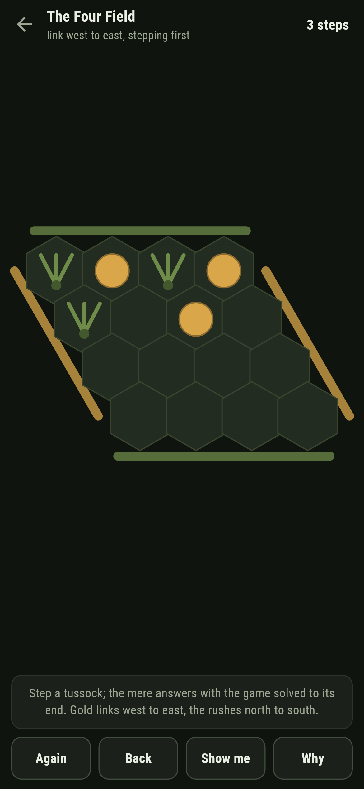
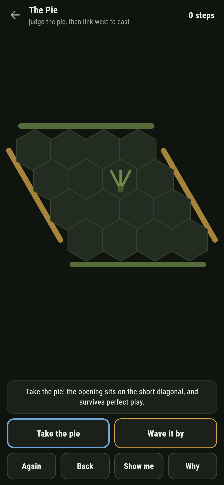
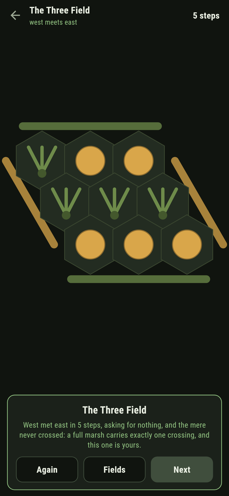
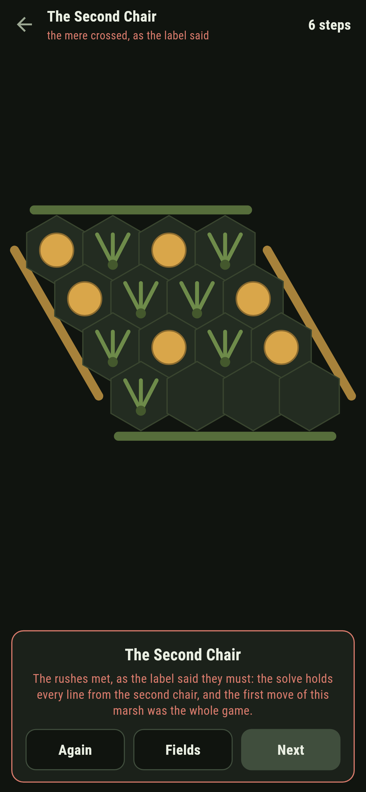
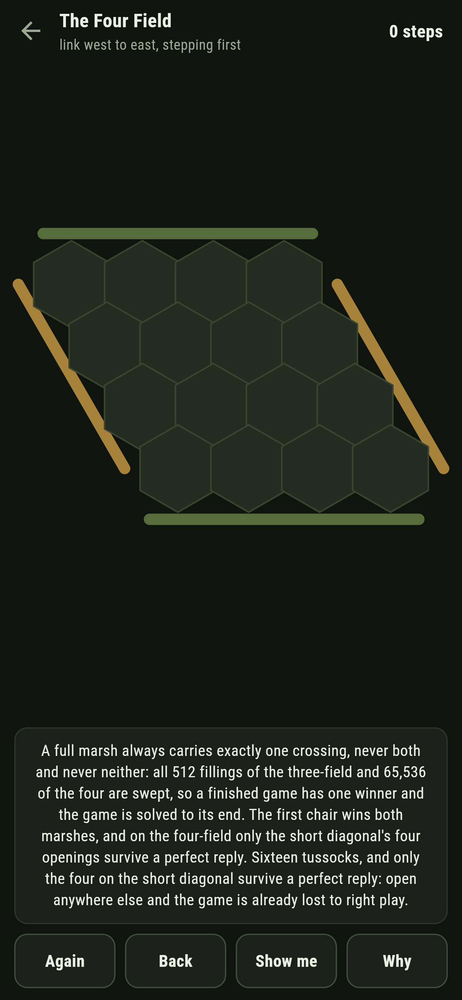

# Tussockmere

A connection game for phones, in Flutter, for Android and iOS.

The marsh is a rhombus of tussocks, every tussock touching six. You
step gold and link the west bank to the east; the mere grows rushes
and links north to south, playing the game solved to its very end.
This is Hex on a small board with its honest furniture: the no-draw
theorem swept filling by filling, the pie rule as a choice you must
actually judge, and a second chair that ships already lost.

| | | | |
|---|---|---|---|
|  |  |  |  |

## Two ways of knowing

The suite knows the marsh two ways that share nothing. The sweep
fills the board every way there is, all 512 fillings of the
three-field and 65,536 of the four, and finds exactly one crossing
in each: never both, never neither, so a finished game always has
its one winner. The solve plays the game itself to the end from
every reachable standing and knows nothing of fillings: the first
chair wins both marshes, and of the four-field's sixteen openings
exactly the four on the short diagonal survive a perfect reply.
Every claim below is one of the two speaking.

```
$ make fields
every filled marsh carries exactly one crossing, never both and never neither, all 512 fillings of the three-field and 65,536 of the four swept; the game is solved to its end, the first chair winning both marshes, and only the short diagonal of the four-field survives a perfect reply

 1 The Three Field   3 by 3  link west to east, stepping first: right play links the banks
 2 The Four Field    4 by 4  link west to east, stepping first: right play links the banks
 3 The Pie           4 by 4  judge the pie, then link west to east: right play links the banks
 4 The Humble Pie    4 by 4  judge the pie, then link west to east: right play links the banks
 5 The Second Chair  4 by 4  link west to east from the second chair: every line of yours loses
```

## The second chair

One field ships labelled hopeless in the house tradition of maps
nobody can win: the mere opens on the short diagonal, no pie is
offered, and you sit second. The solve holds every line from that
chair and each one loses; the first move of the marsh was the whole
game. The game says so on the way in, answers every step of yours
perfectly, and when the rushes meet, the card says exactly what the
label promised.



## The pie, judged for real

The pie rule is usually a sentence in a rulebook; here it is a
choice with a right answer the solve can name. On one field the mere
opens strong, on the short diagonal, and taking the pie is the only
road; on another it opens humble in a corner, and the pie is a trap
you should wave by. **Show me** judges the pie aloud and points the
step the solve keeps the win through, a step that hands the marsh
away is called out the moment it lands, and **Why** speaks the sweep
and the opening book over the field in front of you.



## Building

```
make deps      # fetch packages
make check     # analyze + every test
make fields    # sweep every filling and solve the game
make shots     # render the screenshots and redraw the icons
make apk       # Android release build
make ios       # iOS release build (unsigned)
```

The logo and every app icon are drawn by the game's own painter in
`test/mark_test.dart`. There is no image in this repository that was not
produced by code in it.

## How it is put together

```
lib/mere/rules.dart      the crossings, the sweep of every filling,
                         the solve and its book
lib/mere/field.dart      a field: its size, its opening, its pie
lib/mere/fields.dart     the five fields that ship
lib/mere/play.dart       a marsh being stepped: the pie, take-back
lib/ui/                  the painter, the screens, the mark
tool/check_fields.dart   the sweeps, the solves, and the ledger
                         above
```

The tests read crossings along rows, columns and the slant by hand,
sweep every filling of both marshes for the one crossing, solve both
games and pin the opening books, judge both pies through the play
itself, link every winnable field by following the solve through the
real buttons, watch a handing-away step get called out, watch the
second chair fall to every line, and hold the pictures against the
real widget tree. If any of that drifts, `make check` goes red
before anything leaves the machine.
