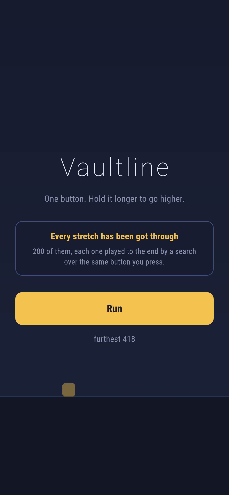
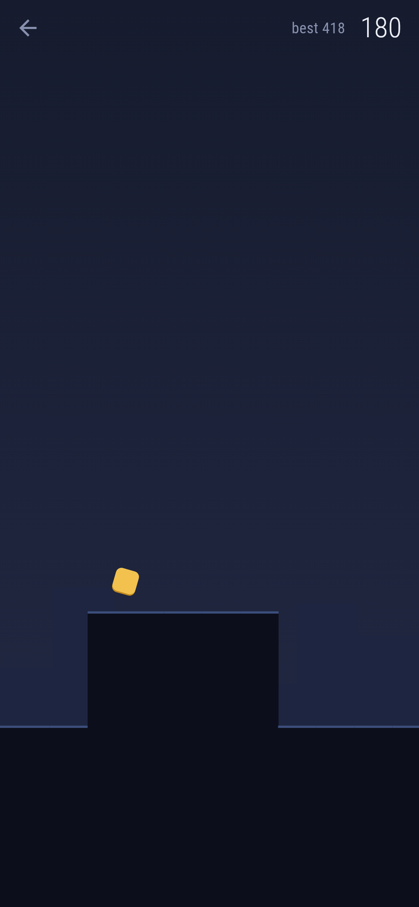
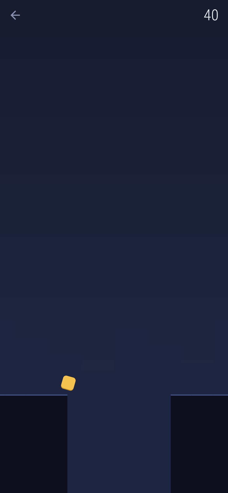
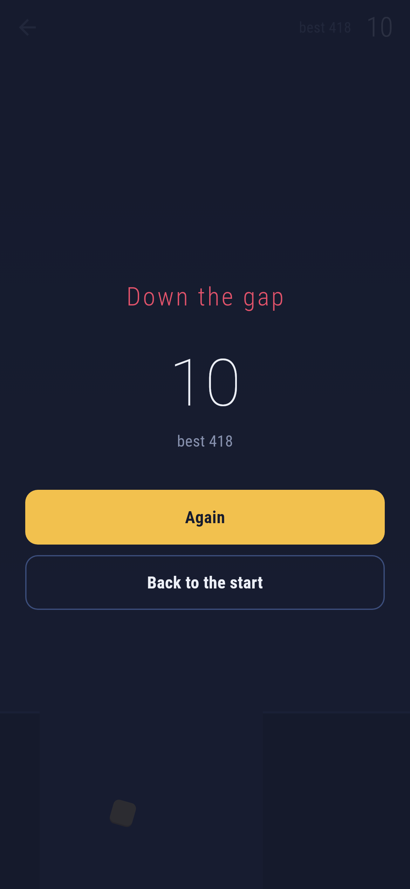

# Vaultline

A runner for phones, in Flutter, for Android and iOS.

You run forwards at a fixed pace and you have one button. Tap it and you hop;
hold it and you go higher. A tap clears a two tile gap and a full hold clears
four, so the same button asks a different question every time.

| | | | |
|---|---|---|---|
|  |  |  |  |

## Every stretch has been got through

The world is built out of 280 stretches, and each one was played to the end by
a search before it ever went in the list.

A generated stretch is a pile of numbers, and there is no looking at it and
knowing whether it is fair. The only honest question is whether somebody
pressing that one button at the right moments gets to the end, and the only
honest answer is to try. So `tool/build_stretches.dart` tries: at every step of
the simulation it takes both branches, held and not, and remembers where it has
been. What comes back is either the list of steps to hold on, which is a proof
because it can be replayed, or nothing, in which case the stretch is thrown
away and never reaches a player.

The proofs are kept beside the stretches in `lib/sim/stretches.dart`. The tests
replay every one of them. A proof nobody can replay is a claim.

**And they chain.** Each proof's goal is not "past the last tile" but
*standing on it*: a runner who leaves a stretch mid-jump arrives in the next
one somewhere its own proof knows nothing about. There is a test that plays a
whole endless run out of nothing but the stored proofs and gets past 700 tiles
without dying, which is what says that joining proved pieces really does give
a run that can be got through, rather than one that nearly can.

## The pace is 7.5 tiles a second, and that is arithmetic

At 120 steps a second, 7.5 tiles a second is exactly one sixteenth of a tile
per step. So a stretch laid at tile *t* has its proof's step *s* at the run's
step *s* + 16*t*, exactly.

With any other pace the runner enters each stretch at a slightly different
point within a tile, the presses that proved it land a fraction early or late,
and a tight jump that was *proved* becomes a jump that *usually works*. That is
not a promise worth making, so the pace was chosen to make the arithmetic come
out whole.

## How it is put together

`lib/sim/` is the game and knows nothing about screens.

- `ground.dart` is a stretch of world. Three kinds of tile and no fourth: flat,
  a pit, a spike, and a step up. A game whose obstacles are combinations of
  those is one a player understands in ten seconds and can be surprised by for
  an hour.
- `runner.dart` is the physics, a hundred and twentieth of a second at a time.
  No randomness anywhere.
- `passable.dart` is the search, and `playWith`, which replays a proof.
- `maker.dart` draws candidates and throws away the ones that cannot be got
  through, and the ones nobody has to jump on.
- `journey.dart` joins stretches end to end, getting harder the further the run
  goes.

`lib/ui/` draws it. Nothing is loaded: the ground is rectangles, the spikes are
triangles, the runner is a rounded square, and the logo and the app icon are
the same shapes again.

## Things worth knowing

**The button does nothing in the air.** Holding it does more than tapping it,
but pressing it again halfway up is not a second jump. That is what stops the
game being played by mashing, and it is why the search only branches on the
ground.

**A frame is not a step.** The runner advances a fixed step whatever the phone
manages to draw, and the leftover is kept between frames rather than rounded
away, because rounding it away is how a jump clears a gap on one phone and not
another. A frame catches up at most a tenth of a second, because a phone that
stalls and then runs a second of game in one frame is a death nobody saw.

**The title plays itself**, driven by the stored proofs, which is the same
trick the tests use. What is running behind the words is a real run that nothing is
faking.

**Thirteen tiles across, not four.** The first version sized a tile from the
screen's height and came out at four tiles visible, which is a runner that is
all reflex and no reading. It is measured from the width now, because how much
of what is coming you can see is a question about the width.

## Running it

```
make deps       # flutter pub get
make test       # everything
make analyze
make shots      # render the screens into build/showcase, redraw the logo
make stretches  # rebuild the world's pieces, playing each one to the end
make apk        # release APK
make ios        # release iOS build, unsigned
```

## Tests

`flutter test` runs the physics (falling in a pit, landing on a spike, hitting
a wall, a hold going higher than a tap, the button doing nothing in the air)
and then the search: that it gets through what can be got through, that it needs no
button on flat ground, that it says so when a gap is too wide, and that it
leaves the runner standing at the end. Then the maker's promises, replayed
through the rules rather than asked of the searcher again. Then every one of
the 280 shipped stretches, replayed. Then the endless run, played by the proofs.

Then the game through the screen on three phone sizes: running on its own,
the whole screen being the button, dying and being told what happened, and a
run held while the app is away.

Screenshots come from `test/showcase_test.dart`, the real widget tree at real
phone dimensions. The runs in them are real ones played by the stored proofs;
nothing is posed.

Pictures of the game on an actual phone need an actual phone. No emulator is
published for this machine's architecture and there is no CI here to borrow
one from, so `integration_test/screenshot_test.dart` is driven by hand on a
machine that has one. `.github/scripts/` holds the two scripts that do it.
