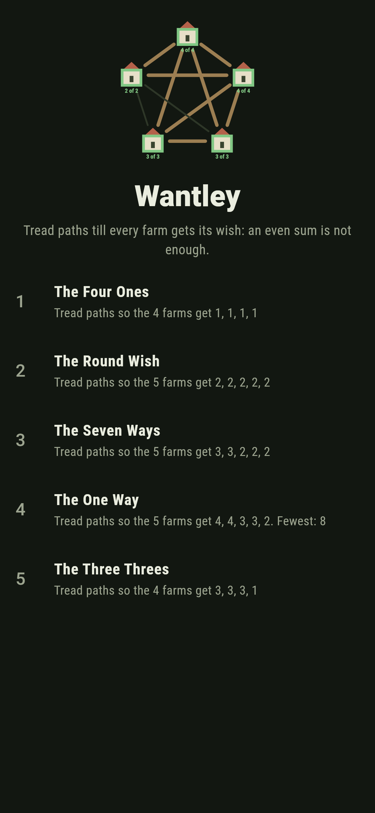
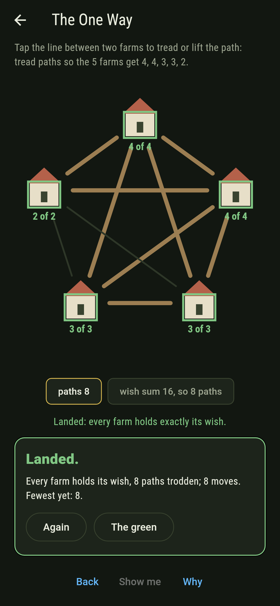
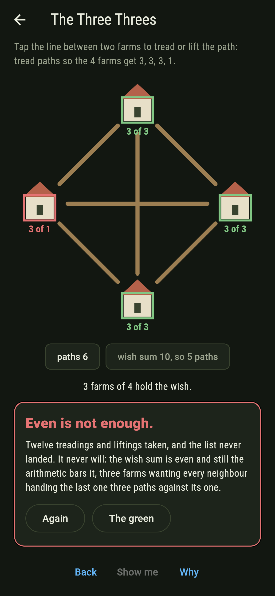
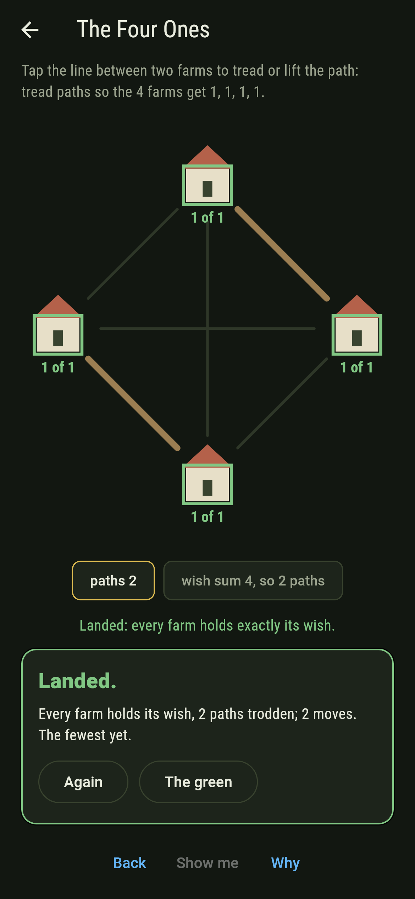
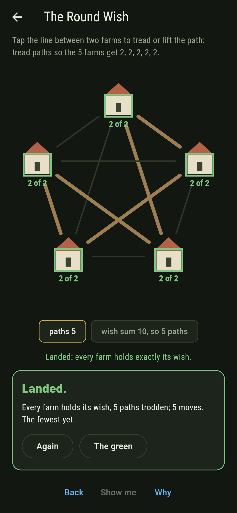
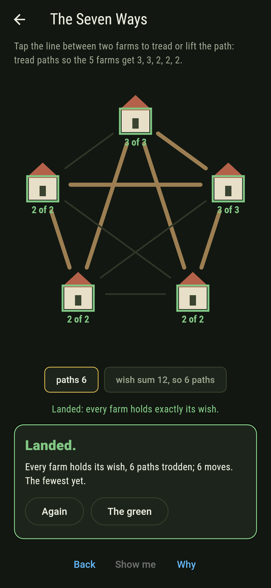
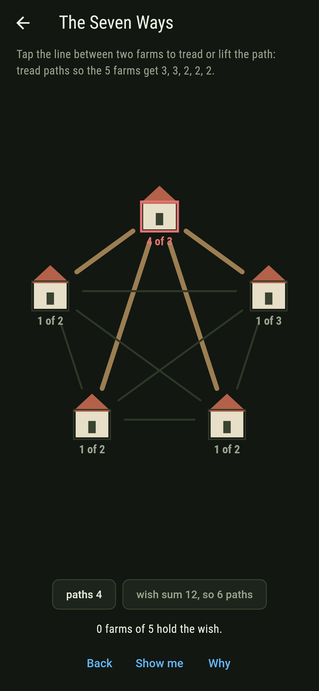
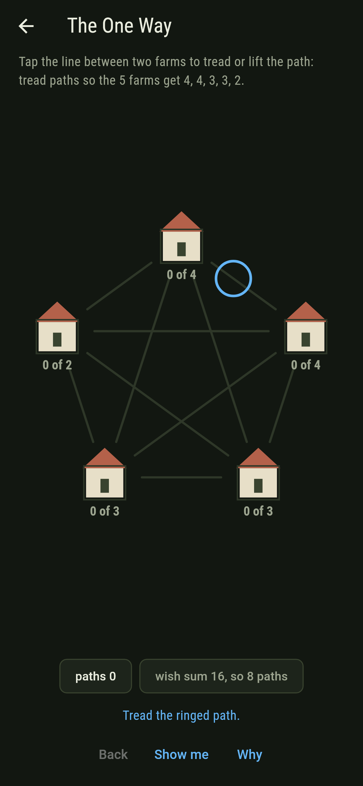
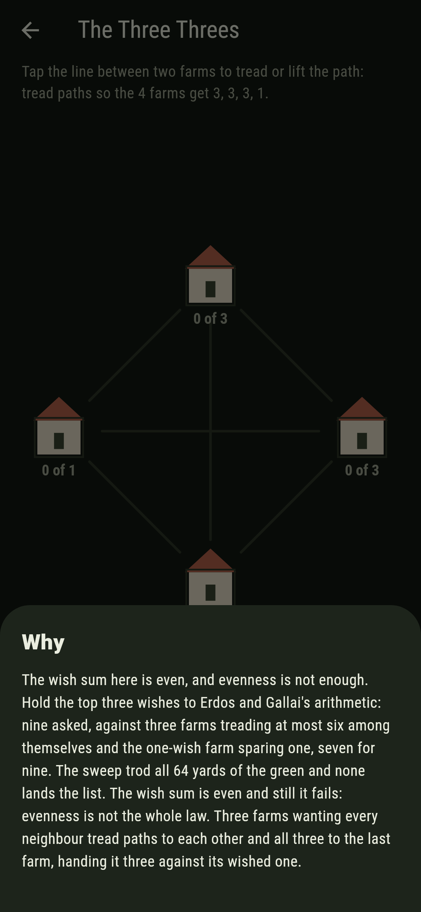

# Wantley


Farms round a green, each wishing for so many footpaths. Tread
and lift paths until every farm holds exactly its wish. Some
lists land many ways, one lands exactly one way, and one lands
never: its wish sum is even, and evenness turns out not to be
the whole law.

## The wish lists

1. **The Four Ones** - tread paths so the 4 farms get 1, 1, 1, 1
2. **The Round Wish** - tread paths so the 5 farms get 2, 2, 2, 2, 2
3. **The Seven Ways** - tread paths so the 5 farms get 3, 3, 2, 2, 2
4. **The One Way** - tread paths so the 5 farms get 4, 4, 3, 3, 2
5. **The Three Threes** - tread paths so the 4 farms get 3, 3, 3, 1

The Four Ones pair off three ways. Every landing of The Round
Wish is one ring through all five farms, and twelve is exactly
the count of rings on five. The One Way lands once and once
only, exactly the treading the biggest-wish-first deal builds.
The Three Threes is labeled hopeless on its tile: three farms
wanting every neighbour hand the last one three paths against
its wished one, and the why hands over the arithmetic.

## Three voices

The game never asserts what it has not computed, and it computes
everything at least twice, here three times:

* **The sweep** treads every yard of the green, 64 of four
  farms and 1,024 of five, and counts the landings of every
  wish list outright.
* **Erdos and Gallai's arithmetic** holds the top k wishes
  under k times k less one plus what the rest can spare, at
  every k, with the wish sum even: a verdict with no searching
  in it.
* **Havel and Hakimi's build** wires the biggest wish first
  and either lands or dies; its landing drives the show-me.

`tool/check_wishes.dart` holds all three together over every
wish list of four and five farms and refuses the bake on any
disagreement.

## The checker's ledger

What `dart run tool/check_wishes.dart` printed for the build
this README shipped with, word for word:

```
every treading of every green swept, 64 of four farms and 1,024 of five: the sweep, Erdos and Gallai's arithmetic and Havel and Hakimi's build agree on every wish list there is, every round-wish landing is one ring of all five, and the three threes fail with an even sum, since evenness is not the whole law

 1 The Four Ones      tread paths so the 4 farms get 1, 1, 1, 1: 3 treadings of the sweep land it
 2 The Round Wish     tread paths so the 5 farms get 2, 2, 2, 2, 2: 12 treadings of the sweep land it
 3 The Seven Ways     tread paths so the 5 farms get 3, 3, 2, 2, 2: 7 treadings of the sweep land it
 4 The One Way        tread paths so the 5 farms get 4, 4, 3, 3, 2: 1 treading of the sweep lands it
 5 The Three Threes   tread paths so the 4 farms get 3, 3, 3, 1: none of the 64, and the arithmetic said so first
```

## Screenshots

| The green | The one way | The three threes admitted |
| --- | --- | --- |
|  |  |  |

| The four ones | The round wish | The seven ways | Mid-tread | Show me | The why |
| --- | --- | --- | --- | --- | --- |
|  |  |  |  |  |  |

Screenshots are drawn by `test/showcase_test.dart` at real phone
sizes with the app's own painter, then copied into `docs/` as
they came out; every path in them was tapped, so nothing
pictured is a treading the game could not reach. The logo and
every launcher icon come out of `test/mark_test.dart` the same
way: the mark is the one way itself, every farm green with its
wish.

## Building

```
flutter test          # 45 tests, the sweep among them
dart run tool/check_wishes.dart
flutter build apk     # or: flutter build ios
```
