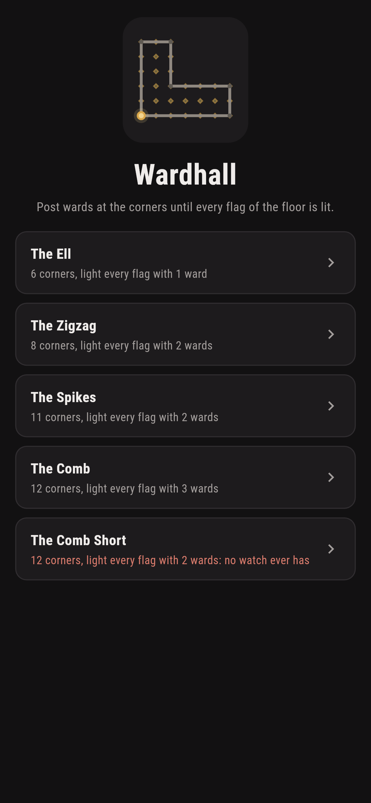
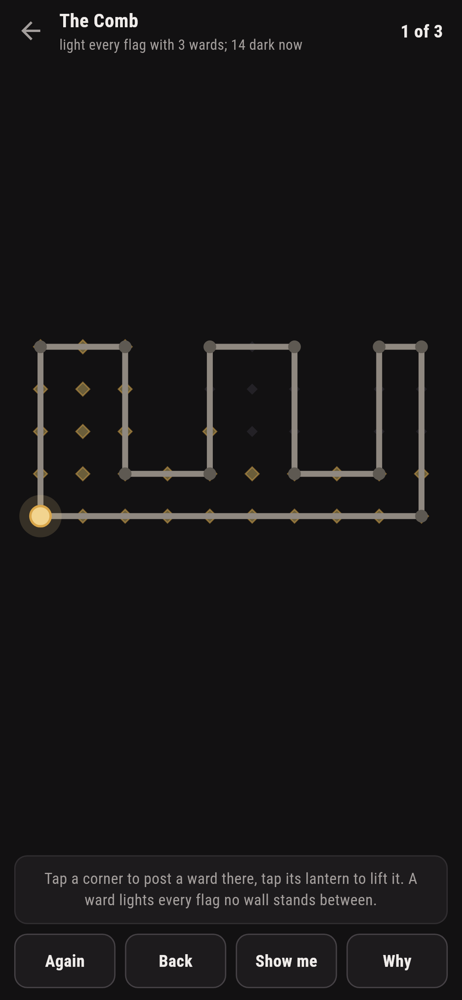
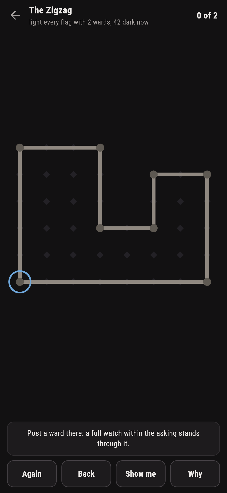
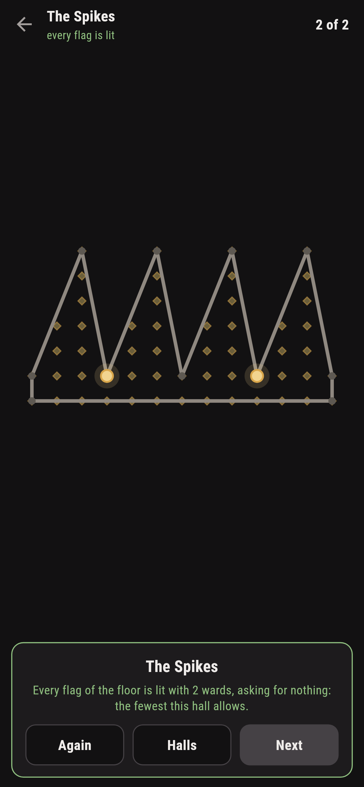
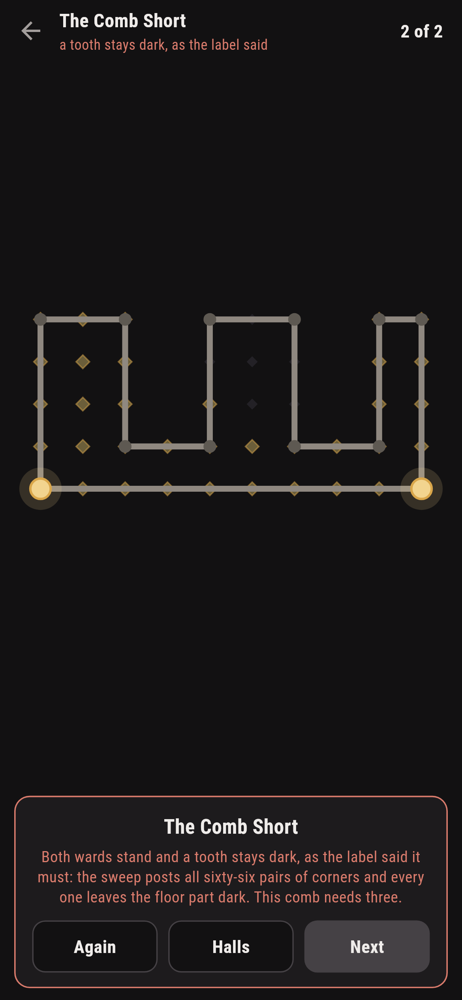
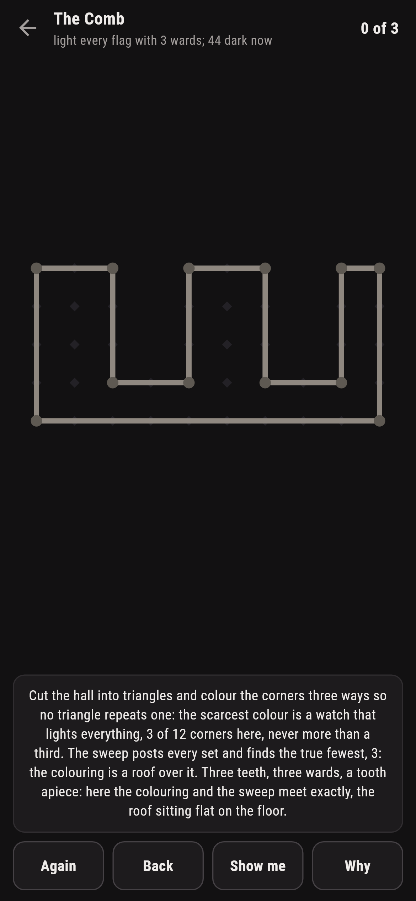

# Wardhall

A watching puzzle for phones, in Flutter, for Android and iOS.

A hall is a ring of corners and the walls between them, its floor
laid with flags. Post a ward at a corner and it lights every flag no
wall stands between; the task is the whole floor lit with the wards
allowed. This is the art gallery theorem walked by lantern light:
the three-colouring builds a working watch from the corners alone,
at most a third of them, and the sweep knows the true fewest, which
sometimes walks in under that roof.

| | | | |
|---|---|---|---|
|  |  |  |  |

## Two ways of knowing

The suite knows every hall two ways that share nothing. The
three-colouring cuts the hall into triangles by ear clipping,
colours the corners three ways so no triangle repeats one, and
posts the scarcest colour: a watch of at most a third of the
corners that lights the whole floor, built without counting a
single flag. The sweep posts every set of corners there is,
smallest first, and finds the true fewest. On the ell the colouring
posts two where the sweep needs one; on the comb the two meet
exactly, a ward a tooth.

```
$ make halls
the three-colouring cuts each hall into triangles, colours the corners so no triangle repeats one, and posts the scarcest colour: a watch of at most a third of the corners that lights the whole floor. The sweep posts every set of corners and finds the true fewest; the colouring is a roof, and on the comb the sweep walks under it

 1 The Ell         6 corners  light every flag with 1 ward: the sweep needs 1, the colouring posts 2
 2 The Zigzag      8 corners  light every flag with 2 wards: the sweep needs 2, the colouring posts 2
 3 The Spikes      11 corners  light every flag with 2 wards: the sweep needs 2, the colouring posts 3
 4 The Comb        12 corners  light every flag with 3 wards: the sweep needs 3, the colouring posts 3
 5 The Comb Short  12 corners  light every flag with 2 wards: the sweep needs 3, and every pair leaves the floor part dark
```

## The comb short

One hall ships labelled hopeless in the house tradition of maps
nobody can win: the three-toothed comb with two wards allowed. The
sweep posts all sixty-six pairs of corners and every one leaves a
tooth part dark; this comb needs a ward a tooth. The game says so
on the way in, lets both lanterns stand, and when the floor keeps
its dark flags the card says what the label promised.



## The floor that shows its dark

Nothing about the watching is folklore here. Every flag of the
floor is drawn lit or dark and moves the moment a lantern posts or
lifts, a full watch that leaves dark flags is told to lift and try
again, and **Why** speaks the triangles, the colours, and both
counts over the hall in front of you. **Show me** points a corner
that a full watch within the asking stands through, found by the
sweep itself.



## Building

```
make deps      # fetch packages
make check     # analyze + every test
make halls     # post every watch and hold the colouring to it
make shots     # render the screenshots and redraw the icons
make apk       # Android release build
make ios       # iOS release build (unsigned)
```

The logo and every app icon are drawn by the game's own painter in
`test/mark_test.dart`. There is no image in this repository that was not
produced by code in it.

## How it is put together

```
lib/hall/rules.dart      the sight lines, the floor, the sweep, the
                         ear clipping and the three colours
lib/hall/hall.dart       a hall: its corners and its asking
lib/hall/halls.dart      the five halls that ship
lib/hall/play.dart       a watch being posted: wards up and down,
                         take-back
lib/ui/                  the painter, the screens, the mark
tool/check_halls.dart    the proofs and the ledger above
```

The tests sight lines by hand around the ell's bend, sweep the
fewest on every hall, cut every hall into exactly its corners less
two triangles and watch no triangle repeat a colour, light every
hall with the colouring's own watch inside a third, light every
winnable hall by following the sweep through the real corners,
watch the comb short leave a tooth dark from every pair, and hold
the pictures against the real widget tree. If any of that drifts,
`make check` goes red before anything leaves the machine.
