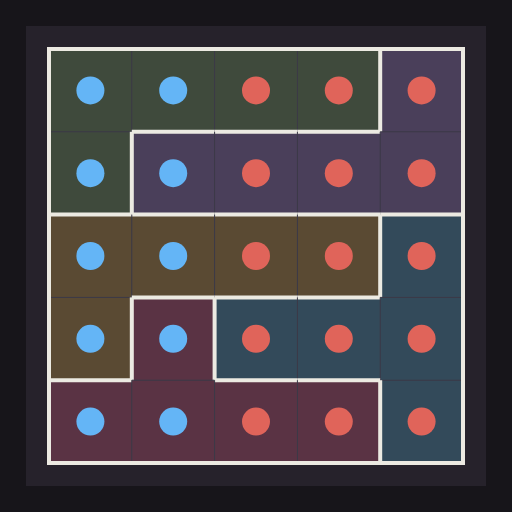
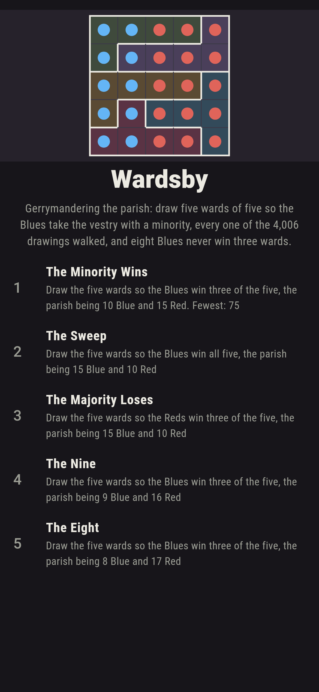
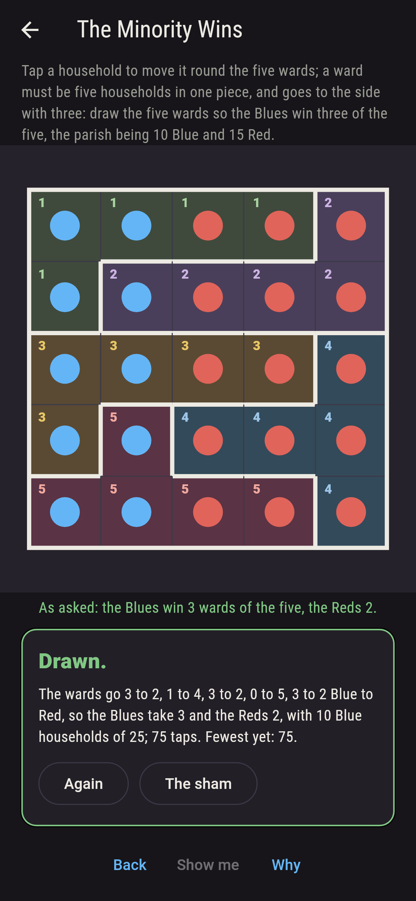
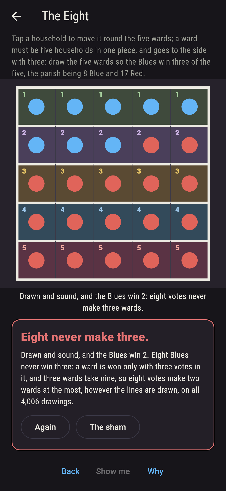
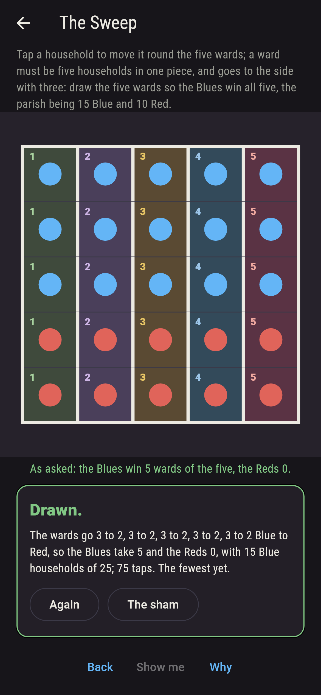
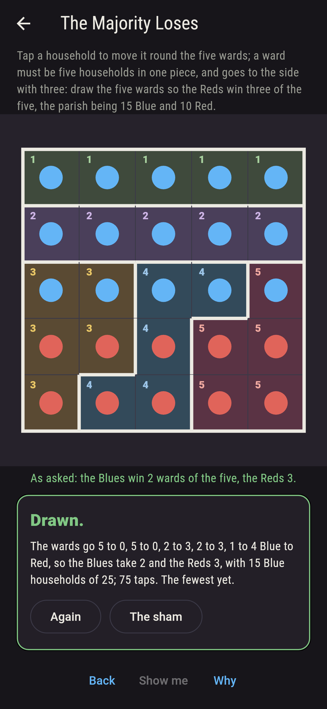
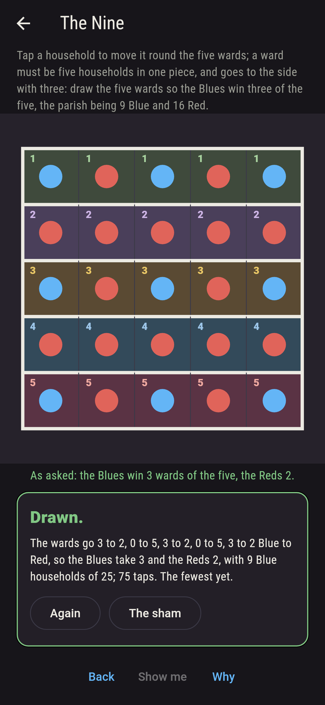
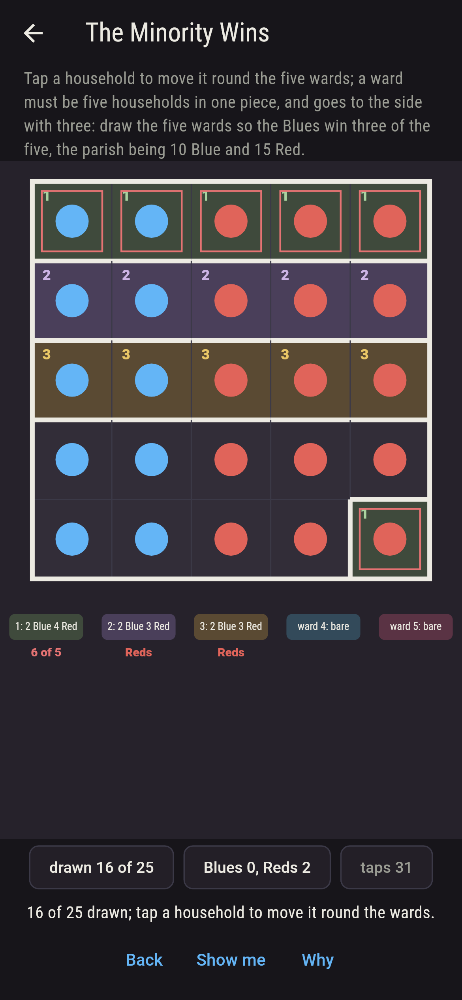
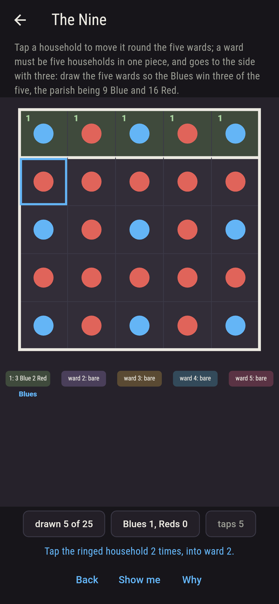
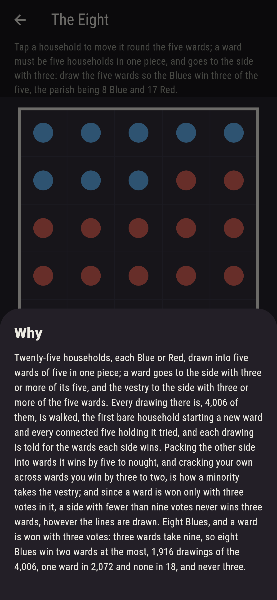

# Wardsby



Gerrymandering the parish. Twenty-five households on a five-by-five,
each Blue or Red, to be drawn into five wards of five households
each, every ward in one piece; a ward goes to the side with three
or more of its five, and the vestry to the side with three or more
of the five wards. Tap a household to move it round the wards.
Every drawing there is, 4,006 of them, is walked, the first bare
household starting a new ward and every connected five holding it
tried, and each drawing is told for the wards each side wins.
Packing the other side into wards it wins by five to nought, and
cracking your own across wards you win by three to two, is how a
minority takes the vestry: ten Blues in two columns take three
wards of five in 276 of the 4,006 drawings, and fifteen Blues in
three rows lose three wards to ten Reds in 276 more. And since a
ward is won only with three votes in it, a side with fewer than
nine votes never wins three wards, however the lines are drawn.

## The parishes

1. **The Minority Wins** - draw the five wards so the Blues win three of the five, the parish being 10 Blue and 15 Red
2. **The Sweep** - draw the five wards so the Blues win all five, the parish being 15 Blue and 10 Red
3. **The Majority Loses** - draw the five wards so the Reds win three of the five, the parish being 15 Blue and 10 Red
4. **The Nine** - draw the five wards so the Blues win three of the five, the parish being 9 Blue and 16 Red
5. **The Eight** - draw the five wards so the Blues win three of the five, the parish being 8 Blue and 17 Red

Ten Blues in the two left columns win three wards in 276 drawings,
232 of them with three, three and four Blues in the won wards and
the Reds packed into two wards of their own; fifteen Blues in the
top three rows win all five in one drawing only, the columns, and
lose three to the Reds in 276; nine Blues on the odd squares of the
odd rows win three wards in ten drawings, three Blues to each; and
eight Blues win two wards in 1,916 drawings and three in none. The
Eight is labeled hopeless on its tile, and the three votes a ward
takes are the why.

## Two voices

The game never asserts what it has not computed, and it computes
everything at least twice:

* **The walk** finds every drawing of the parish into five wards of
  five in one piece, 4,006 of them, each checked sound and none
  twice, the set the same turned a quarter, and tells every one for
  the wards each side wins; every count on the sham is the walk's.
* **The three votes** walk nothing: a ward is won only with three
  votes in it, so a side with v votes wins at most a third of v
  wards, and every drawing of every parish on the sham is held to
  that ceiling, which is what makes eight Blues hopeless.

`tool/check_wards.dart` runs the lot and refuses the bake on any
disagreement.

## The checker's ledger

What `dart run tool/check_wards.dart` printed for the build this
README shipped with, word for word:

```
every drawing of the five-by-five parish into five wards of five in one piece walked, 4,006 drawings, each sound and none twice, the set the same turned a quarter, and every one told for the wards each side wins, three votes to a ward: ten Blues in the two left columns win three wards in 276 drawings, two in 3,033, one in 696 and none in one, the columns; fifteen Blues in the top three rows win all five in one drawing, the columns, four in 696, three in 3,033 and two in 276, so the Reds take three wards in 276; nine Blues on the odd squares of the odd rows win three wards in 10 drawings, every one three Blues to each won ward; eight Blues win two wards in 1,916 drawings, one in 2,072, none in 18 and three never, since three wards take nine votes; and no drawing of any parish gives a side more wards than a third of its votes

 1 The Minority Wins  draw the five wards so the Blues win three of the five, the parish being 10 Blue and 15 Red: 276 of the 4,006 drawings land it
 2 The Sweep          draw the five wards so the Blues win all five, the parish being 15 Blue and 10 Red: 1 of the 4,006 drawings lands it
 3 The Majority Loses draw the five wards so the Reds win three of the five, the parish being 15 Blue and 10 Red: 276 of the 4,006 drawings land it
 4 The Nine           draw the five wards so the Blues win three of the five, the parish being 9 Blue and 16 Red: 10 of the 4,006 drawings land it
 5 The Eight          draw the five wards so the Blues win three of the five, the parish being 8 Blue and 17 Red: none of the 4,006, and the three votes said so first
```

## Screenshots

| The sham | The minority wins | The eight admitted |
| --- | --- | --- |
|  |  |  |

| The sweep | The majority loses | The nine | Mid-drawing | Show me | The why |
| --- | --- | --- | --- | --- | --- |
|  |  |  |  |  |  |

Screenshots are drawn by `test/showcase_test.dart` at real phone
sizes with the app's own painter, then copied into `docs/` as they
came out; every household in them was drawn by taps, so nothing
pictured is a parish the game could not reach. The logo and every
launcher icon come out of `test/mark_test.dart` the same way: the
mark is the packed ten drawn to win three wards.

## Building

```
flutter test          # 46 tests, the walk among them
dart run tool/check_wards.dart
flutter build apk     # or: flutter build ios
```
