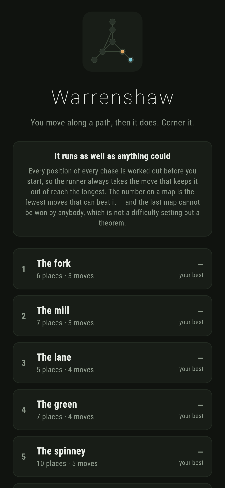
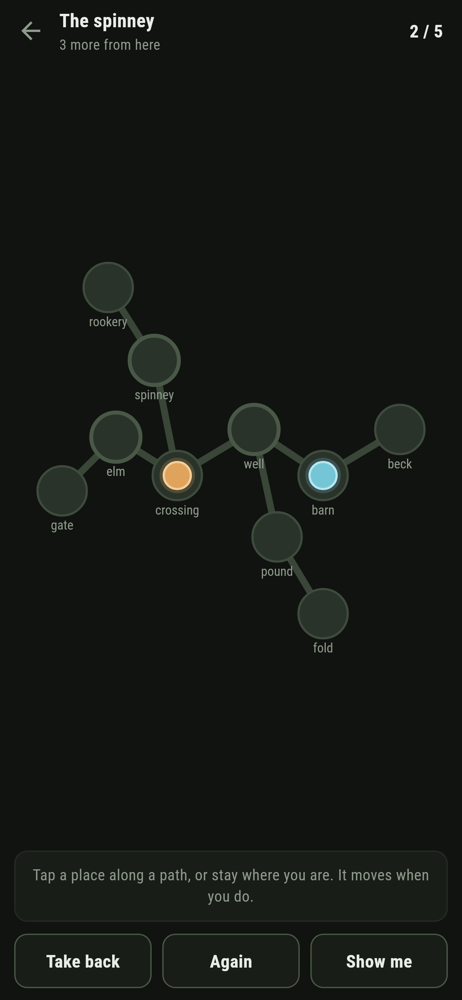
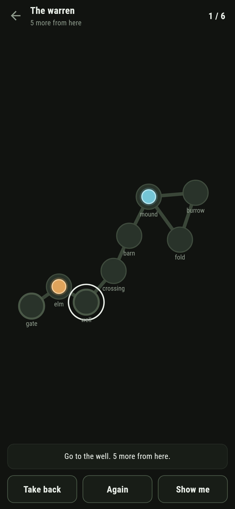
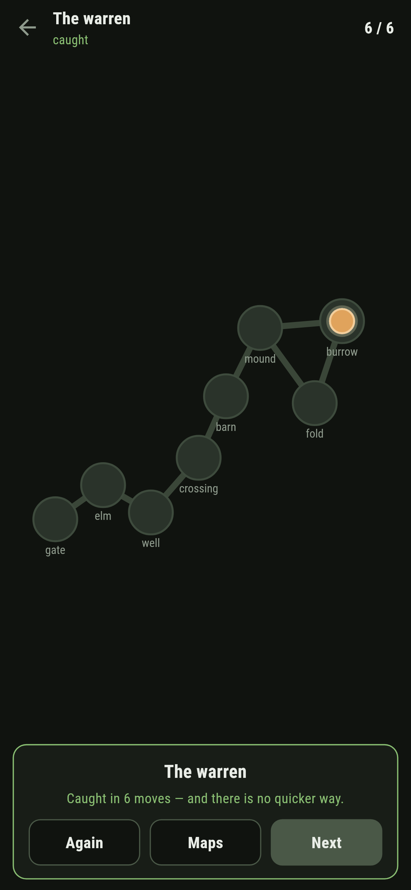
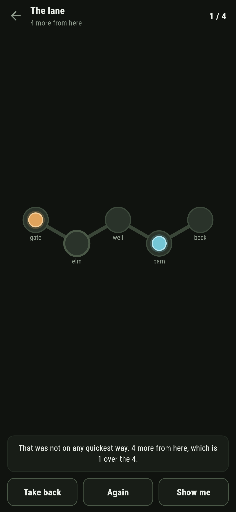
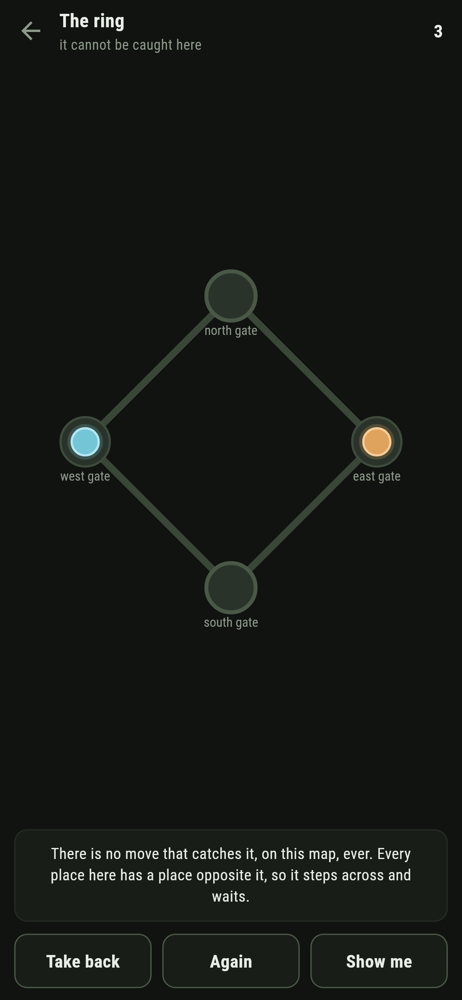

# Warrenshaw

A chase for phones, in Flutter, for Android and iOS.

You move along a path, then it does. Corner it. The number on each map is the
fewest moves that can beat a runner playing as well as anything could — and
the last map cannot be won by anybody, which is a theorem rather than a
difficulty setting.

| | | | |
|---|---|---|---|
|  |  |  |  |

## The chase is over before it starts

A position is where the seeker is, where the runner is, and whose turn it is.
On maps this size that is a few hundred of them, so there is no reason to
search anything while somebody is playing: every position is settled when the
map opens, and the game reads.

It is settled backwards. Everything starts at *never*, and a position only
ever comes down — a seeker's turn takes the best of what it can reach, a
runner's turn takes the worst — until nothing changes. A position still at
*never* when that stops is one the runner really does get away with: if there
were a way to catch it, that way would have brought it down.

So the runner is not an opponent that was written, it is the table read the
other way up. There is no luck in this game and no bad day. A chase lost is a
chase that was lost by a move, and the game will tell you which one:



> That was not on any quickest way. 4 more from here, which is 1 over the 4.

## The old theorem, and the table, and they agree

There is another way to answer "can the seeker win this map?", and it never
looks at a single move.

Call a place **covered** when everywhere you could go from it, you could also
go from some one neighbour — its own place included. Standing on a covered
place is worth nothing to a runner: whatever it could do from there it could
do from the place that covers it, and the seeker is no nearer. So rub covered
places off the map. Keep rubbing. **If the map comes down to a single place
the seeker wins; if it sticks with several and none of them covered, the
runner gets away for ever.**

That is Quilliot, and Nowakowski and Winkler, in the early eighties. It has
nothing in common with the table but the answer, so the two are held against
each other — on every map that ships, and on three hundred made up at random:

```dart
expect(Dismantle.comesApart(chart), table.isSeekerWin, reason: 'disagreed on $paths');
```

```
$ make agree ARGS="400 8"
400 maps of 8 places
  the seeker wins 136 of them
  the longest chase was 6 moves
  the theorem and the table disagreed 0 times
```

The sample has to have both answers in it or the test proves nothing, so it
insists on at least twenty of each.

## One map nobody can win



The last one is four gates in a ring. Whatever the seeker does, the runner
steps to the far side and waits — and no amount of playing would ever tell you
whether that is a fact or a failure of imagination. Taking the map apart tells
you: nothing on a ring of four covers anything else, so it does not come
apart, so there is no winning it. Ever. By anybody.

It ships with **no par**, it is labelled on the list as unwinnable before you
open it, and asking for a hint gets the reason rather than a move.

## Running it

```
make deps    # flutter pub get
make test    # everything
make analyze
make shots   # render the screens into build/showcase, redraw the logo and icons
make maps    # walk every shipped map: winnable, par, and what taking it apart says
make agree   # hold the theorem against the table on maps made up at random
make apk     # release APK
make ios     # release iOS build, unsigned
```

## Tests

`flutter test` runs the maps (paths both ways round, every place next to
itself, whether the map is one piece), the table (a lane where the runner
backs away until it runs out, a ring of four where it never runs out at all,
that the best move really does leave exactly one fewer to go, and that nothing
beats it), the theorem against the table on every shipped map and three
hundred random ones, every map (one piece, the par it says, and the
unwinnable one claiming nothing), and the playing (moving along a path,
refusing anything that is not one, the runner answering at once, a move that
wastes time saying so, and taking one back).

Then the game through the screen: tapping a place, being refused one, the
warning that a move went off the quickest way, **Take back**, **Again**,
**Show me** naming a place — and on the unwinnable map, saying why there is
none — and every map that can be won being won in its par.

Screenshots come from `test/showcase_test.dart`, and every move in them was
made by tapping a place. `test/mark_test.dart` draws the logo, the launcher
icons at every density Android asks for and every size the iOS icon set asks
for; there is no image in this repository that was not produced by it.
