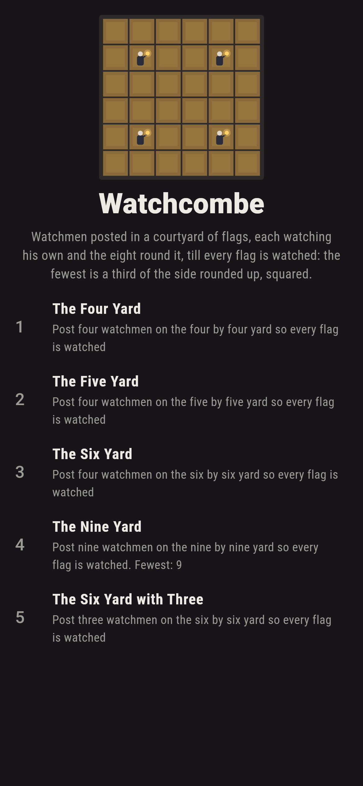
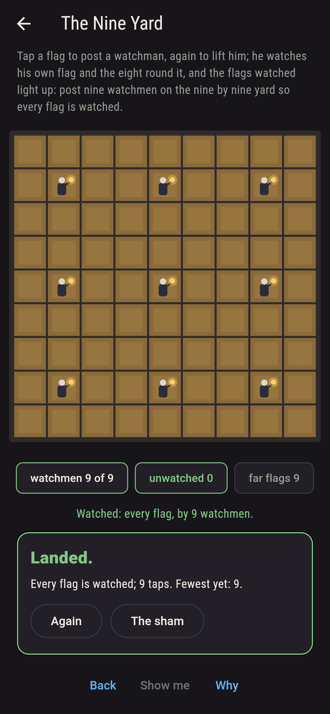
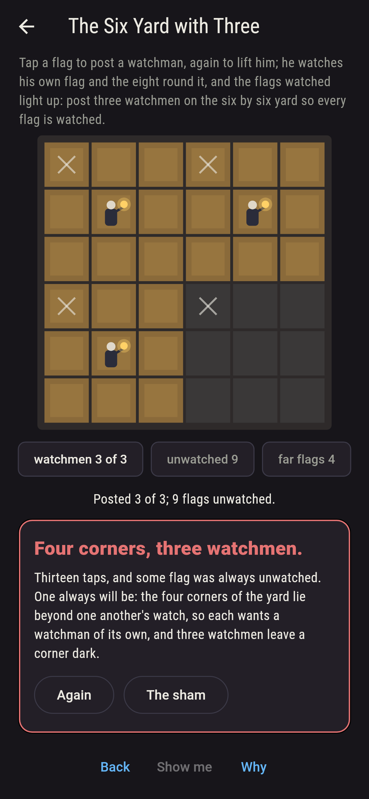
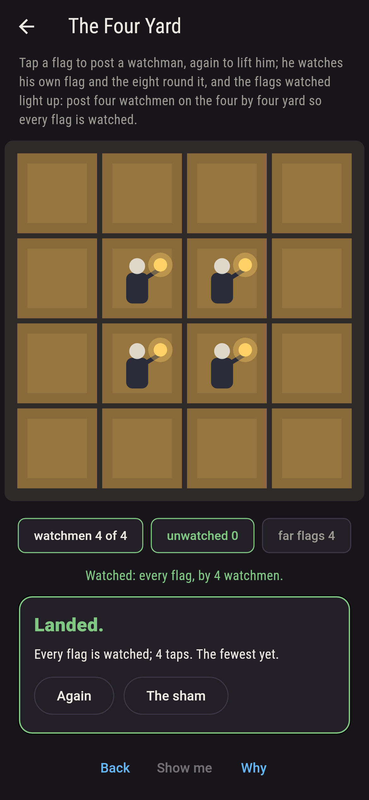
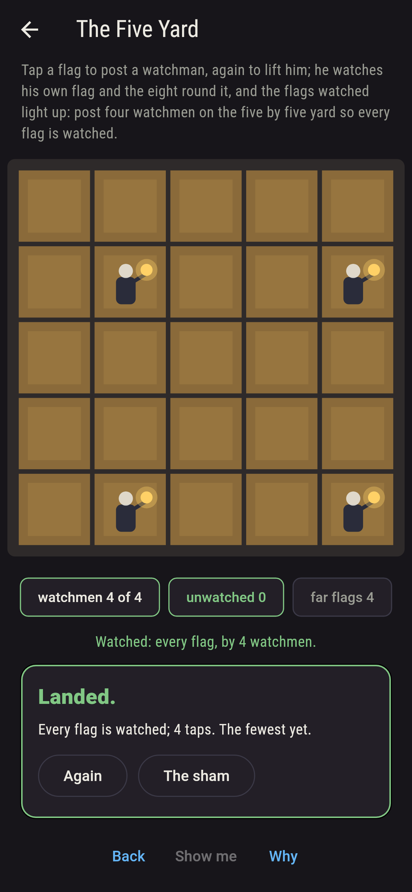
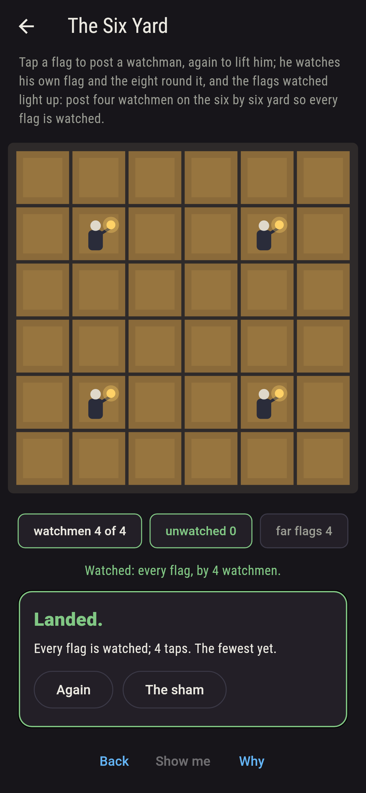
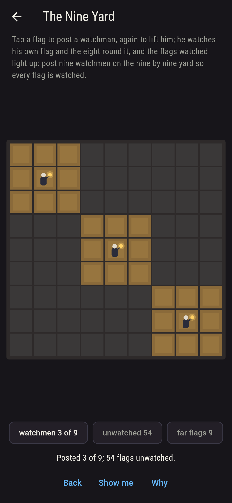
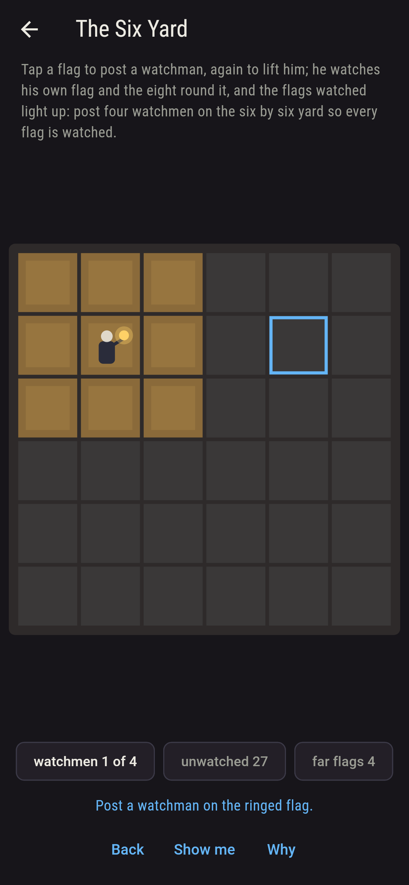
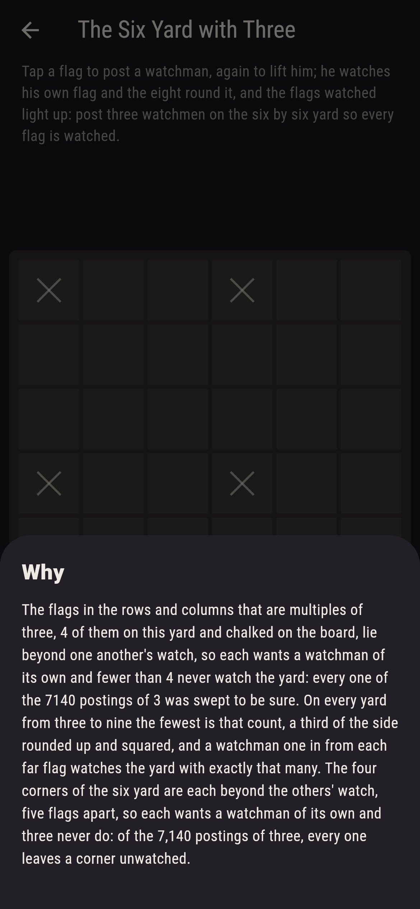

# Watchcombe


Watchmen posted in a courtyard of flags by night, each watching his
own flag and the eight round it, and every flag to be watched. Tap a
flag to post a watchman, again to lift him, and the flags watched
light up. The fewest that will do is a third of the side rounded
up, squared: the flags in the rows and columns that are multiples
of three lie beyond one another's watch, so each wants a watchman
of its own, and a watchman one in from each of them watches the
whole yard with exactly that many. Every posting is swept on the
small yards and walked on all, and on every yard from three to
nine the walk, the far flags and the posting agree; the six yard
is watched by four one way only, one in from each corner, and the
nine yard by nine one way only.

## The yards

1. **The Four Yard** - post four watchmen on the four by four yard so every flag is watched
2. **The Five Yard** - post four watchmen on the five by five yard so every flag is watched
3. **The Six Yard** - post four watchmen on the six by six yard so every flag is watched
4. **The Nine Yard** - post nine watchmen on the nine by nine yard so every flag is watched
5. **The Six Yard with Three** - post three watchmen on the six by six yard so every flag is watched

The four yard is watched by four 256 ways of 1,820, one watchman
to each corner's quarter and any of its four flags will serve; the
five by four 79 ways of 12,650; the six by four one way alone of
58,905; the nine by nine one way alone of 260,887,834,350. The Six
Yard with Three is labeled hopeless on its tile, its far flags are
chalked, and the why counts the corners.

## Two voices

The game never asserts what it has not computed, and it computes
everything at least twice:

* **The walk** posts a watchman on some flag that watches the first
  unwatched flag, again and again, barring the candidates passed
  over so no posting is told twice, and counts the postings that
  watch the whole yard; on the four, five and six yards every
  posting is also held up one by one, 80,515 of them, and the two
  agree. Every count on the sham is the walk's.
* **The far flags** need no walk: the flags in the rows and columns
  that are multiples of three are checked to lie beyond one
  another's watch, so the fewest is at least their count, a third
  of the side rounded up and squared; the posting one in from each
  is checked to watch the whole yard with exactly that many; and
  the walk is held to find no posting of one fewer, on every yard
  from three to nine.

`tool/check_postings.dart` runs the lot and refuses the bake on any
disagreement.

## The checker's ledger

What `dart run tool/check_postings.dart` printed for the build this
README shipped with, word for word:

```
every posting of the watchmen swept whole on the four, five and six yards, 80,515 postings held up one by one, and every yard walked from the first unwatched flag, the sweep and the walk agreeing wherever both ran; on every yard from three to nine the flags in the rows and columns that are multiples of three lie beyond one another's watch, 40 far flags on the seven yards, so the fewest watchmen is at least their count, a third of the side rounded up and squared, and a watchman one in from each of them watches the yard with exactly that many, one fewer never watching it; the four yard is watched by four 256 ways of 1,820, the five by four 79 ways of 12,650, the six by four 1 way of 58,905, the nine by nine 1 way of 260,887,834,350, and the six by three never

 1 The Four Yard           post four watchmen on the four by four yard so every flag is watched: 256 of the 1,820 postings watch it
 2 The Five Yard           post four watchmen on the five by five yard so every flag is watched: 79 of the 12,650 postings watch it
 3 The Six Yard            post four watchmen on the six by six yard so every flag is watched: 1 of the 58,905 postings watches it
 4 The Nine Yard           post nine watchmen on the nine by nine yard so every flag is watched: 1 of the 260,887,834,350 postings watches it
 5 The Six Yard with Three post three watchmen on the six by six yard so every flag is watched: none of the 7,140, and the far flags said so first
```

## Screenshots

| The sham | The nine yard watched | Three watchmen admitted |
| --- | --- | --- |
|  |  |  |

| The four yard | The five yard | The six yard | Mid-posting | Show me | The why |
| --- | --- | --- | --- | --- | --- |
|  |  |  |  |  |  |

Screenshots are drawn by `test/showcase_test.dart` at real phone
sizes with the app's own painter, then copied into `docs/` as they
came out; every watchman in them was posted by a tap, so nothing
pictured is a yard the game could not reach. The logo and every
launcher icon come out of `test/mark_test.dart` the same way: the
mark is the six yard watched, four watchmen one in from each corner.

## Building

```
flutter test          # 43 tests, the walk among them
dart run tool/check_postings.dart
flutter build apk     # or: flutter build ios
```
