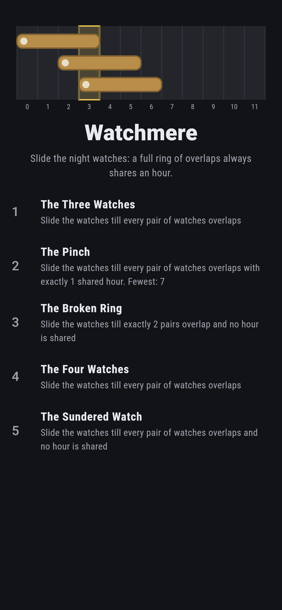
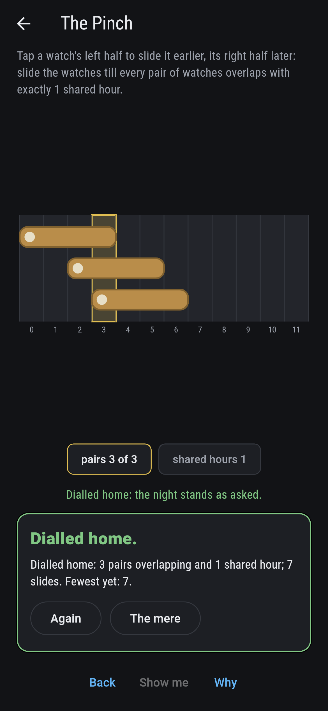
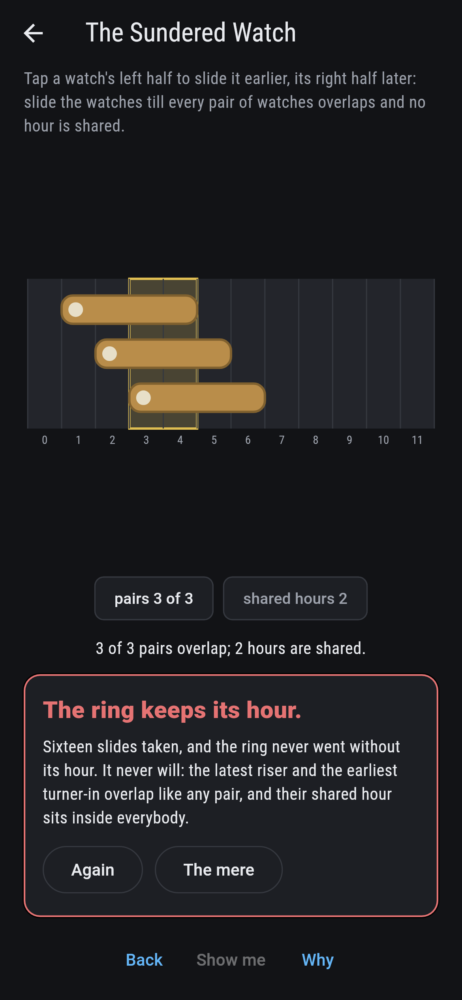
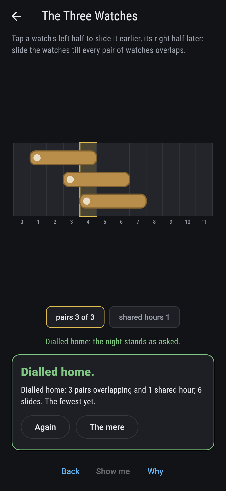
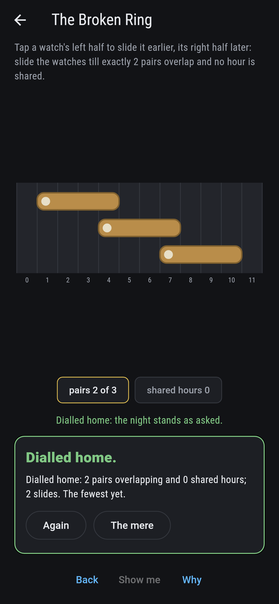
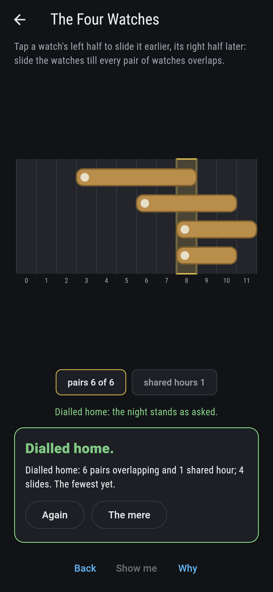
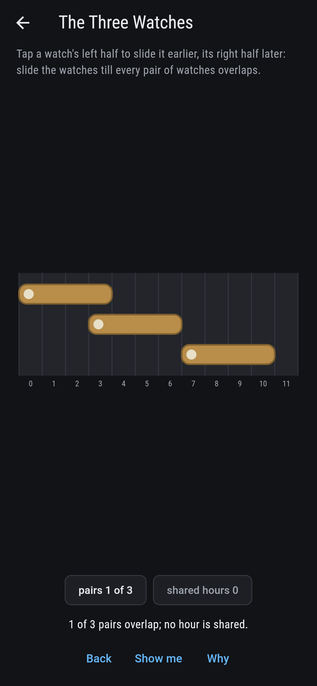
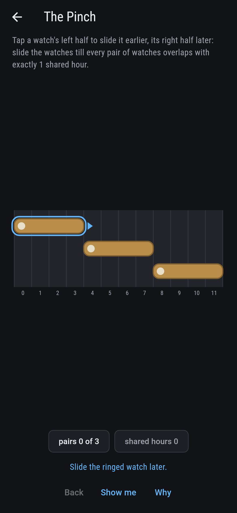
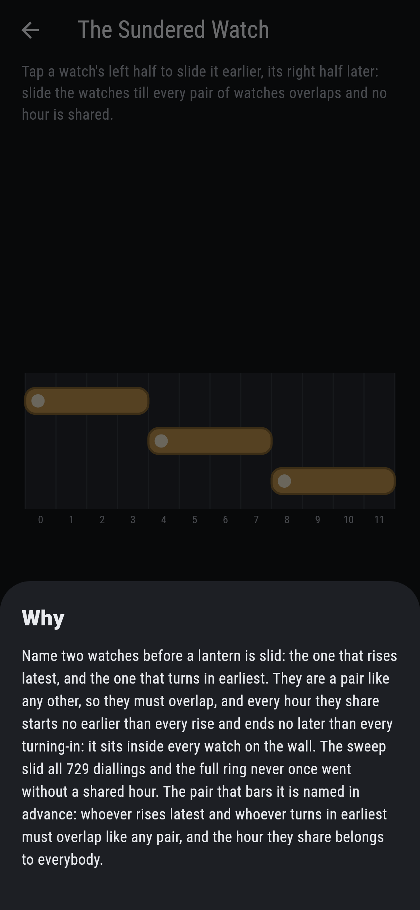

# Watchmere


Twelve hours on the mere wall and night watches slid along
them. Two watches overlap when they share an hour, and Helly's
law on a line says that when every pair overlaps, some hour
sits inside every watch at once. The pair that proves it is
named in advance: whoever rises latest and whoever turns in
earliest must overlap like any pair, and the hour they share
serves everybody.

## The meres

1. **The Three Watches** - slide till every pair overlaps
2. **The Pinch** - every pair overlapping, exactly one shared hour
3. **The Broken Ring** - exactly two pairs overlapping, no shared hour
4. **The Four Watches** - four watches, every pair overlapping
5. **The Sundered Watch** - every pair overlapping, no shared hour

A shared hour comes free with the full ring, 249 diallings of
the three watches and 1,206 of the four. The Pinch narrows the
night to a single gold hour, 108 ways. The Broken Ring shows
the other side: drop one pair and the shared hour goes with it,
156 ways. The Sundered Watch is labeled hopeless on its tile,
and the why names the pair that bars it.

## Two voices

The game never asserts what it has not computed, and it computes
everything at least twice:

* **The pair census** checks every two watches for an hour in
  both, and the wall washes the shared hours gold as the
  lanterns slide.
* **The arithmetic** takes the latest rise and the earliest
  turning-in with no searching at all. The sweep slides all
  729 diallings of the three watches and all 5,040 of the
  four, and the two readings never part.

`tool/check_watches.dart` runs the lot and refuses the bake on
any disagreement.

## The checker's ledger

What `dart run tool/check_watches.dart` printed for the build
this README shipped with, word for word:

```
every dialling of every mere slid, 729 of the three watches and 5,040 of the four: whenever every pair overlaps some hour sits inside them all, on every single dialling, while two overlaps of three go without a shared hour 156 ways, and the full ring without one goes nought ways at all

 1 The Three Watches  slide the watches till every pair of watches overlaps: 249 diallings of the sweep land it
 2 The Pinch          slide the watches till every pair of watches overlaps with exactly 1 shared hour: 108 diallings of the sweep land it
 3 The Broken Ring    slide the watches till exactly 2 pairs overlap and no hour is shared: 156 diallings of the sweep land it
 4 The Four Watches   slide the watches till every pair of watches overlaps: 1206 diallings of the sweep land it
 5 The Sundered Watch slide the watches till every pair of watches overlaps and no hour is shared: none of the 729, and the named pair said so first
```

## Screenshots

| The wall | The pinch | The sundered watch admitted |
| --- | --- | --- |
|  |  |  |

| The three watches | The broken ring | The four watches | Mid-slide | Show me | The why |
| --- | --- | --- | --- | --- | --- |
|  |  |  |  |  |  |

Screenshots are drawn by `test/showcase_test.dart` at real phone
sizes with the app's own painter, then copied into `docs/` as
they came out; every slide in them was tapped, so nothing
pictured is a dialling the game could not reach. The logo and
every launcher icon come out of `test/mark_test.dart` the same
way: the mark is the pinch itself, three watches meeting in a
single gold hour.

## Building

```
flutter test          # 44 tests, the sweep among them
dart run tool/check_watches.dart
flutter build apk     # or: flutter build ios
```
