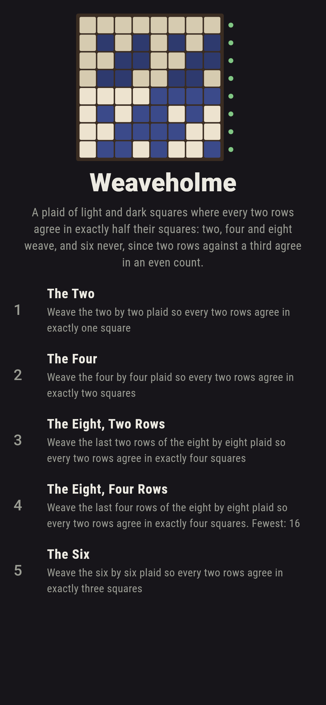
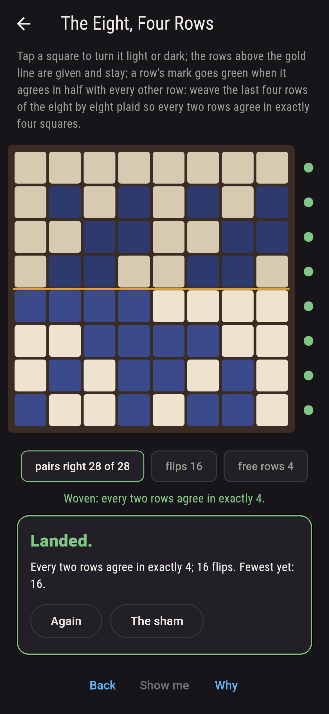
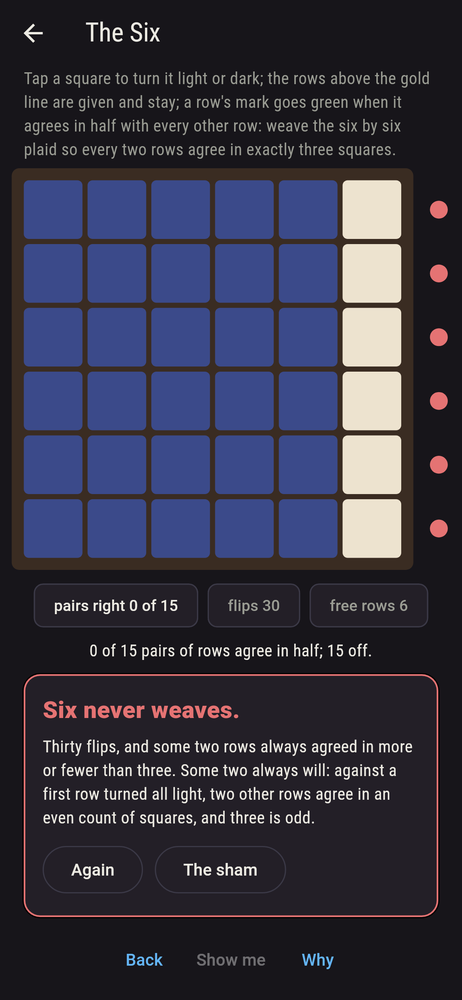
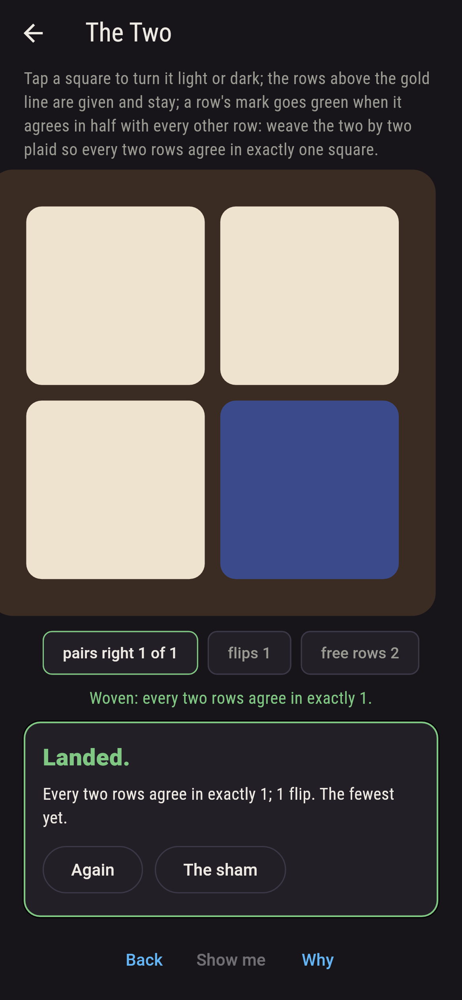
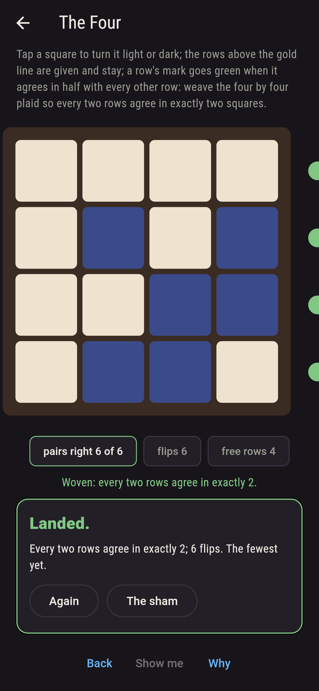
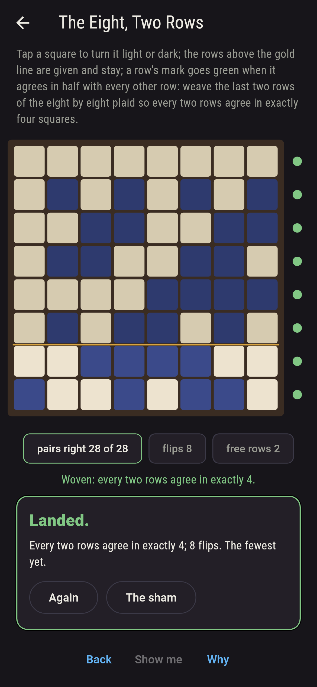
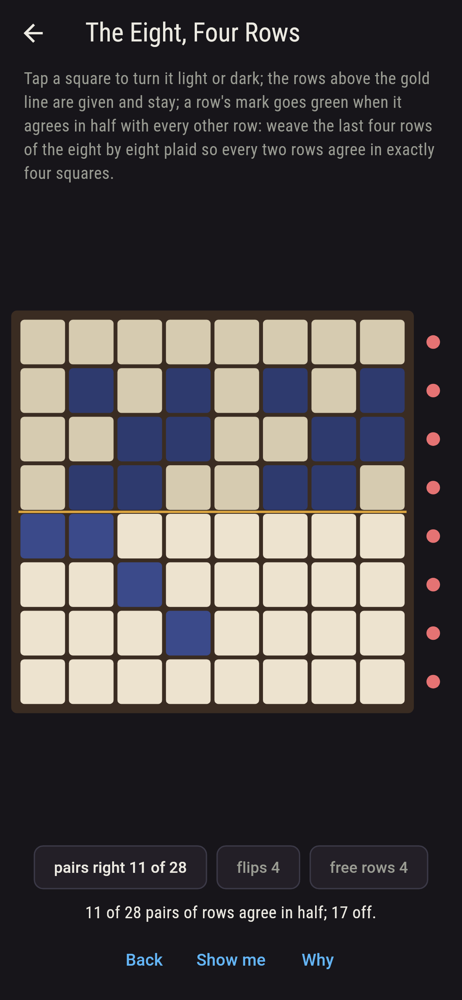
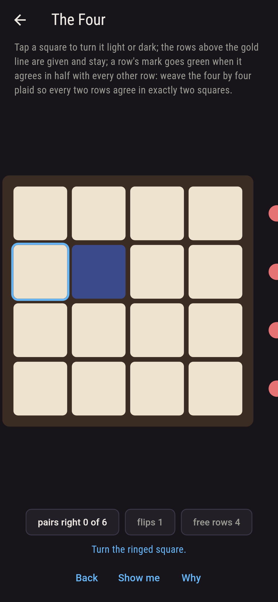
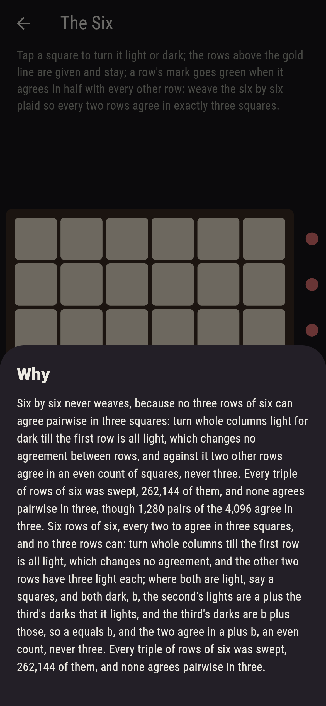

# Weaveholme


A plaid of light and dark squares on the loom, and one rule: every
two rows are to agree in exactly half their squares. Tap a square to
turn it, and a row's mark goes green when it agrees in half with
every other row. Two by two weaves, eight ways of sixteen; four by
four weaves, 768 ways of 65,536; eight by eight weaves, and
Sylvester showed how, the four laid out four times with the last
quarter turned light for dark; and six by six never weaves, since no
three rows of six can agree pairwise in three squares: turn whole
columns till the first row is all light, which changes no
agreement, and against it two other rows agree in an even count.
The game sweeps every filling of the two and the four, walks the
eight row by row over Sylvester's rows, and sweeps every triple of
rows of six.

## The plaids

1. **The Two** - weave the two by two plaid so every two rows agree in exactly one square
2. **The Four** - weave the four by four plaid so every two rows agree in exactly two squares
3. **The Eight, Two Rows** - weave the last two rows of the eight by eight plaid so every two rows agree in exactly four squares
4. **The Eight, Four Rows** - weave the last four rows of the eight by eight plaid so every two rows agree in exactly four squares
5. **The Six** - weave the six by six plaid so every two rows agree in exactly three squares

The two weaves eight ways of sixteen and the four 768 of 65,536;
over six of Sylvester's rows the last two weave eight ways of
65,536, and over four the last four 768 ways of 4,294,967,296. The
Six is labeled hopeless on its tile, and the why turns the columns.

## Two voices

The game never asserts what it has not computed, and it computes
everything at least twice:

* **The sweep** holds up every filling of the two by two and the
  four by four, sixteen and 65,536, and counts those where every
  two rows agree in half; the walk weaves the free rows of the
  eight one by one, each new row held against every row above it,
  and counts the fillings that land; and every triple of rows of
  six, 262,144 of them, is swept for three that agree pairwise in
  three, and none is found. Every count on the sham is theirs.
* **The even count** needs no sweep: with the first row all light,
  two other rows agree in an even count of squares, so three rows
  of six never agree pairwise in three, and no six by six plaid can
  be; and Sylvester's plaids of two, four and eight are built and
  held to land, every two rows agreeing in half.

`tool/check_weaves.dart` runs the lot and refuses the bake on any
disagreement.

## The checker's ledger

What `dart run tool/check_weaves.dart` printed for the build this
README shipped with, word for word:

```
every filling of the two by two and the four by four swept whole, 16 and 65,536, and 8 and 768 land, every two rows agreeing in exactly half; the eight by eight walked row by row over Sylvester's rows, 8 fillings of the last two rows landing of 65,536 and 768 of the last four of 4,294,967,296; every triple of rows of six swept, 262,144 triples, and none agrees pairwise in three though 1,280 pairs of 4,096 do, since against a first row of all light two rows agree in an even count of squares; Sylvester's two, four and eight are held to land

 1 The Two               weave the two by two plaid so every two rows agree in exactly 1 squares: 8 of the 16 fillings land it
 2 The Four              weave the four by four plaid so every two rows agree in exactly two squares: 768 of the 65,536 fillings land it
 3 The Eight, Two Rows   weave the last two rows of the eight by eight plaid so every two rows agree in exactly four squares: 8 of the 65,536 fillings land it
 4 The Eight, Four Rows  weave the last four rows of the eight by eight plaid so every two rows agree in exactly four squares: 768 of the 4,294,967,296 fillings land it
 5 The Six               weave the six by six plaid so every two rows agree in exactly 3 squares: none of the 68,719,476,736, and the even count said so first
```

## Screenshots

| The sham | The eight woven | The six admitted |
| --- | --- | --- |
|  |  |  |

| The two | The four | The eight over six rows | Mid-weaving | Show me | The why |
| --- | --- | --- | --- | --- | --- |
|  |  |  |  |  |  |

Screenshots are drawn by `test/showcase_test.dart` at real phone
sizes with the app's own painter, then copied into `docs/` as they
came out; every square in them was turned by a tap, so nothing
pictured is a plaid the game could not reach. The logo and every
launcher icon come out of `test/mark_test.dart` the same way: the
mark is Sylvester's eight, every two rows agreeing in four.

## Building

```
flutter test          # 42 tests, the sweep among them
dart run tool/check_weaves.dart
flutter build apk     # or: flutter build ios
```
