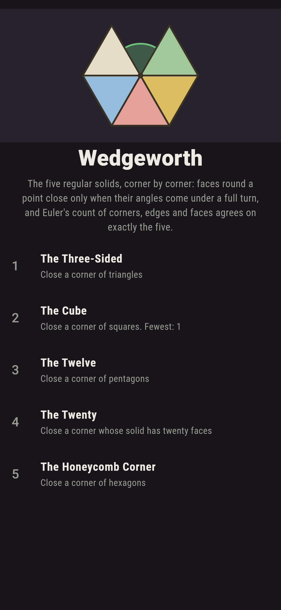
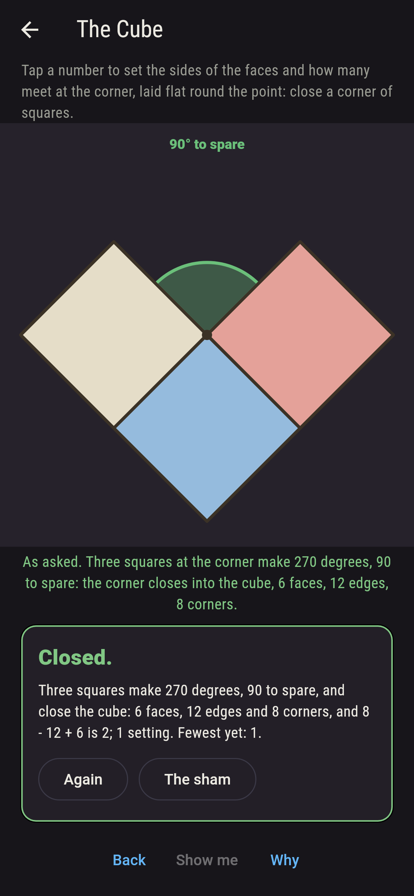
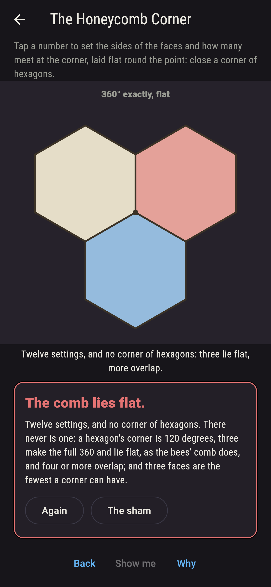
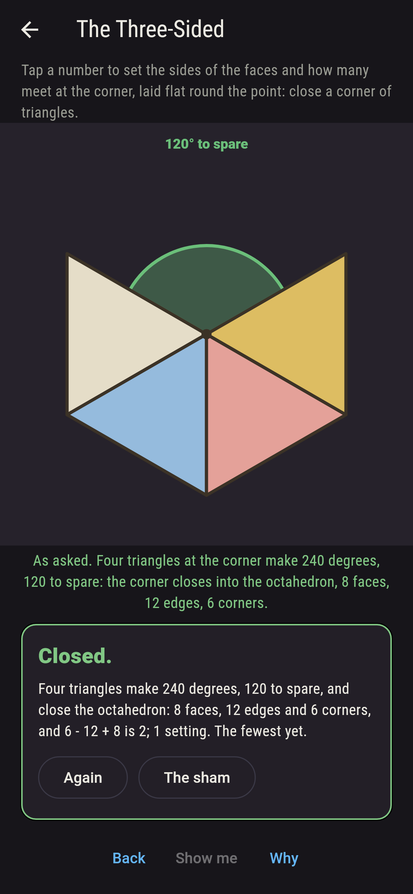
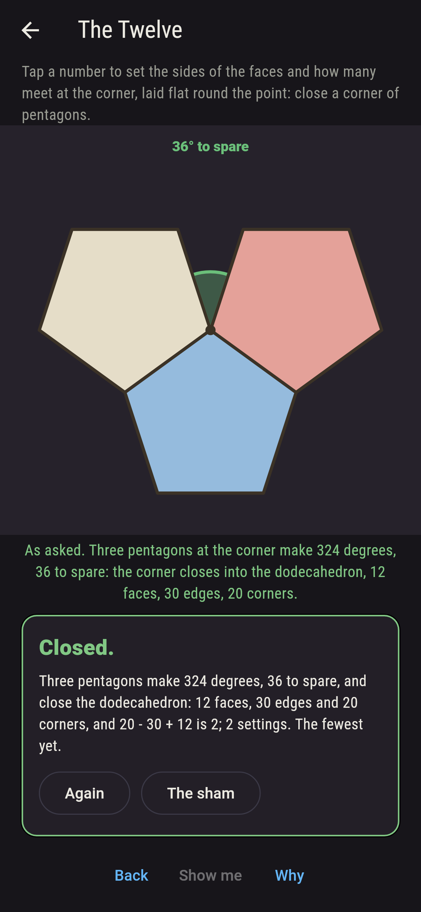
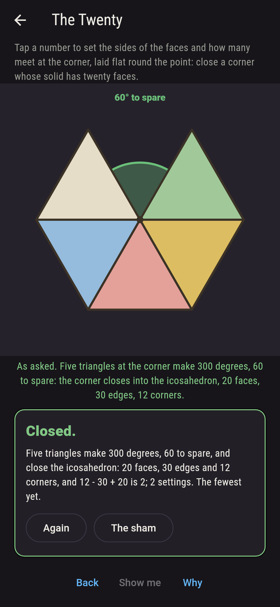
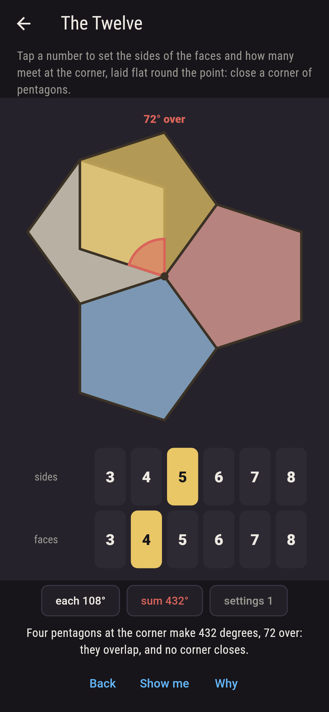
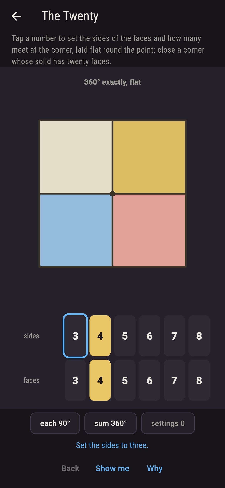
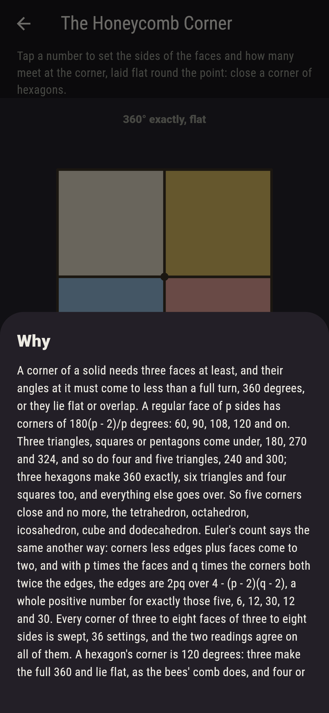

# Wedgeworth


The five regular solids, built corner by corner on a paper-craft
bench. Pick how many sides a face has, three to eight, and how many
faces meet at a corner, three to eight, and the fan lays them flat
round the point, each a regular polygon with its corner at the
point. A corner of a solid closes only when the angles come to less
than a full turn: at 360 degrees exactly the faces lie flat, and
over it they overlap. A face of p sides has corners of 180(p - 2)/p
degrees, so three triangles, squares or pentagons come under, 180,
270 and 324, and so do four and five triangles, 240 and 300; three
hexagons make 360 exactly, and everything else goes over. So five
corners close and no more: the tetrahedron, octahedron and
icosahedron, the cube and the dodecahedron. Euler's count says the
same another way, corners less edges plus faces coming to two, and
it is a whole number for exactly the same five. Every angle is kept
as an exact fraction of a degree, and every setting is swept.

## The asks

1. **The Three-Sided** - close a corner of triangles
2. **The Cube** - close a corner of squares
3. **The Twelve** - close a corner of pentagons
4. **The Twenty** - close a corner whose solid has twenty faces
5. **The Honeycomb Corner** - close a corner of hexagons

Triangles close three ways, three, four and five to a corner, the
tetrahedron, the octahedron and the icosahedron; squares one way,
three to a corner, the cube; pentagons one way, the dodecahedron,
with 36 degrees to spare; and only five triangles make a solid of
twenty faces, the icosahedron, 30 edges and 12 corners. Four
pentagons go 72 degrees over, three heptagons 25 5/7. The sham
opens on four squares, flat, the square tiling. The Honeycomb
Corner is labeled hopeless on its tile, and its picture is the why:
three hexagons make the full 360 and lie flat, as the bees' comb
does, four overlap, and three faces are the fewest a corner can
have.

## Two voices

The game never asserts what it has not computed, and it computes
everything at least twice:

* **The angle** sums q corners of 180(p - 2)/p degrees as an exact
  fraction, for every p and q from three to eight, 36 settings, and
  out to twelve and twelve, 100, and sorts each into closing, flat
  or over; every number on the sham is that sum's.
* **Euler's count** never measures an angle: with p times the faces
  and q times the corners both twice the edges, and corners less
  edges plus faces two, the edges are 2pq over 4 - (p - 2)(q - 2),
  and the count is a whole positive number for exactly the settings
  the angle closes, on all 100; the five it names add up, 4 - 6 + 4,
  6 - 12 + 8, 12 - 30 + 20, 8 - 12 + 6 and 20 - 30 + 12, two every
  time.

`tool/check_wedges.dart` runs the lot and refuses the bake on any
disagreement.

## The checker's ledger

What `dart run tool/check_wedges.dart` printed for the build this
README shipped with, word for word:

```
every corner of three to eight faces of three to eight sides swept, 36 settings, the angle sum kept as an exact fraction of a degree and held against Euler's count of corners, edges and faces: five corners close, three, four and five triangles, three squares and three pentagons, with 180, 120, 60, 90 and 36 degrees to spare, and Euler's count is a whole number for exactly those five, the tetrahedron 4 corners 6 edges 4 faces, the octahedron 6 12 8, the icosahedron 12 30 20, the cube 8 12 6 and the dodecahedron 20 30 12, each two by Euler; three settings lie flat, six triangles, four squares and three hexagons, the three tilings, and 28 overlap; out to twelve sides and twelve faces, 100 settings, still the same five close and no more

 1 The Three-Sided      close a corner of triangles: 3 of the 36 settings land it
 2 The Cube             close a corner of squares: 1 of the 36 settings lands it
 3 The Twelve           close a corner of pentagons: 1 of the 36 settings lands it
 4 The Twenty           close a corner whose solid has twenty faces: 1 of the 36 settings lands it
 5 The Honeycomb Corner close a corner of hexagons: none of the 36, and the angle said so first
```

## Screenshots

| The sham | The cube | The honeycomb admitted |
| --- | --- | --- |
|  |  |  |

| The tetrahedron | The dodecahedron | The icosahedron | Four pentagons over | Show me | The why |
| --- | --- | --- | --- | --- | --- |
|  |  |  |  |  |  |

Screenshots are drawn by `test/showcase_test.dart` at real phone
sizes with the app's own painter, then copied into `docs/` as they
came out; every dial in them was set by a tap, so nothing pictured
is a corner the game could not reach. The logo and every launcher
icon come out of `test/mark_test.dart` the same way: the mark is
the icosahedron's corner, five triangles round a point with sixty
degrees to spare.

## Building

```
flutter test          # 50 tests, the sweep among them
dart run tool/check_wedges.dart
flutter build apk     # or: flutter build ios
```
