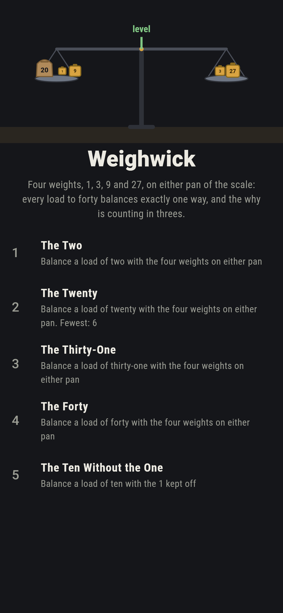
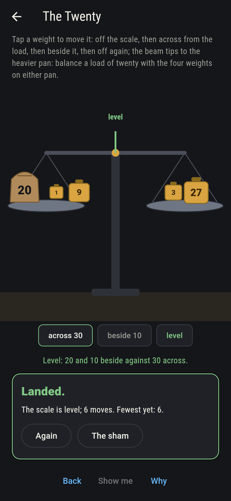
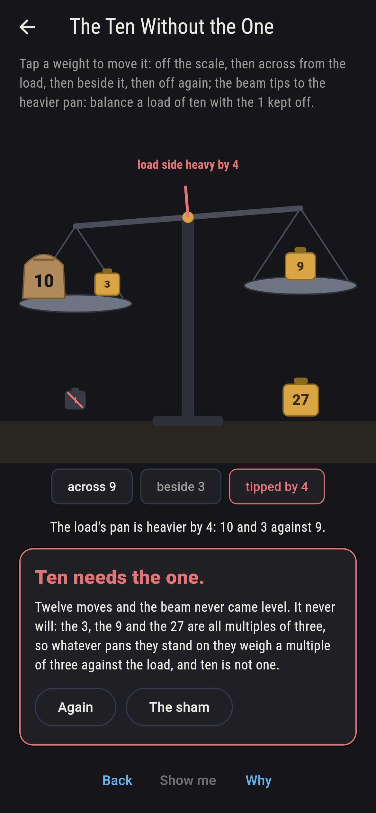
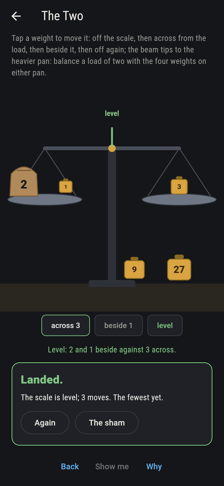
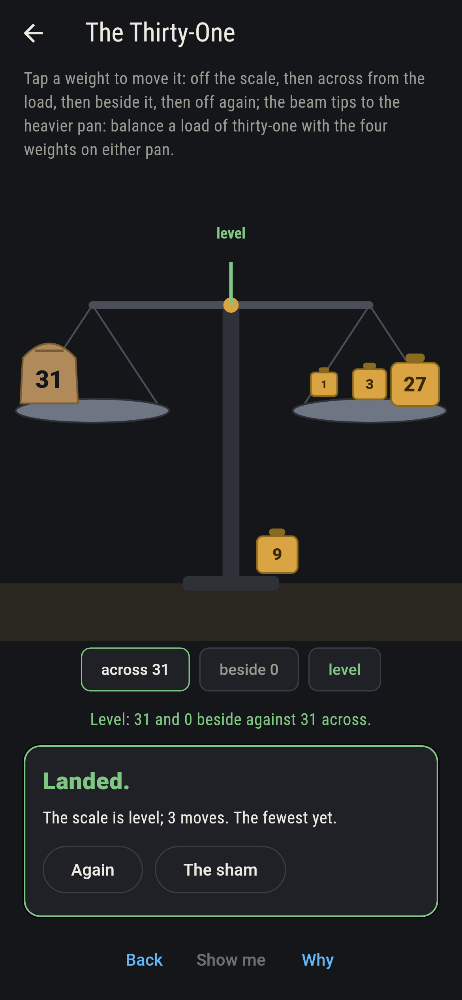
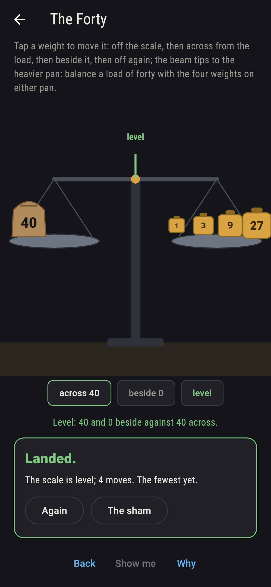
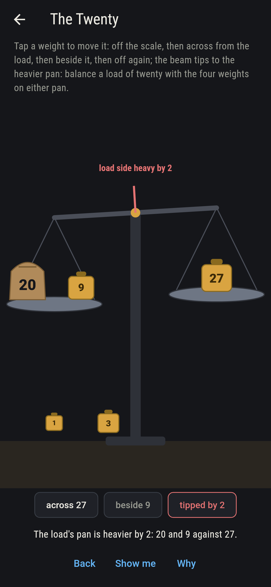
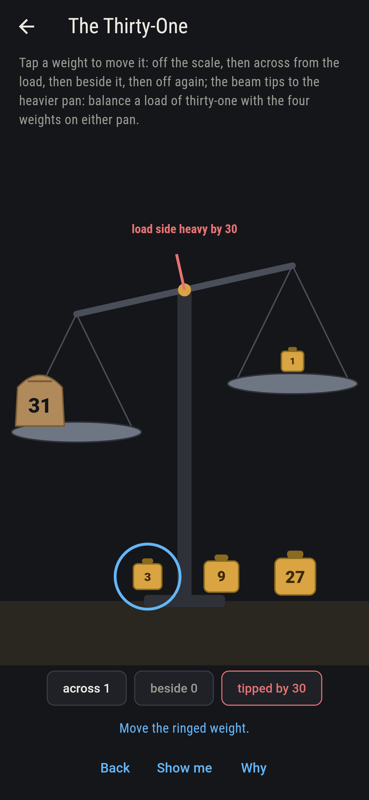
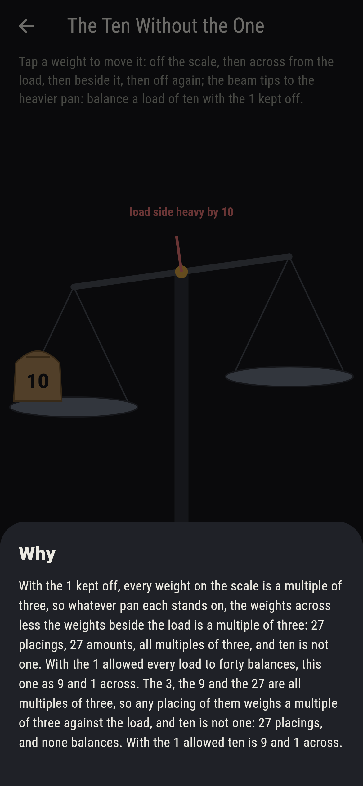

# Weighwick


A market scale, a load in a sack on the left pan, and four weights
to balance it with: 1, 3, 9 and 27. A weight may go on the pan
across from the load, or on the pan beside it, or stay on the
ground. Bachet set the puzzle in 1612: with those four, every
whole load from one to forty balances, and each in exactly one
way. The reason is counting in threes with the digits 1, 0 and
-1: every number to forty writes one way in ones, threes, nines
and twenty-sevens with those digits, and a digit of 1 puts the
weight across, -1 beside the load, 0 off. Every placing of the
four is swept, 81 of them, and they weigh 81 different amounts.
Keep the 1 off and only multiples of three balance, so ten never
does.

## The loads

1. **The Two** - balance a load of two with the four weights on either pan
2. **The Twenty** - balance a load of twenty with the four weights on either pan
3. **The Thirty-One** - balance a load of thirty-one with the four weights on either pan
4. **The Forty** - balance a load of forty with the four weights on either pan
5. **The Ten Without the One** - balance a load of ten with the 1 kept off

Two is the 3 across and the 1 beside; twenty is the 27 and the 3
across with the 9 and the 1 beside; thirty-one is 27, 3 and 1
across; forty is all four across. Each is one placing of the 81,
as every load to forty is. The Ten Without the One is labeled
hopeless on its tile: the 3, the 9 and the 27 weigh multiples of
three however they stand, and ten is not one.

## Two voices

The game never asserts what it has not computed, and it computes
everything at least twice:

* **The sweep** sets each weight off, across or beside the load,
  81 placings, and reads what each weighs against the load: 81
  different amounts, -40 to 40, so every load to forty balances
  exactly one way and forty-one none; with the 1 kept off, the 27
  placings of the rest all weigh multiples of three.
* **Counting in threes** with the digits 1, 0 and -1 writes each
  load down with no sweep, a digit for each weight, and the
  placing it names is the sweep's one placing for every load from
  one to forty.

`tool/check_weighings.dart` runs the lot and refuses the bake on
any disagreement.

## The checker's ledger

What `dart run tool/check_weighings.dart` printed for the build
this README shipped with, word for word:

```
every placing of the weights 1, 3, 9 and 27 swept, 81 of them, off the scale, across from the load or beside it, and the 81 weigh 81 different amounts against the load, -40 to 40, one apiece: every load from 1 to 40 balances exactly one way, and that way is what counting in threes with the digits 1, 0 and -1 writes down for it, load by load, while forty-one balances no way; and with the 1 kept off, the 27 placings of the other three all weigh multiples of three, so ten never balances without it, though with it ten is 9 and 1 across

 1 The Two                 balance a load of two with the four weights on either pan: 1 placing of the 81 balances it
 2 The Twenty              balance a load of twenty with the four weights on either pan: 1 placing of the 81 balances it
 3 The Thirty-One          balance a load of thirty-one with the four weights on either pan: 1 placing of the 81 balances it
 4 The Forty               balance a load of forty with the four weights on either pan: 1 placing of the 81 balances it
 5 The Ten Without the One balance a load of ten with the 1 kept off: none of the 27, and the multiples of three said so first
```

## Screenshots

| The sham | The twenty balanced | The ten without the one admitted |
| --- | --- | --- |
|  |  |  |

| The two | The thirty-one | The forty | Mid-weighing | Show me | The why |
| --- | --- | --- | --- | --- | --- |
|  |  |  |  |  |  |

Screenshots are drawn by `test/showcase_test.dart` at real phone
sizes with the app's own painter, then copied into `docs/` as they
came out; every weight in them was moved by a tap, so nothing
pictured is a placing the game could not reach. The logo and every
launcher icon come out of `test/mark_test.dart` the same way: the
mark is twenty balanced, all four weights on the scale.

## Building

```
flutter test          # 45 tests, the sweep among them
dart run tool/check_weighings.dart
flutter build apk     # or: flutter build ios
```
