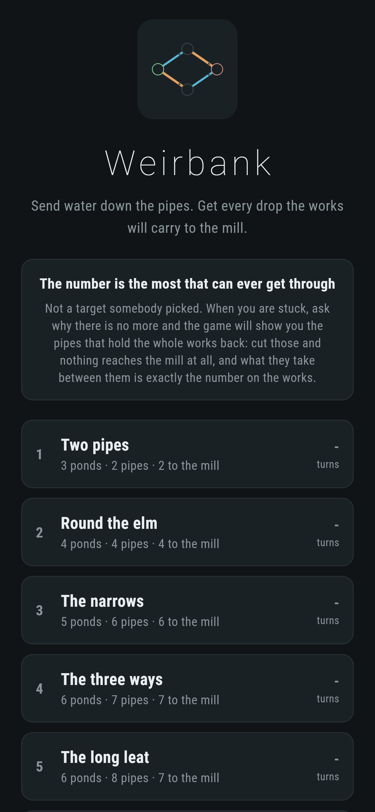
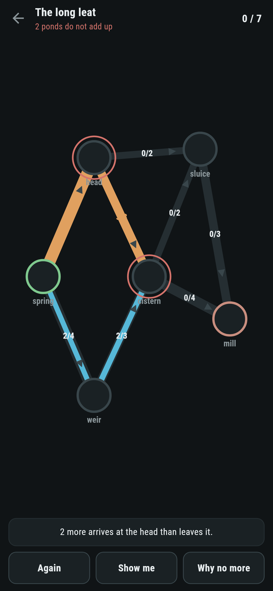
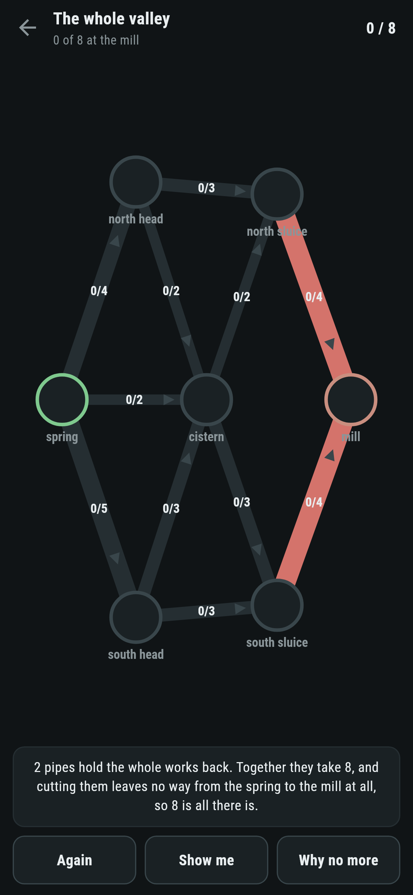
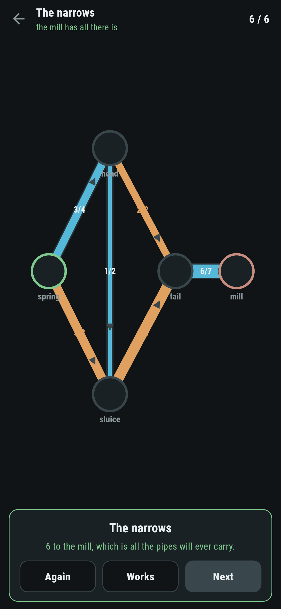
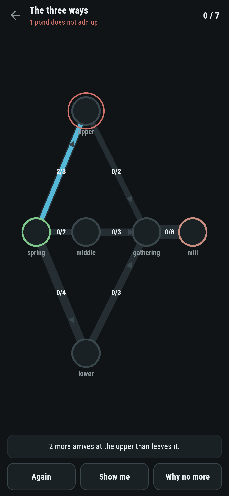

# Weirbank

A water puzzle for phones, in Flutter, for Android and iOS.

Pipes run from a spring to a mill, and each takes only so much. Send as much
as the works will carry. The number on each one is the most that can ever get
through, and when you are stuck the game will show you why there is no more.

| | | | |
|---|---|---|---|
|  |  |  |  |

## The answer comes with its own reason

Two things come out of the same search. One is an amount for every pipe that
really does deliver the number on the works. The other is a set of pipes that,
if you cut them, leaves no way from the spring to the mill at all. Add up what
those pipes take and you get the same number.

So one says "this much can be done" and the other says "and no more can", and
neither is a matter of opinion. Ford and Fulkerson wrote that down in 1956:
the most that can flow is what the smallest cut holds.


> 2 pipes hold the whole works back. Together they take 8, and cutting them
> leaves no way from the spring to the mill at all, so 8 is all there is.

That is the **Why no more** button, and it is the reason this game exists. A
puzzle that tells you a target and leaves you to believe it is asking for
trust. This one hands over the argument.

## The proof, run three hundred times

`test/flow_test.dart` builds works at random, works out the most that gets
through, and checks the two halves against each other:

```dart
expect(most.holdsOfCut(works), most.amount, reason: '${works.pipes}');
```

Then it cuts the pipes it named and checks that nothing at all gets through
what is left. A cut that holds the right amount but does not actually cut the
works in two would pass the first test and fail the second.

There is a third check on every shipped works: every pipe in the cut is full.
That is what makes it the reason rather than a coincidence, since the
bottleneck has to be where the water is already as much as it can be.

## Sending water back is what makes it work

The method is the obvious one done carefully. Find a way from the spring to
the mill with room to spare, push as much down it as the tightest pipe will
take, and go again.

The care is in two places. Each way is found by walking outwards, so it is the
shortest one, which is what stops the search taking as many rounds as the
numbers are large. And every pipe carries a way back, so water already sent
can be sent somewhere else later. Without that, a first choice that turns out
badly can never be undone and the answer comes out too small. There is a test
on the four pond works everybody uses to show it: fill the middle pipe first
and a search that cannot undo it says 1, when the answer is 2.

## What the game says on its own



One thing, and only when it is true: a pond where more arrives than leaves.
That is the rule somebody can break without noticing, because the numbers on
the pipes still look reasonable one at a time.

Everything else has to be asked for. **Show me** names a pipe and says what it
carries in the answer; **Why no more** shows the cut.

## Running it

```
make deps    # flutter pub get
make test    # everything
make analyze
make shots   # render the screens into build/showcase, redraw the logo and icons
make works   # walk every shipped works, the most through it and the cut
make apk     # release APK
make ios     # release iOS build, unsigned
```

## Tests

`flutter test` runs the works (which pipes leave a pond and which arrive, and
whether the mill can be reached at all), the search (one line, two ways round,
the works that needs water sent back, and a mill nothing can reach), the cut
against the flow on every shipped works and on three hundred made up at
random, every shipped works (the target is the most there is, the water obeys
every pipe and every pond, and the bottleneck is never simply the last pipe),
and the setting of pipes (turning one up, round to nothing, emptying it, a
pond that spills, and the answer laid out finishing the puzzle).

Then the game through the screen: tapping a pipe, wrapping it round, the
message naming the pond that does not add up, **Again**, **Show me**, **Why no
more** showing a cut that holds exactly the target, and every works set to the
most it will carry.

Screenshots come from `test/showcase_test.dart`, and every drop in them was
sent by tapping a pipe. `test/mark_test.dart` draws the logo, the launcher
icons at every density Android asks for and every size the iOS icon set asks
for; there is no image in this repository that was not produced by it.
