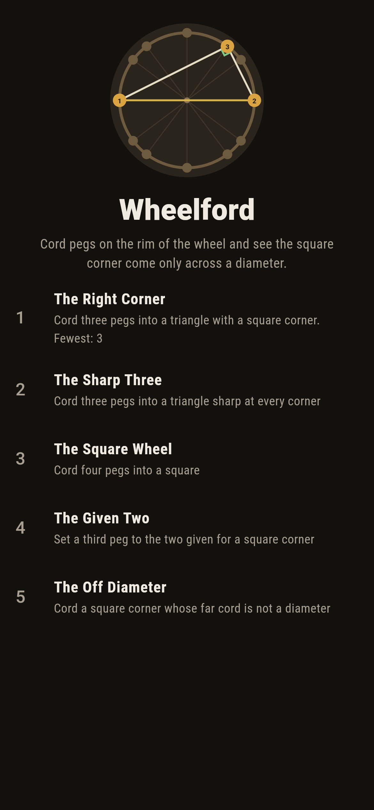
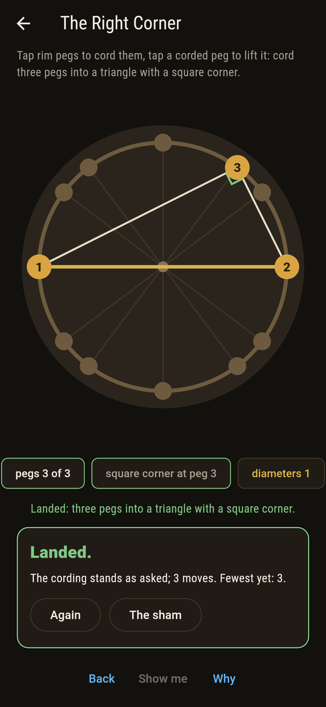
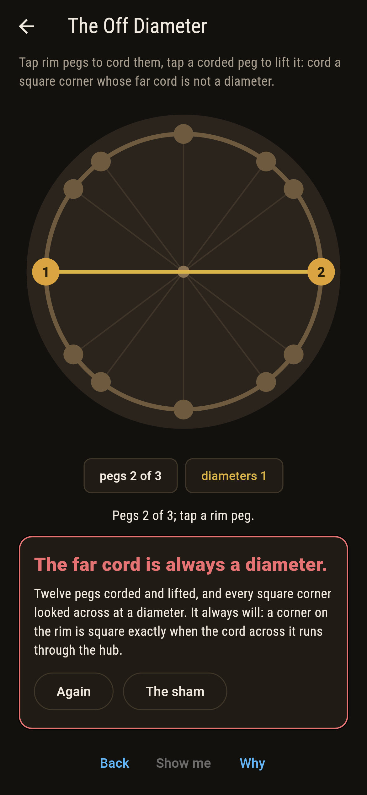
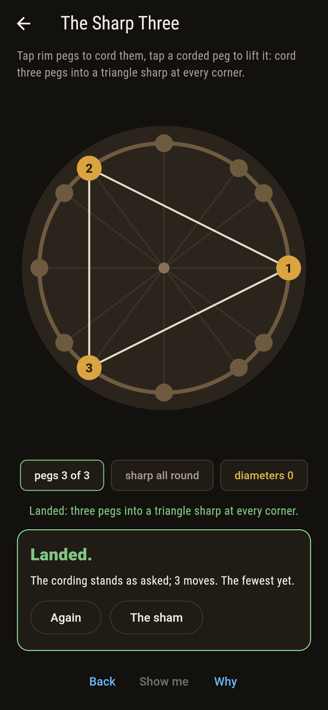
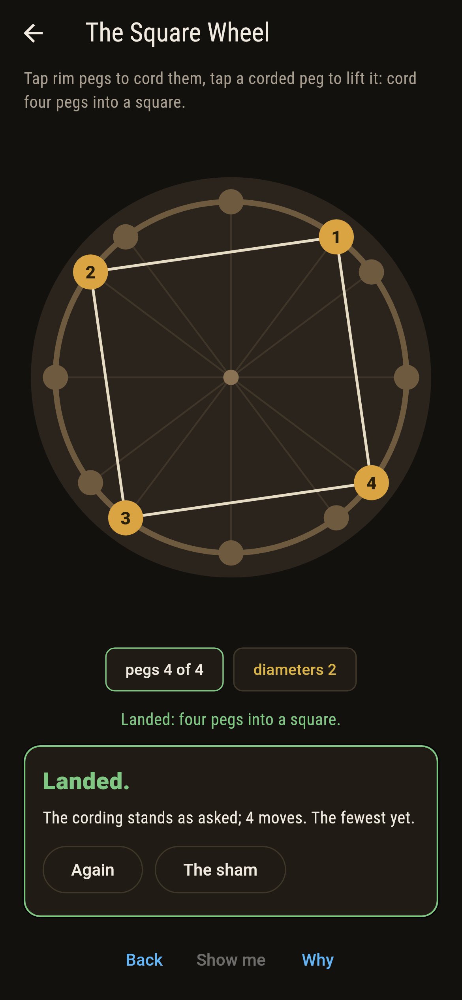
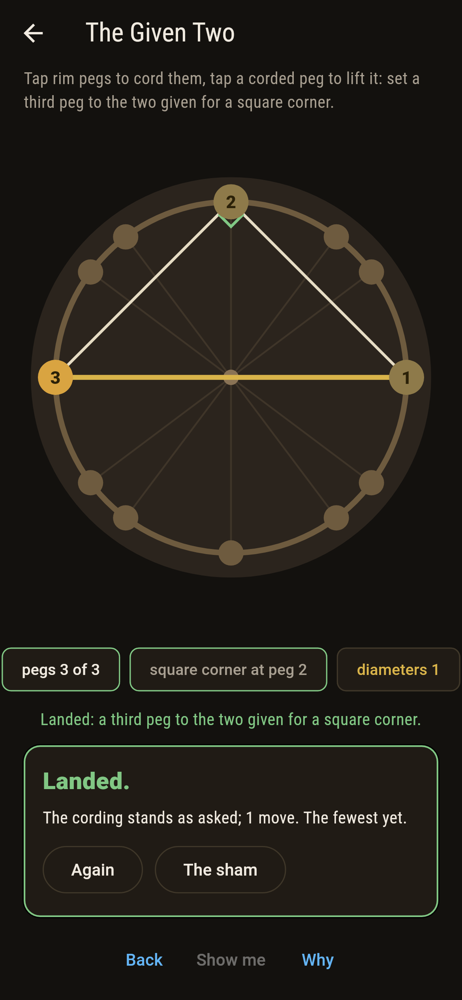
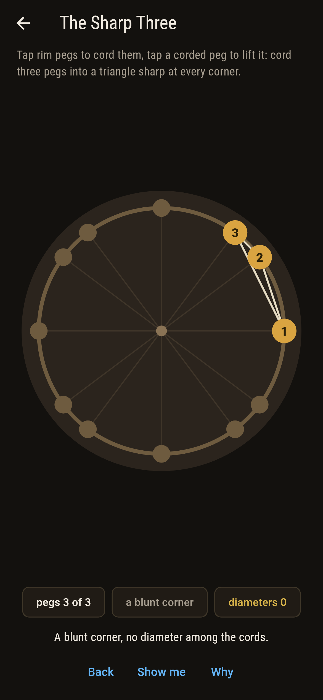
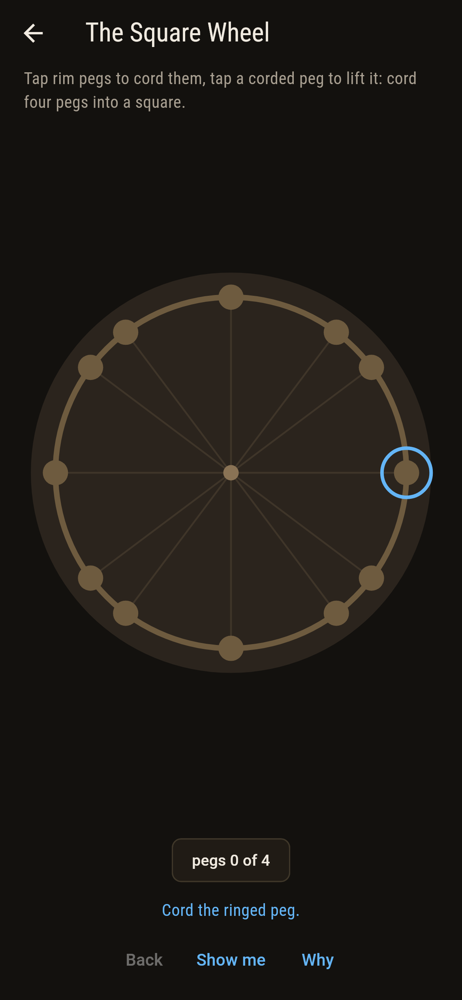
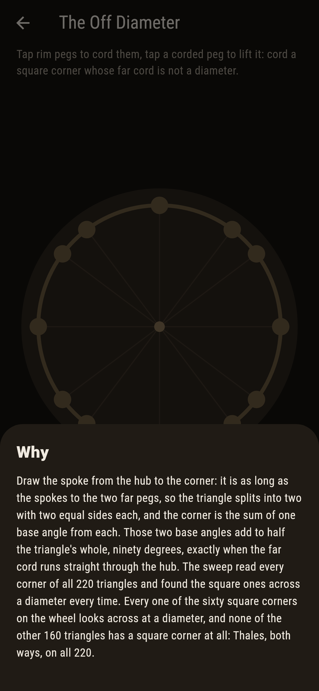

# Wheelford


Twelve pegs stand on the rim of a wheel five spokes across, at the
whole-number places whose squares add to twenty-five, and cords
run between them. Thales' theorem, the oldest in the book, says a
corner on the rim is square exactly when the cord across from it
is a diameter, straight through the hub. The sweep here cords
every three of the twelve, 220 triangles, and finds sixty with a
square corner, every one across a diameter and never otherwise;
forty sharp all round, a hundred and twenty blunt somewhere; and
four pegs make a square three ways, each two diameters crossing
square.

## The cordings

1. **The Right Corner** - cord three pegs into a triangle with a square corner
2. **The Sharp Three** - cord three pegs into a triangle sharp at every corner
3. **The Square Wheel** - cord four pegs into a square
4. **The Given Two** - set a third peg to the two given for a square corner
5. **The Off Diameter** - cord a square corner whose far cord is not a diameter

Sixty of the 220 triangles have a square corner, six diameters
with ten pegs to sit the corner on for each; forty are sharp all
round, the hub inside them; three of the 495 fours are squares.
Two pegs given that are not across from one another leave two
third pegs of ten. The Off Diameter is labeled hopeless on its
tile, and the why splits the triangle at the hub.

## Two voices

The game never asserts what it has not computed, and it computes
everything at least twice:

* **The dot product** tests every corner of every triangle: the
  two cords out of a corner multiplied and summed come to nought
  exactly when the corner is square.
* **Thales' reading** tests the same corners with no angle in
  sight: whether the cord across runs through the hub, the two far
  pegs at places that cancel; the two readings agree on every
  corner of all 220 triangles, and the three squares are checked to
  be two diameters crossing square.

`tool/check_wheels.dart` runs the lot and refuses the bake on any
disagreement.

## The checker's ledger

What `dart run tool/check_wheels.dart` printed for the build this
README shipped with, word for word:

```
every three of the twelve rim pegs corded, 220 triangles, and every corner tested two ways, by the dot product and by whether the cord across runs through the hub: sixty triangles have a square corner and every one of them looks across at a diameter, forty are sharp all round and a hundred and twenty blunt, three of the 495 fours are squares, each two diameters crossing square, and no square corner on the wheel ever looks across at anything but a diameter

 1 The Right Corner  cord three pegs into a triangle with a square corner: 60 of the 220 cordings land it
 2 The Sharp Three   cord three pegs into a triangle sharp at every corner: 40 of the 220 cordings land it
 3 The Square Wheel  cord four pegs into a square: 3 of the 495 cordings land it
 4 The Given Two     set a third peg to the two given for a square corner: 2 of the 10 cordings land it
 5 The Off Diameter  cord a square corner whose far cord is not a diameter: none of the 220, and Thales said so first
```

## Screenshots

| The sham | The right corner landed | The off diameter admitted |
| --- | --- | --- |
|  |  |  |

| The sharp three | The square wheel | The given two | Mid-cording | Show me | The why |
| --- | --- | --- | --- | --- | --- |
|  |  |  |  |  |  |

Screenshots are drawn by `test/showcase_test.dart` at real phone
sizes with the app's own painter, then copied into `docs/` as they
came out; every peg in them was tapped, so nothing pictured is a
wheel the game could not reach. The logo and every launcher icon
come out of `test/mark_test.dart` the same way: the mark is a
square corner across a diameter in gold.

## Building

```
flutter test          # 45 tests, the sweep among them
dart run tool/check_wheels.dart
flutter build apk     # or: flutter build ios
```
