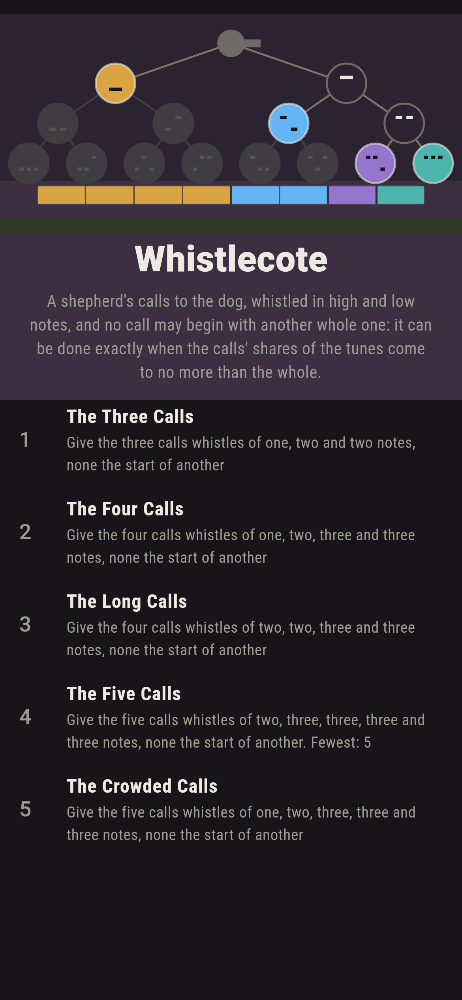
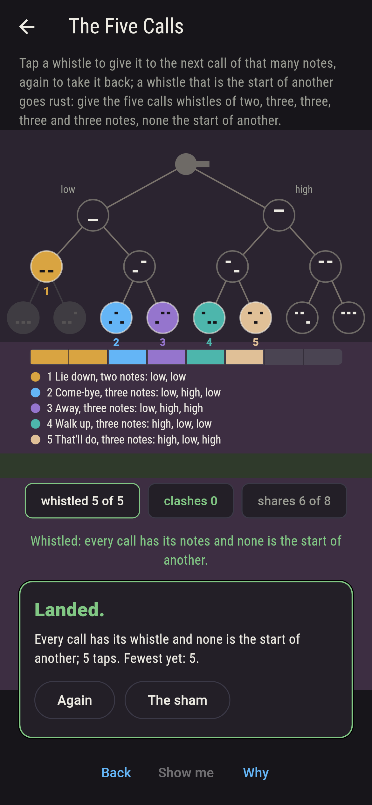
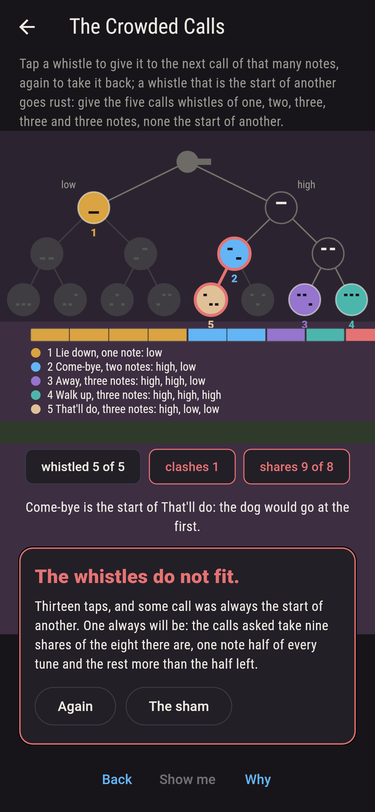
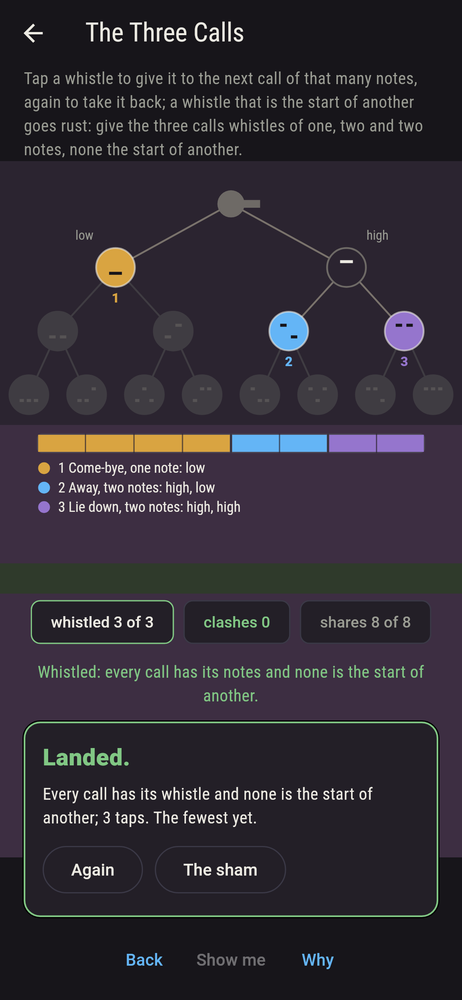
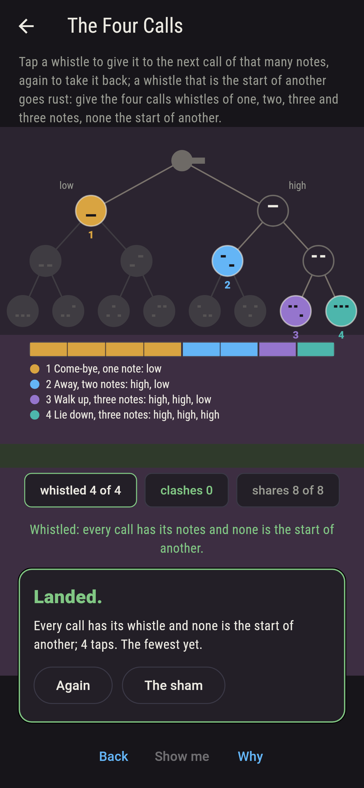
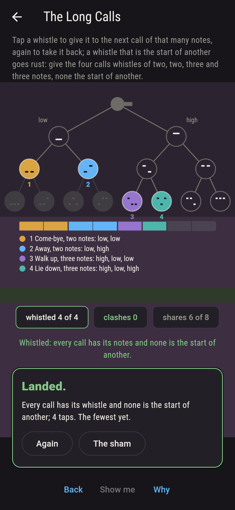
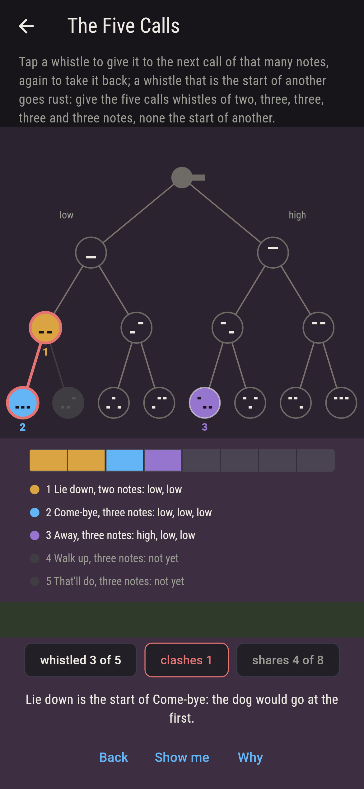
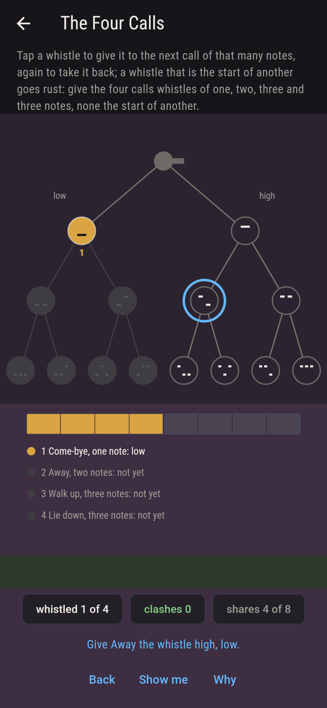
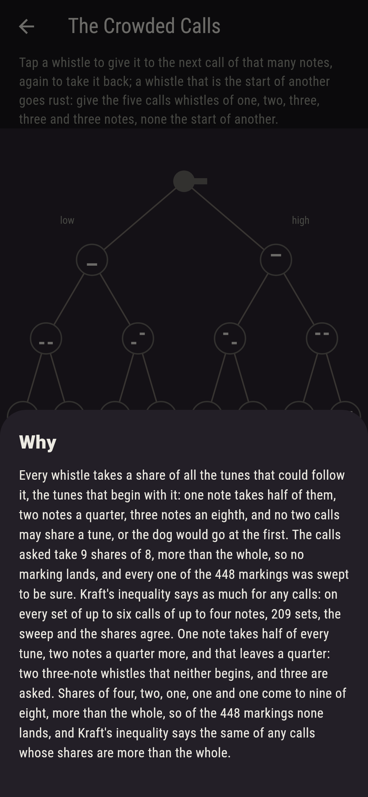

# Whistlecote


A shepherd on the moor whistles the dog its calls, Come-bye, Away,
Walk up, Lie down, in runs of high and low notes, and no call may
begin with another whole one, or the dog would go at the first.
The whistles of up to three notes hang as a tree from the shepherd,
low to the left and high to the right; tap one to give it to the
next call wanting that many notes, again to take it back, and a
whistle that is the start of another goes rust. Every whistle takes
a share of all the tunes that could follow it, half for one note, a
quarter for two, an eighth for three, and Kraft showed in 1949 when
calls of given lengths can be whistled: exactly when their shares
come to no more than the whole. The shepherd's own way marks with no
search, shortest calls first and each on the leftmost whistle no
marked one begins; every marking of every set here is swept; and on
every set of up to six calls of up to four notes, 209 sets, the
sweep, the shares and the shepherd agree.

## The calls

1. **The Three Calls** - give the three calls whistles of one, two and two notes, none the start of another
2. **The Four Calls** - give the four calls whistles of one, two, three and three notes, none the start of another
3. **The Long Calls** - give the four calls whistles of two, two, three and three notes, none the start of another
4. **The Five Calls** - give the five calls whistles of two, three, three, three and three notes, none the start of another
5. **The Crowded Calls** - give the five calls whistles of one, two, three, three and three notes, none the start of another

The three calls whistle two ways of twelve, and their shares come to
the whole exactly, four and two and two of eight; the four calls
four ways of 224, eight shares of eight again; the long calls 36 of
168, six shares of eight; the five calls sixty of 280, six of eight.
The Crowded Calls is labeled hopeless on its tile, and the why
counts the shares: nine of eight.

## Two voices

The game never asserts what it has not computed, and it computes
everything at least twice:

* **The sweep** marks the whistles every way with the notes asked,
  choosing at each length among the whistles of that length, and
  keeps the markings where no whistle is the start of another; every
  count on the sham is that sweep's.
* **The shares and the shepherd** need no sweep: the shares of the
  lengths asked, added up, come to no more than the whole exactly
  when the sweep finds a marking, which is Kraft's inequality; the
  shepherd's way, shortest calls first and each on the leftmost
  whistle no marked one begins, lands whenever they do; and the
  markings landing number the product, length by length, of the
  choices among the whistles no shorter call begins, since a marked
  whistle of l notes puts exactly two to the (length minus l) of the
  longer whistles out of reach whichever it is. On every set of up
  to six calls of up to four notes, 209 sets and 768,211 markings,
  the four agree.

`tool/check_whistles.dart` runs the lot and refuses the bake on any
disagreement.

## The checker's ledger

What `dart run tool/check_whistles.dart` printed for the build this
README shipped with, word for word:

```
every marking of every set of calls swept, and every set of up to six calls of up to four notes taken whole, 209 sets and 768,211 markings: the sweep finds a marking where no whistle starts another exactly when the shares come to no more than the whole, 102 sets of the 209, which is Kraft's inequality; where it does, the shepherd's way lands, shortest calls first and each on the leftmost whistle no given one begins, and the markings landing number the product of the free choices at each length; the three calls whistle 2 ways of 12, the four calls 4 of 224, the long calls 36 of 168, the five calls 60 of 280, and the crowded calls none of 448

 1 The Three Calls   give the three calls whistles of one, two and two notes, none the start of another: 2 of the 12 markings land it
 2 The Four Calls    give the four calls whistles of one, two, three and three notes, none the start of another: 4 of the 224 markings land it
 3 The Long Calls    give the four calls whistles of two, two, three and three notes, none the start of another: 36 of the 168 markings land it
 4 The Five Calls    give the five calls whistles of two, three, three, three and three notes, none the start of another: 60 of the 280 markings land it
 5 The Crowded Calls give the five calls whistles of one, two, three, three and three notes, none the start of another: none of the 448, and Kraft's inequality said so first
```

## Screenshots

| The sham | The five calls whistled | The crowded calls admitted |
| --- | --- | --- |
|  |  |  |

| The three calls | The four calls | The long calls | Mid-whistle | Show me | The why |
| --- | --- | --- | --- | --- | --- |
|  |  |  |  |  |  |

Screenshots are drawn by `test/showcase_test.dart` at real phone
sizes with the app's own painter, then copied into `docs/` as they
came out; every whistle in them was given by taps, so nothing
pictured is a marking the game could not reach. The logo and every
launcher icon come out of `test/mark_test.dart` the same way: the
mark is the four calls whistled the shepherd's way, every tune
spoken for.

## Building

```
flutter test          # 47 tests, the sweep among them
dart run tool/check_whistles.dart
flutter build apk     # or: flutter build ios
```
