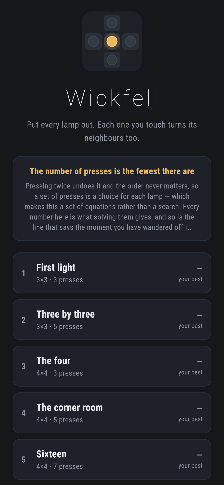
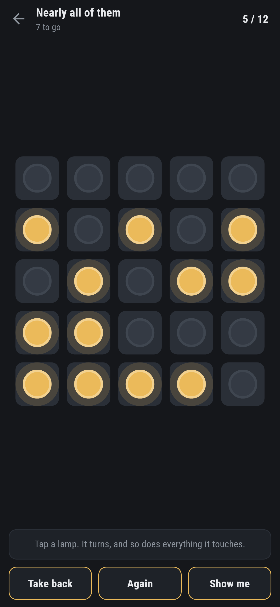
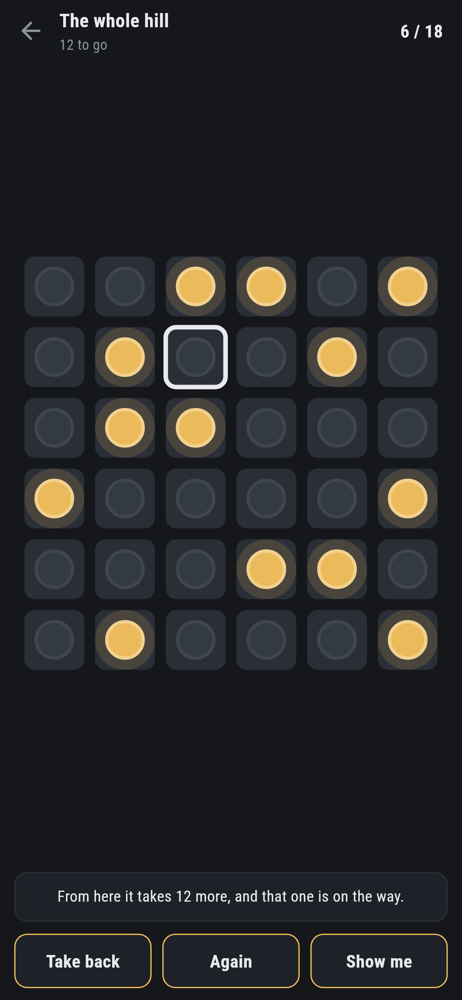
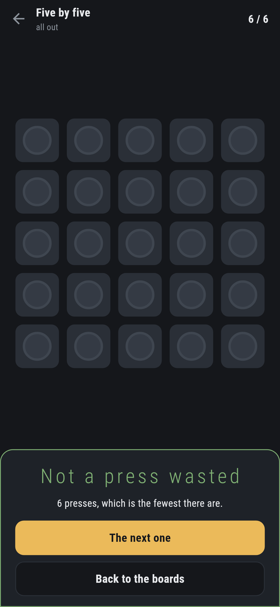
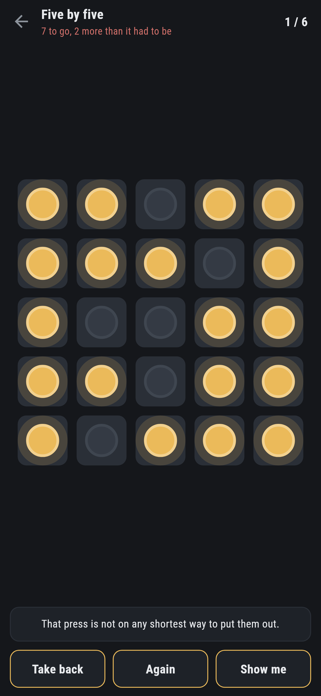

# Wickfell

A lamp puzzle for phones, in Flutter, for Android and iOS.

Press a lamp and it turns — and so does everything it touches. Put them all
out. The number on each board is the fewest presses there are, and it is not
found by searching.

| | | | |
|---|---|---|---|
|  |  |  |  |

## It is a set of equations, not a search

Two facts about pressing lamps decide everything else. Pressing the same lamp
twice puts it back exactly as it was, and the order of the presses makes no
difference at all. So a set of presses is not a sequence — it is a yes or no
for each lamp, and turning the board off means choosing the presses whose
effects add up to exactly what is lit.

That is a system of linear equations where every value is a nought or a one,
and it is solved the way linear equations are solved: work down the lamps
putting the system into a triangle, then read the answer back. Whatever is
left over at the bottom is the null space — the sets of presses that change
nothing at all — and every solution is one solution plus one of those.

Trying all of those is what gives the *fewest* presses rather than merely
some. There are four of them on a five by five, so it is four sums rather than
a search.

## The arithmetic agrees with what was known before it

```
$ make sizes
3x3   9 lamps  0 sets of presses change nothing  1 board in 1 can be turned off
4x4  16 lamps  4 sets of presses change nothing  1 board in 16 can be turned off
5x5  25 lamps  2 sets of presses change nothing  1 board in 4 can be turned off
5x4  20 lamps  0 sets of presses change nothing  1 board in 1 can be turned off
6x6  36 lamps  0 sets of presses change nothing  1 board in 1 can be turned off
```

Those numbers were worked out long before this code was, and a test asserts
them — which makes them the one thing here that is checked against somebody
else's work rather than against itself.

They also decide which boards can ship. On a five by five, three boards in
four **cannot be turned off at all**, and on a four by four fifteen in
sixteen. A game that handed one of those over would be a game that cannot be
finished, so the tool that finds boards throws away everything unsolvable
before it looks at anything else.

## And it is checked the slow way too

On a three by three there are only 512 sets of presses, so every one of them
can be tried. `test/lamps_test.dart` does exactly that on sixty boards and
holds the answer against the sums:

```dart
expect(answer.fewest, fewest, reason: 'board $board');
```

If the linear algebra were subtly wrong — a pivot in the wrong place, a row
not cleared — that test would find it on a board a person could check by hand.

## It tells you the moment you have wandered off



Because the fewest presses from *anywhere* is one solve, the game knows at
every moment how many are left. Presses made plus presses still needed,
against the number on the board — one subtraction, and it says so at once:

> That press is not on any shortest way to put them out.

Ask, and it points at a lamp that is on the way, and says how many more there
are from where the board actually stands.

## Running it

```
make deps    # flutter pub get
make test    # everything
make analyze
make shots   # render the screens into build/showcase, redraw the logo
make sizes   # what each size of board is like
make pick ARGS="5 5 12"   # find boards of a size taking that many presses
make apk     # release APK
make ios     # release iOS build, unsigned
```

## Tests

`flutter test` runs the grid (a corner turns three lamps and the middle turns
five; pressing twice changes nothing; the order of presses makes no
difference), the sums (the known null spaces for five sizes, that a set of
presses that changes nothing really changes nothing, that the presses given
really put the lamps out, that nothing shorter does — checked by trying every
set there is on a three by three — and that a board it calls impossible
survives two hundred random attempts), every shipped board against its number,
and a game (pressing, taking back, knowing at once when a press has gone
nowhere, and finishing).

Then the game through the screen: pressing a lamp and its neighbours, pressing
it twice, taking one back, the warning, and every board put out in exactly its
own number of presses by following what **Show me** says.

Screenshots come from `test/showcase_test.dart`, and every lamp that has gone
out in them went out by being pressed. `test/mark_test.dart` draws the logo
and the app icon; there is no image in this repository that was not produced
by it.
