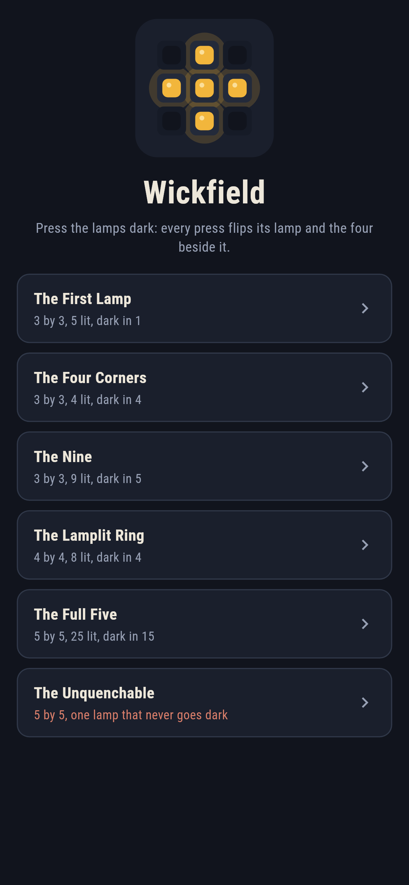
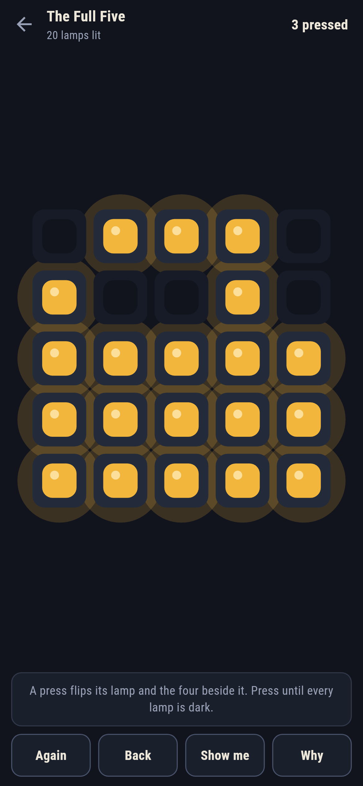
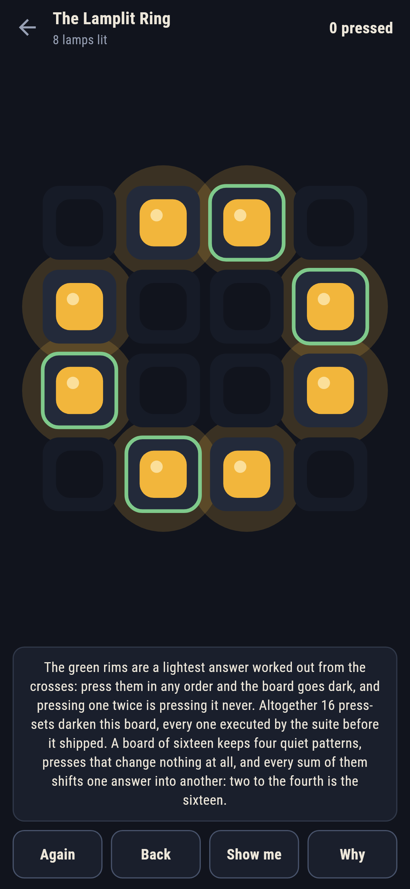
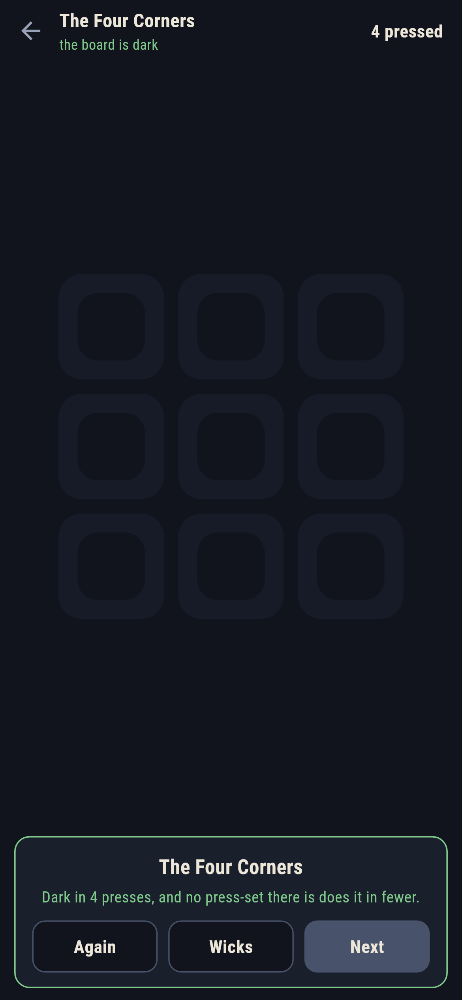
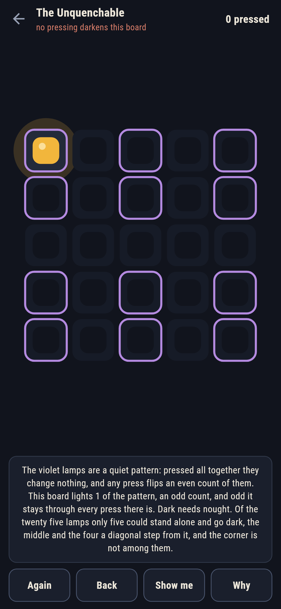
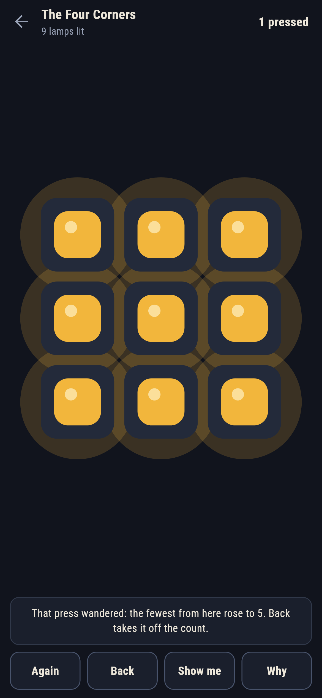

# Wickfield

A lamp-pressing puzzle for phones, in Flutter, for Android and iOS.

A board of lamps, some lit. Pressing one flips it and the four beside
it. Press until every lamp is dark. This is the old Lights Out, and
under it sits a piece of honest algebra: over two-element arithmetic
the whole game is one linear question, and the game answers it in front
of you rather than waving at it.

| | | | |
|---|---|---|---|
|  |  |  |  |

## Two ways of knowing

The suite knows the game two ways that share nothing. A walk from the
dark board, breadth first, presses its way to every reachable board and
writes down the fewest presses for each; it knows no algebra. An
elimination over the press matrix reduces the crosses once and answers
any board from the residue; it never presses anything. On every board
of nine there is, and every board of sixteen, all 66,048 of them, the
two name the same fewest, and the checker refuses the bake on the first
disagreement.

```
$ make wicks
every board of 3 by 3: the walk from dark and the elimination name the same fewest, all 512
every board of 4 by 4: the walk from dark and the elimination name the same fewest, all 65536

 1 The First Lamp     3 by 3  5 lit  dark in 1, 1 way
 2 The Four Corners   3 by 3  4 lit  dark in 4, 1 way
 3 The Nine           3 by 3  9 lit  dark in 5, 1 way
 4 The Lamplit Ring   4 by 4  8 lit  dark in 4, 16 ways
 5 The Full Five      5 by 5  25 lit  dark in 15, 4 ways
 6 The Unquenchable   5 by 5  1 lit  never goes dark
```

Every written number above is worked out from the crosses before it is
believed, and every press-set that darkens a shipped board is executed
by the suite, all sixteen of the ring's included.

## The quiet patterns

Some boards keep press-sets that change nothing at all. The board of
sixteen keeps four of them, which is why sixteen different answers
darken the ring; the board of twenty five keeps two, and they are the
death certificate of the last wick. The Unquenchable is one lamp that
never goes dark: it stands on a quiet pattern at one lamp, an odd
count, and a press flips an even count of any quiet pattern's lamps,
so odd it stays through every press there is, and dark needs nought.
**Why** rims the pattern violet on the board in front of you, with the
lone lamp standing on it. It ships in the house tradition of maps
nobody can win.



## The live number

The game never refuses a press; it counts. The fewest presses from the
board as it stands is recomputed after every touch, and a press that
raises it is called out the moment it lands, with **Back** waiting.
**Show me** points at one press off a lightest answer from here, and
**Why** rims a whole one green.



## Building

```
make deps    # fetch packages
make check   # analyze + every test
make wicks   # sweep the small boards both ways and print the ledger
make shots   # render the screenshots and redraw the icons
make apk     # Android release build
make ios     # iOS release build (unsigned)
```

The logo and every app icon are drawn by the game's own painter in
`test/mark_test.dart`. There is no image in this repository that was not
produced by code in it.

## How it is put together

```
lib/wick/rules.dart    the crosses, the elimination, the walk, the
                       quiet patterns
lib/wick/wick.dart     a wick: a name, a board, its numbers
lib/wick/wicks.dart    the six wicks that ship
lib/wick/play.dart     a board being pressed: the count, take-back, the
                       live fewest
lib/ui/                the painter, the screens, the mark
tool/check_wicks.dart  the sweeps and the ledger above
```

The tests press crosses by hand at the walls, sweep both small boards
against the walk, execute every quiet pattern on the dark board and
every shipped answer on its wick, pin the parity that kills the
Unquenchable and the five lamps that could stand alone, darken every
winnable wick by following the game's own pointer, and hold the
pictures against the real widget tree. If any of that drifts,
`make check` goes red before anything leaves the machine.
