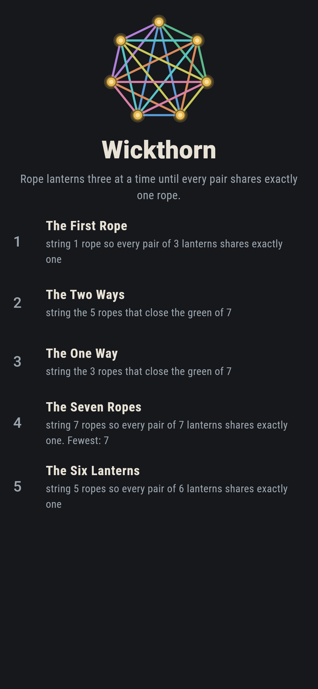
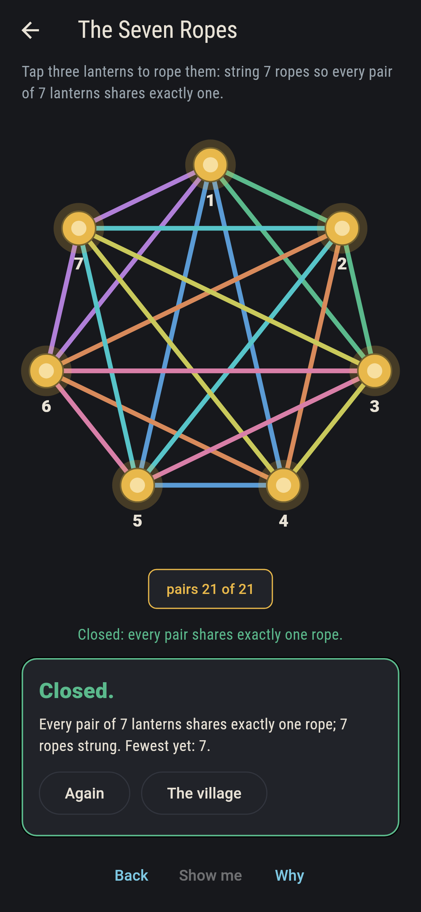
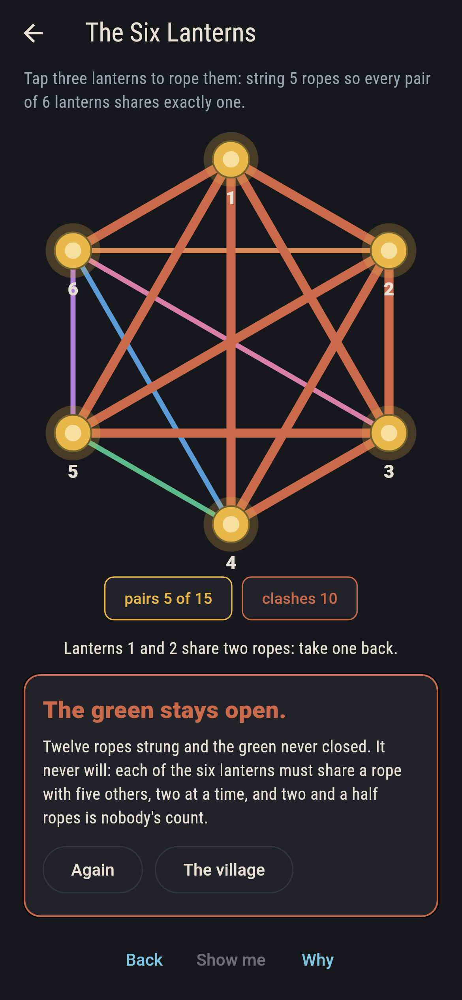
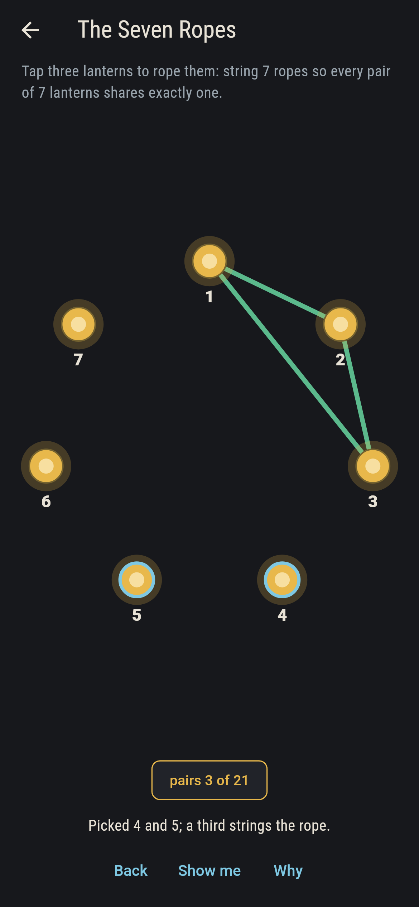
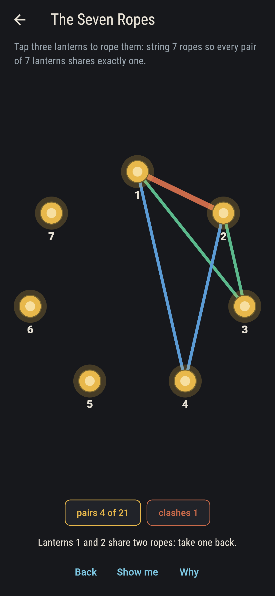
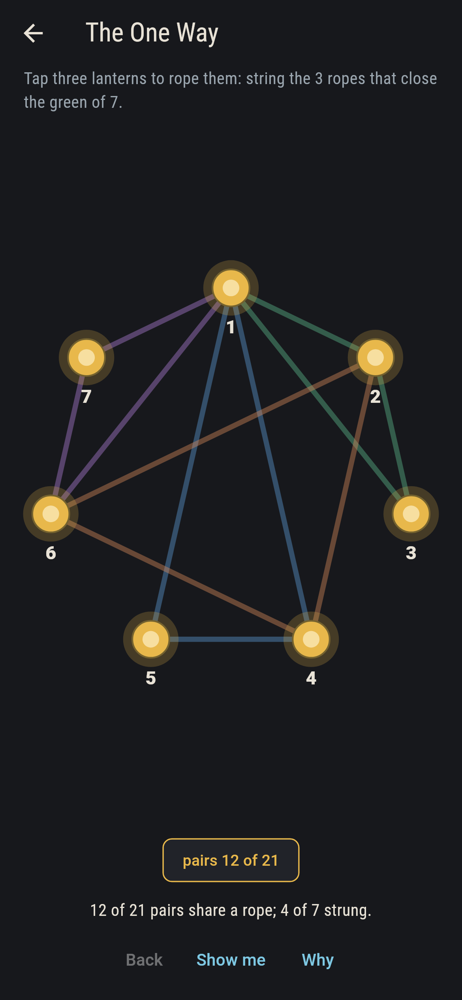
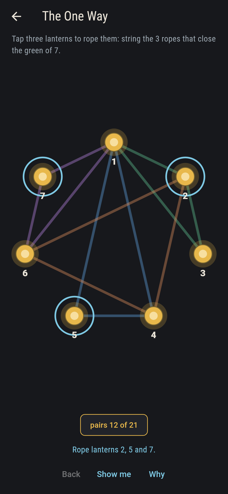
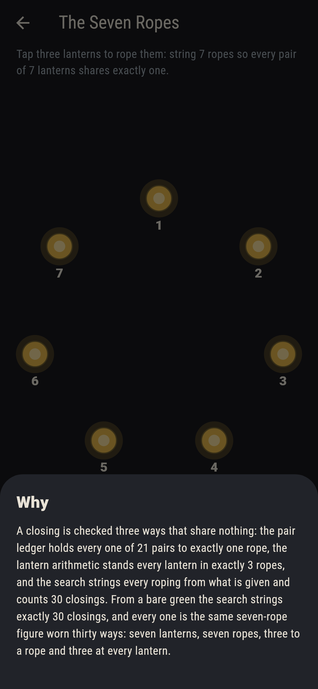

# Wickthorn


Lanterns stand in a ring on the village green, and ropes are
strung three lanterns to a rope. The asking never changes: string
ropes until every pair of lanterns shares exactly one. Seven
lanterns close in seven ropes, and the figure they close into is
one worth meeting. Six lanterns never close at all, and the
reason fits in a sentence.

## The greens

1. **The First Rope** - string 1 rope so every pair of 3 lanterns shares exactly one
2. **The Two Ways** - string the 5 ropes that close the green of 7
3. **The One Way** - string the 3 ropes that close the green of 7
4. **The Seven Ropes** - string 7 ropes so every pair of 7 lanterns shares exactly one
5. **The Six Lanterns** - string 5 ropes so every pair of 6 lanterns shares exactly one

The Seven Ropes closes exactly 30 ways from a bare green, and
every one of them is the same seven-rope figure worn thirty ways:
seven lanterns, seven ropes, three to a rope, three at every
lantern, every pair on exactly one. The Six Lanterns is the
asking that cannot be met: fifteen pairs divide neatly into five
ropes, and still each lantern would have to stand in two and a
half of them.

## Three voices

The game never asserts what it has not computed, and it computes
everything at least twice:

* **The pair ledger** counts every pair each rope covers and
  cries the moment one is covered twice, in rust, on the green.
* **The lantern arithmetic** divides: a lantern among n must
  share a rope with n - 1 others, two at a time, so (n - 1) / 2
  must come out whole. At seven it is 3; at six it is nobody's
  count.
* **The search** strings every roping from whatever is given and
  counts the closings: 30 from a bare seven, 2 and 1 from the
  part-strung greens, none at all from six.

`tool/check_greens.dart` runs all three, holds every closing to
the ledger and the lantern share, and refuses the bake on any
disagreement.

## The checker's ledger

What `dart run tool/check_greens.dart` printed for the build this
README shipped with, word for word:

```
every green searched to its end: seven lanterns close in seven ropes exactly 30 ways, every closing stands every lantern in exactly three ropes with the pair ledger clean, and six lanterns never close, their fifteen pairs dividing into five ropes while each lantern would need two and a half

 1 The First Rope   string 1 rope so every pair of 3 lanterns shares exactly one: 1 closing by the search
 2 The Two Ways     string the 5 ropes that close the green of 7: 2 closings by the search
 3 The One Way      string the 3 ropes that close the green of 7: 1 closing by the search
 4 The Seven Ropes  string 7 ropes so every pair of 7 lanterns shares exactly one: 30 closings by the search
 5 The Six Lanterns string 5 ropes so every pair of 6 lanterns shares exactly one: none, by the arithmetic and the search both
```

## Screenshots

| The village | The seven ropes closed | The six lanterns admitted |
| --- | --- | --- |
|  |  |  |

| Picking | A clash called out | The one way | Show me | The why |
| --- | --- | --- | --- | --- |
|  |  |  |  |  |

Screenshots are drawn by `test/showcase_test.dart` at real phone
sizes with the app's own painter, then copied into `docs/` as they
came out; every rope in them was strung by taps, so nothing
pictured is a green the game could not reach. The logo and every
launcher icon come out of `test/mark_test.dart` the same way: the
mark is the seven ropes closed.

## Building

```
flutter test          # 49 tests, the search among them
dart run tool/check_greens.dart
flutter build apk     # or: flutter build ios
```
