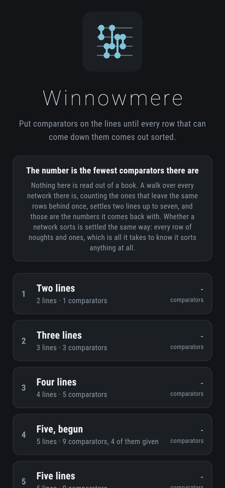
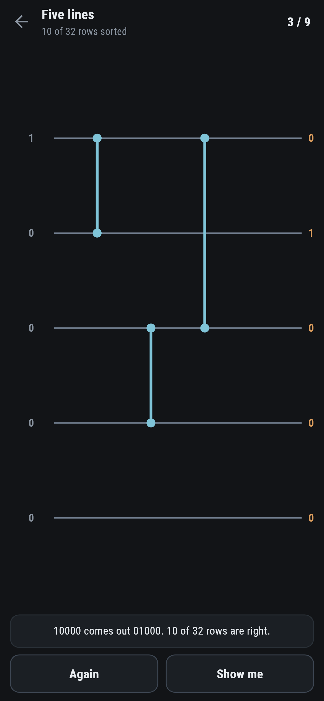
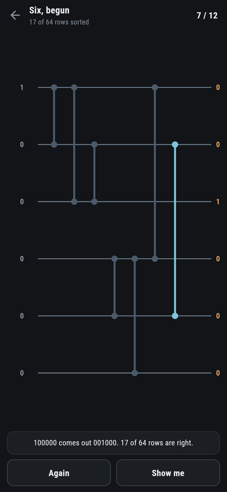
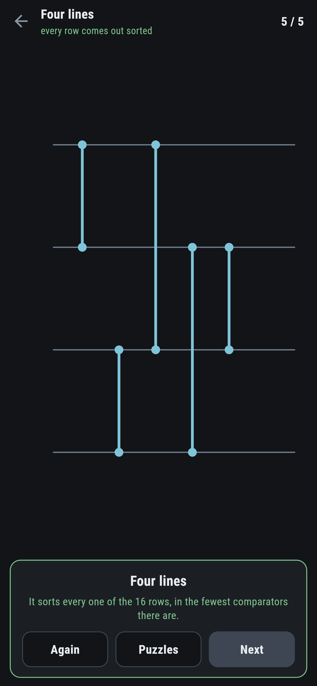

# Winnowmere

A sorting puzzle for phones, in Flutter, for Android and iOS.

A comparator looks at two lines and puts the smaller of them on the upper one.
Put enough of them on the lines and every row of numbers that can come down
comes out sorted. The number on each puzzle is the fewest comparators that
will do it.

| | | | |
|---|---|---|---|
|  |  |  |  |

## Noughts and ones are enough

Whether a network sorts looks like a question about every row of numbers there
is, which is a great many. It is not, because of one old result:

**A network of comparators sorts every row of numbers if and only if it sorts
every row of noughts and ones.**

Suppose a network fails on some row of numbers, so two of the outputs come out
the wrong way round. Take the smaller of those two and turn the whole row into
noughts and ones: 0 for everything below it, 1 for everything else. Every
comparator does the same thing to the noughts and ones that it did to the
numbers, because comparing is all a comparator does and that turning keeps
order. So the network fails on that row of noughts and ones as well.

Which makes checking a network 2^n rows rather than n! of them. For six lines
that is 64. The game runs all of them after every tap, so it always knows
whether the network sorts, and when it does not it can hand over the row:


> 100000 comes out 001000. 17 of 64 rows are right.

There is a test on the other direction, which is the checkable one: a network
that passes the noughts and ones is thrown every ordering of four different
numbers, and then rows with repeats in them.

## The numbers are worked out, not looked up

1, 3, 5, 9, 12, 16 for two lines up to seven. Those are the figures everybody
has, and nothing here reads them from anywhere:

```
$ make fewest ARGS=6
2 lines: 1 comparators, 10ms, and it sorts: true
    0-1
3 lines: 3 comparators, 2ms, and it sorts: true
    0-1  0-2  1-2
4 lines: 5 comparators, 6ms, and it sorts: true
    0-1  2-3  0-2  1-3  1-2
5 lines: 9 comparators, 32ms, and it sorts: true
    0-1  0-2  0-3  0-4  1-2  3-4  1-3  2-4  2-3
6 lines: 12 comparators, 472ms, and it sorts: true
    0-1  0-2  1-2  3-4  3-5  0-3  4-5  1-4  1-3  2-5  2-3  3-4
```

The walk is over networks by what they leave behind rather than by what they
are. A network is only ever worth what its outputs are worth, so two networks
that turn the 2^n rows into the same set of rows are the same network as far
as anything after them is concerned. Keeping one of each set rather than one
of each network is the difference between a walk that finishes and one that
does not.

A test runs that for two lines up to six, and then says it the other way
round, which is what "fewest" means: stopping the walk one short reaches
nothing that sorts.

Seven lines takes about a minute and a half, so it is left to `make fewest
ARGS=7` rather than run on every push. Eight is a good deal further and is not
attempted.

## Half the puzzles start with something in

The later ones come with the first few comparators of a network that really
does finish in the number promised, so finishing one of those in par is always
possible. A test checks exactly that for every puzzle: what it starts with,
walked to the end, comes out at the number on the card.

Those comparators are drawn dim and cannot be taken out. Everything you add is
yours to remove.

## Running it

```
make deps     # flutter pub get
make test     # everything
make analyze
make shots    # render the screens into build/showcase, redraw the logo and icons
make fewest   # work out the fewest comparators, two lines upwards
make puzzles  # check every shipped puzzle still finishes in its number
make apk      # release APK
make ios      # release iOS build, unsigned
```

## Tests

`flutter test` runs the comparator (which line the smaller one goes on, that
writing the two lines either way round is the same comparator, and that the
bit version agrees with the plain one on every row), the noughts and ones (a
network that passes them sorting every ordering and every row with repeats, a
network that misses one row being caught by that row, and the count of rows
that come out right), the fewest (the known numbers for two lines up to six,
each with a network that really sorts, and nothing sorting one comparator
short), every shipped puzzle (finishes in its number, does not already sort,
and gets harder), and the building of one (adding, refusing a comparator from
a line to itself, taking one out, never taking out one the puzzle gave, and
finishing).

Then the game through the screen: tapping two lines, letting go of one,
naming the row that still comes out wrong, taking a comparator out, being
refused one that came with the puzzle, **Again**, **Show me**, and every
puzzle finished in par.

Screenshots come from `test/showcase_test.dart`, and every comparator in them
was put there by tapping two lines. `test/mark_test.dart` draws the logo, the
launcher icons at every density Android asks for and every size the iOS icon
set asks for; there is no image in this repository that was not produced by
it.
