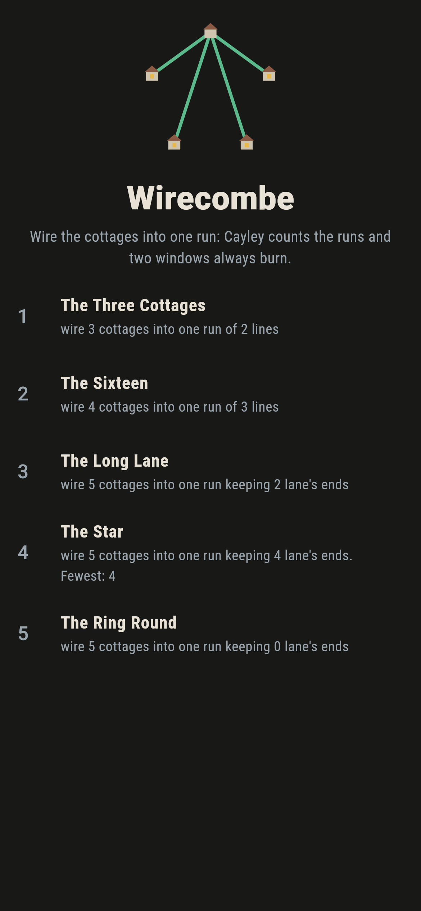
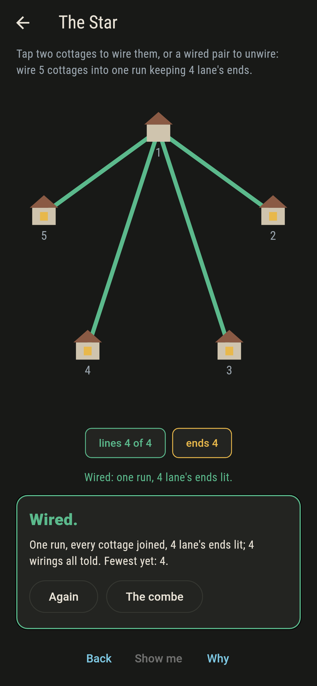
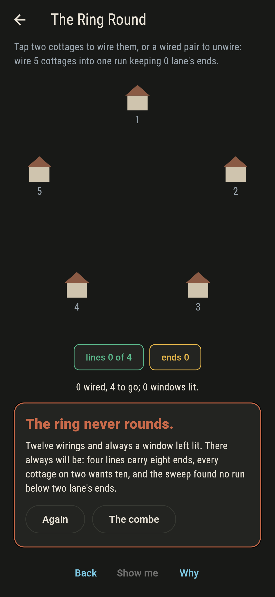
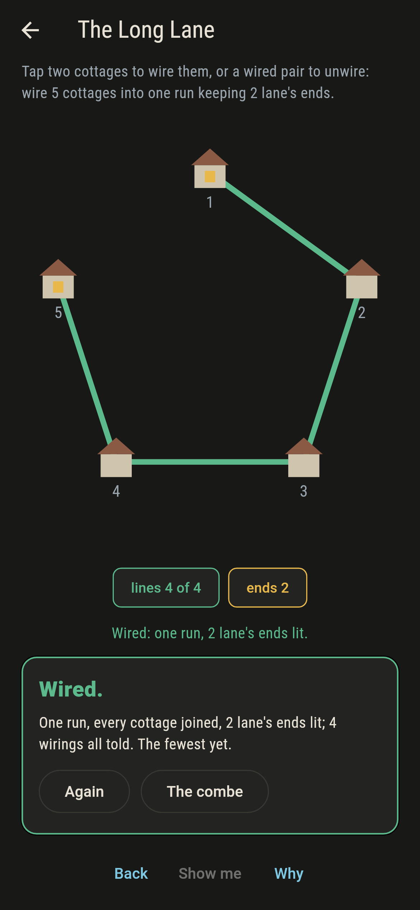
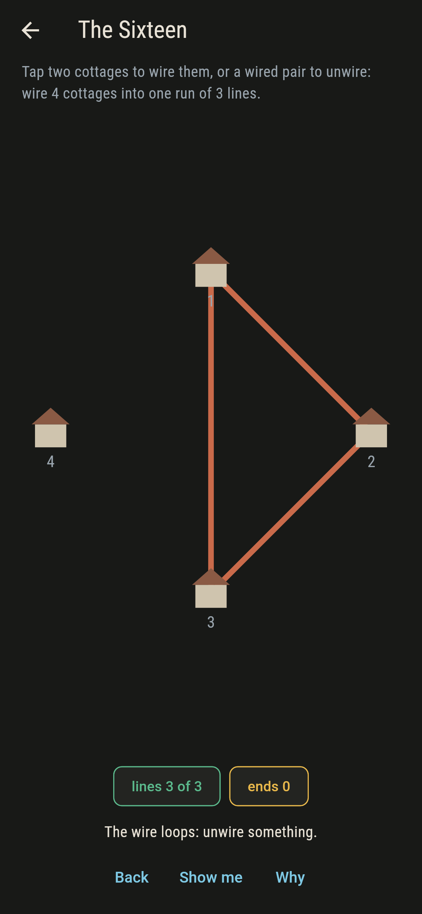
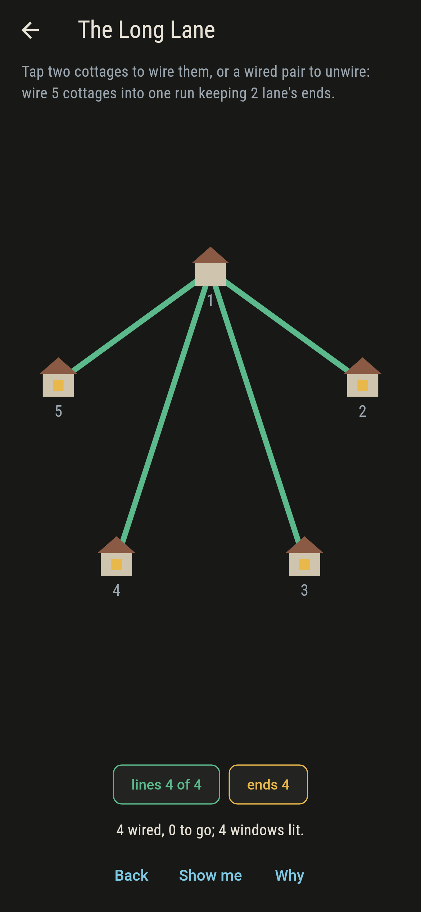
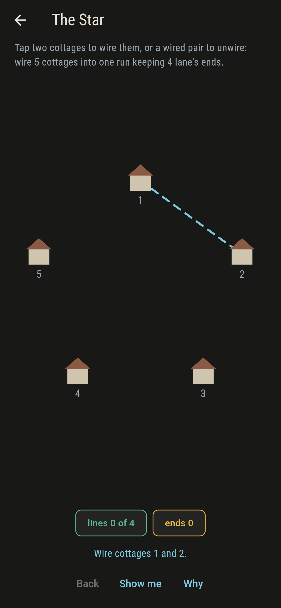
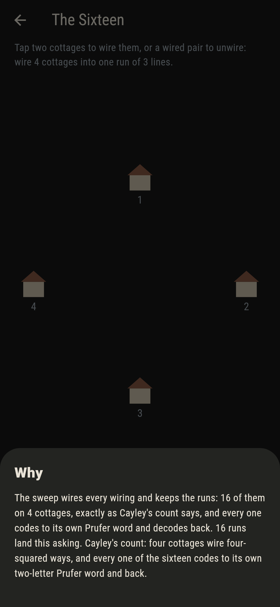

# Wirecombe


Cottages stand in a ring, and wire runs cottage to cottage. A run
joins every cottage into one piece with not a line to spare, and
a cottage left on a single line is a lane's end, its window lit.
Two old facts rule the combe: Cayley's count, that n cottages
wire n to the n minus two ways, and the lane's ends, that every
run keeps at least two of them lit, by arithmetic you can do on
your fingers.

## The combes

1. **The Three Cottages** - wire 3 cottages into one run of 2 lines
2. **The Sixteen** - wire 4 cottages into one run of 3 lines
3. **The Long Lane** - wire 5 cottages into one run keeping 2 lane's ends
4. **The Star** - wire 5 cottages into one run keeping 4 lane's ends
5. **The Ring Round** - wire 5 cottages into one run keeping 0 lane's ends

Five cottages wire 125 ways, and the lane's ends split them 60
lanes, 60 in between, and 5 stars, nothing below two. The Ring
Round asks for a run with no lane's end at all: four lines carry
eight line-ends, every cottage on two lines would want ten, and
the sweep found nothing because there was nothing to find.

## Three voices

The game never asserts what it has not computed, and it computes
everything at least twice:

* **The sweep** wires every wiring and keeps the runs: 3, 16 and
  125, exactly Cayley's n to the n minus two.
* **The Prufer code** writes every run down as a word and reads
  every word back to its run: the round trip holds on all 144
  runs shipped, which is the bijection behind Cayley's count.
* **The standing arithmetic** shares out the line-ends and finds
  the Ring Round two short before a single wiring is tried.

`tool/check_combes.dart` runs the lot and refuses the bake on
any disagreement.

## The checker's ledger

What `dart run tool/check_combes.dart` printed for the build this
README shipped with, word for word:

```
every wiring of every combe swept: the runs number 3, 16 and 125 exactly as Cayley says, every run codes to its Prufer word and back, every run keeps two lane's ends at least, and the ends of five split 60, 60 and 5 with nothing below two

 1 The Three Cottages   wire 3 cottages into one run of 2 lines: 3 runs of the sweep land it
 2 The Sixteen          wire 4 cottages into one run of 3 lines: 16 runs of the sweep land it
 3 The Long Lane        wire 5 cottages into one run keeping 2 lane's ends: 60 runs of the sweep land it
 4 The Star             wire 5 cottages into one run keeping 4 lane's ends: 5 runs of the sweep land it
 5 The Ring Round       wire 5 cottages into one run keeping 0 lane's ends: none, two line-ends short before a wiring is tried
```

## Screenshots

| The combeland | The star wired | The ring round admitted |
| --- | --- | --- |
|  |  |  |

| The long lane | A loop called out | The wrong shape | Show me | The why |
| --- | --- | --- | --- | --- |
|  |  |  |  |  |

Screenshots are drawn by `test/showcase_test.dart` at real phone
sizes with the app's own painter, then copied into `docs/` as
they came out; every wire in them was tapped, so nothing pictured
is a combe the game could not reach. The logo and every launcher
icon come out of `test/mark_test.dart` the same way: the mark is
the star wired.

## Building

```
flutter test          # 49 tests, the sweep among them
dart run tool/check_combes.dart
flutter build apk     # or: flutter build ios
```
