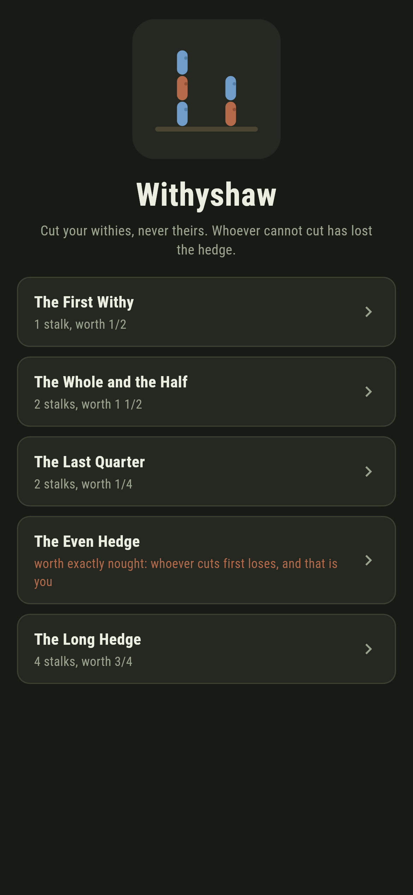
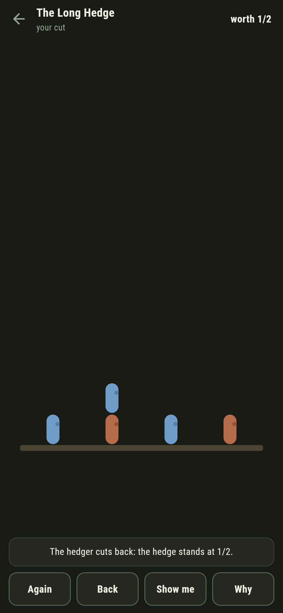
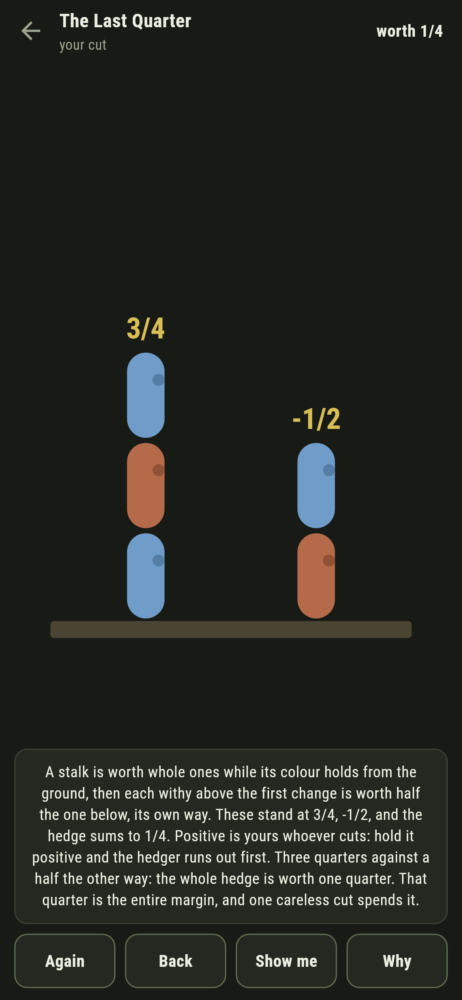
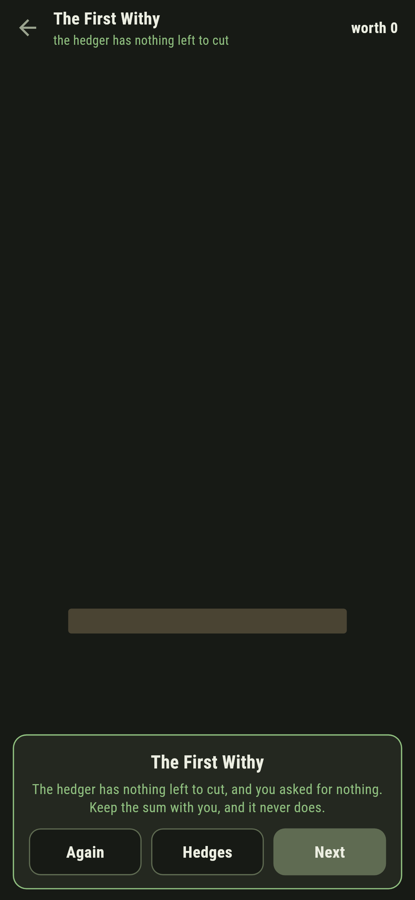
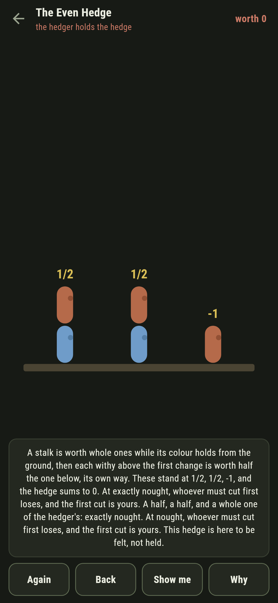
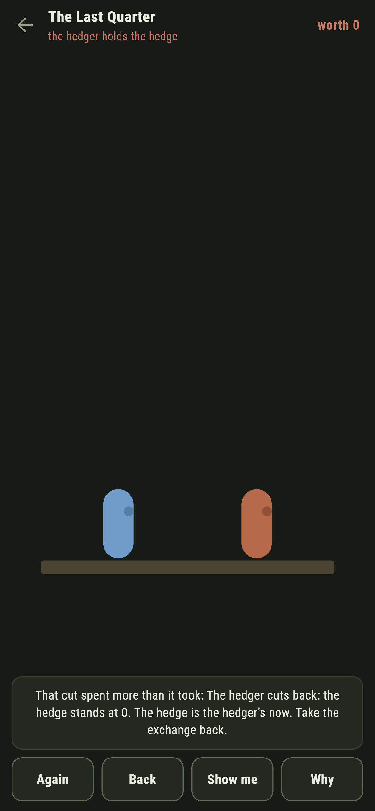

# Withyshaw

A hedge-cutting duel for phones, in Flutter, for Android and iOS.

Stalks of withies spring from the ground, yours blue, the hedger's rust.
You may cut only your own; a cut fells everything above it, whoever it
belongs to; the hedger cuts back; and whoever cannot cut has lost the
hedge. Underneath the pruning is the strangest scoring on the shelf:
every stalk is worth an exact fraction, and the fractions decide
everything before the first cut.

| | | | |
|---|---|---|---|
|  |  |  |  |

## Every stalk is worth a fraction

Count from the ground: whole ones while the colour holds, and from the
first change of colour each withy is worth half the one below, signed
its own way. Blue alone is one; blue under red is a half; blue, red,
blue is three quarters. The hedge is worth the sum of its stalks, and
the theorem is the whole game: positive is yours whoever cuts, negative
is the hedger's, and at exactly nought whoever must cut first loses.

This is Blue-Red Hackenbush, the game Conway grew the surreal numbers
out of, and none of it is taken on trust here. The search, which knows
only cuts, is laid over the worth, which knows only arithmetic, on
every two-stalk hedge of up to four withies and a sweep of three-stalk
hedges besides:

```
$ make hedges
the worth and the search agree on all 465 two-stalk hedges of up to four withies

 1 The First Withy        worth    1/2  yours to hold
 2 The Whole and the Half worth  1 1/2  yours to hold
 3 The Last Quarter       worth    1/4  yours to hold
 4 The Even Hedge         worth      0  the hedger's
 5 The Long Hedge         worth    3/4  yours to hold
```

**Why** writes the worths in gold over the stalks in front of you and
reads the sum aloud.

## The Even Hedge

A half, a half, and a whole one of the hedger's: exactly nought. At
nought the position is perfectly balanced, whoever must move loses, and
the first cut is yours. It ships labelled, in the house tradition of
maps nobody can win, and a test cuts every one of your withies in turn
to check that each of them loses it.



## The margin is the fraction

The Last Quarter is worth exactly one quarter, and that quarter is the
whole of your lead. Cut your withy on the hedger's stalk and you fell
one of yours to no purpose: the worth drops through nought and the game
says so as it lands, in the fraction's own terms.



## Building

```
make deps    # fetch packages
make check   # analyze + every test
make hedges  # the worth against the search, then the ledger
make shots   # render the screenshots and redraw the icons
make apk     # Android release build
make ios     # iOS release build (unsigned)
```

The logo and every app icon are drawn by the game's own painter in
`test/mark_test.dart`. There is no image in this repository that was not
produced by code in it.

## How it is put together

```
lib/hedge/worth.dart     exact halves of halves, eased and said
lib/hedge/rules.dart     the worth of a stalk, and the game search
lib/hedge/hedge.dart     a hedge: its stalks and its verdict
lib/hedge/hedges.dart    the five hedges that ship
lib/hedge/play.dart      a duel: cuts, the hedger's answers
lib/ui/                  the painter, the screens, the mark
tool/check_hedges.dart   the ledger above
```

The tests hold the worth against the search on every small hedge two
ways round, pin the classic values and the famous nought, check every
first cut of the even hedge loses, follow the search to victory on
every winnable hedge, and hold the pictures against the real widget
tree. If any of that drifts, `make check` goes red before anything
leaves the machine.
