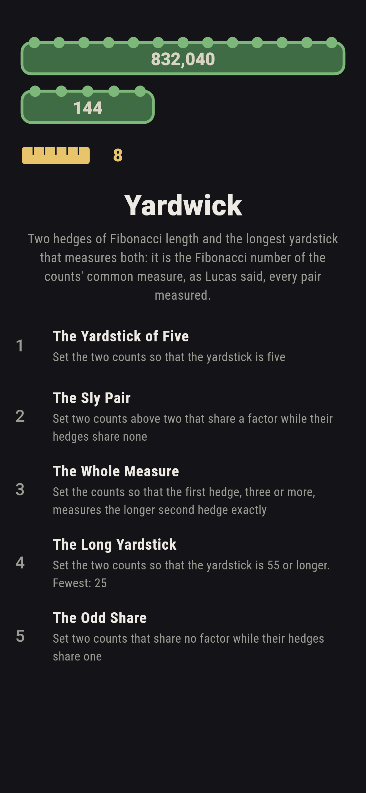
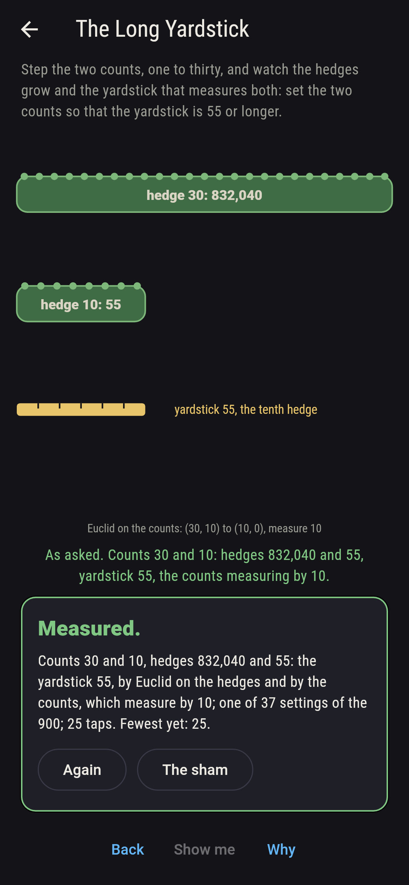
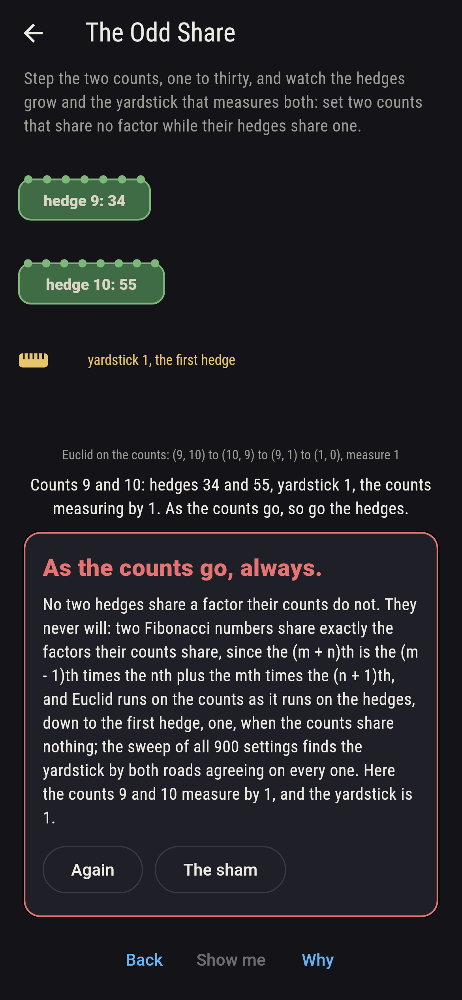
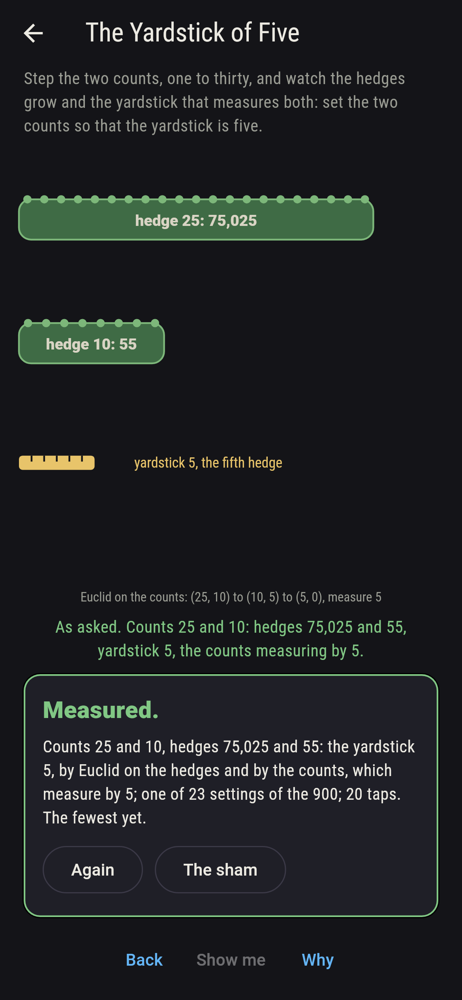
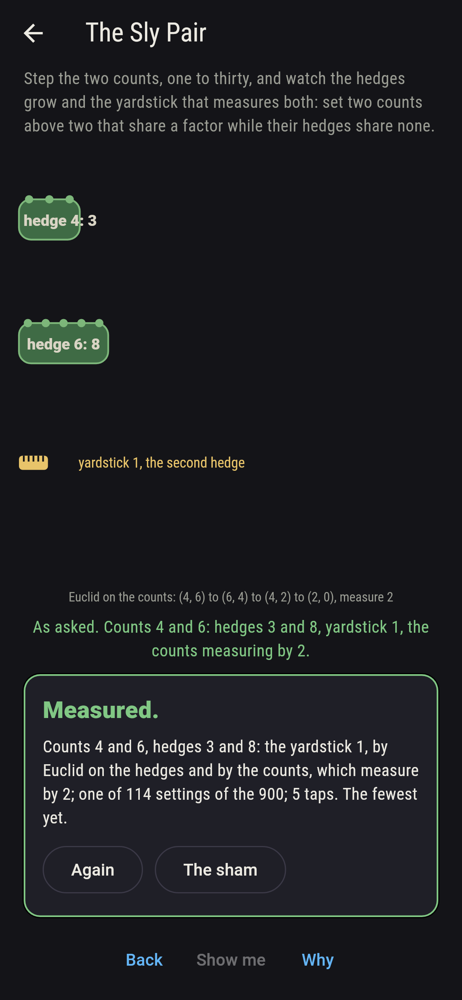
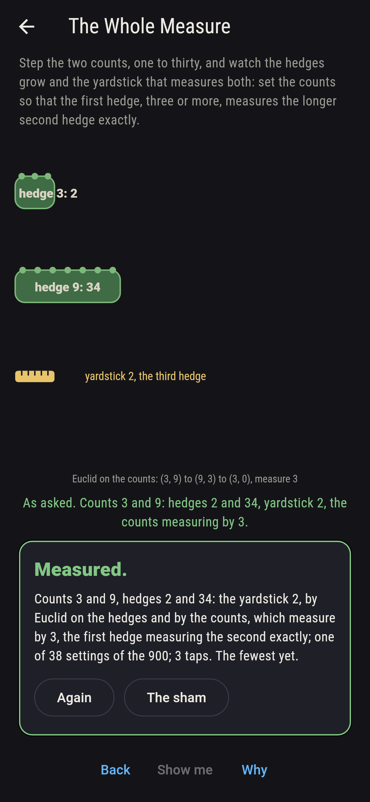
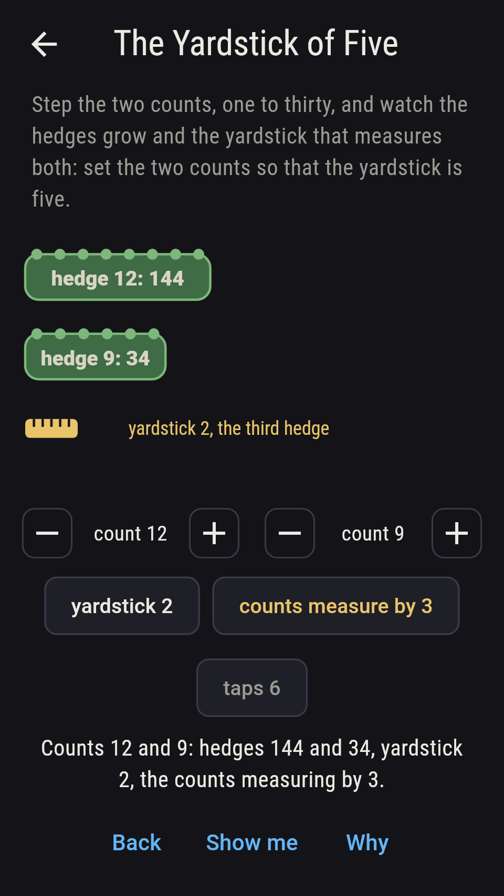
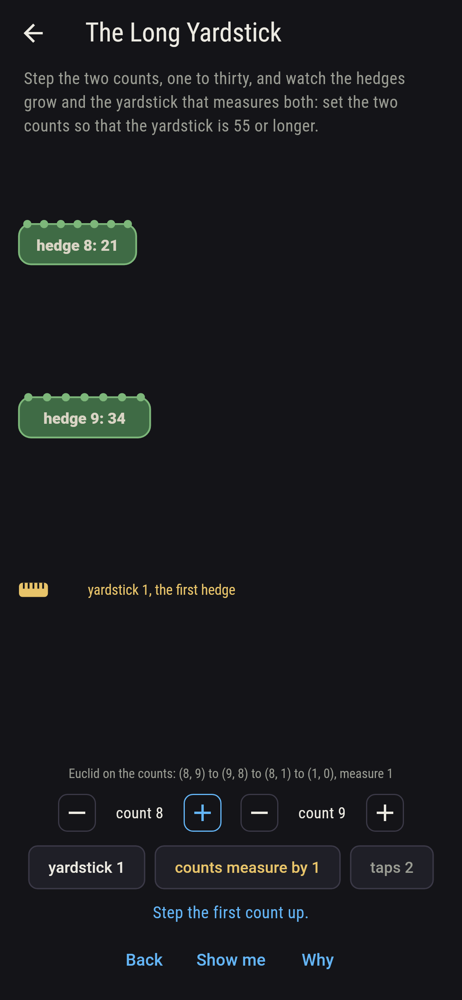
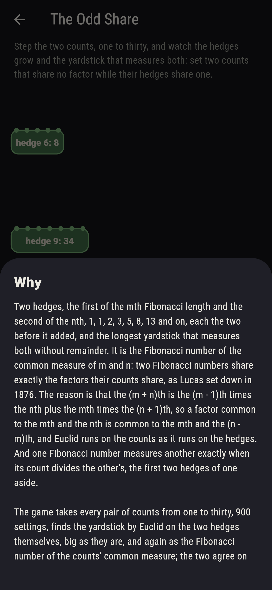

# Yardwick


Two hedges, the first of the mth Fibonacci length and the second of
the nth, 1, 1, 2, 3, 5, 8, 13 and on, each the two before it added,
and the longest yardstick that measures both without remainder. It
is the Fibonacci number of the common measure of m and n: two
Fibonacci numbers share exactly the factors their counts share, as
Lucas set down in 1876. The reason is that the (m + n)th is the
(m - 1)th times the nth plus the mth times the (n + 1)th, so a
factor common to the mth and the nth is common to the mth and the
(n - m)th, and Euclid runs on the counts as it runs on the hedges.
And one Fibonacci number measures another exactly when its count
divides the other's, the first two hedges of one aside. Step the two
counts on their dials and watch the hedges grow. The game takes
every pair of counts from one to thirty, 900 settings, finds the
yardstick by Euclid on the two hedges themselves, big as they are,
and again as the Fibonacci number of the counts' common measure; the
two agree on all 900, and one hedge measures the other exactly when
the counts say so, on all 900 too.

## The asks

1. **The Yardstick of Five** - set the two counts so that the yardstick is five
2. **The Sly Pair** - set two counts above two that share a factor while their hedges share none
3. **The Whole Measure** - set the counts so that the first hedge, three or more, measures the longer second hedge exactly
4. **The Long Yardstick** - set the two counts so that the yardstick is 55 or longer
5. **The Odd Share** - set two counts that share no factor while their hedges share one

The yardstick is five, the fifth Fibonacci number, exactly when the
two counts have five for their common measure: 23 settings of the
900; it is 8 on 19 settings and 55 on 7. The first two Fibonacci
numbers are both one, so two hedges are coprime whenever their
counts measure by one or by two: 698 settings have coprime hedges,
and 114 of them, the counts both above two, are sly, the counts
sharing a factor and the hedges none, 4 and 6 first, hedges 3 and 8.
One Fibonacci number measures another exactly when its count divides
the other's: 38 settings have the first count from three up, below
the second and dividing it, 3 and 6 first; and a hedge of prime
count is prime on seven of the ten prime counts to thirty, the
nineteenth failing, 4,181 being 37 times 113, while the fourth hedge,
3, is prime with a count that is not. A yardstick of 55 or longer
wants the counts to measure by ten at least, 37 settings, and the
longest of all is 832,040 itself, both counts thirty. The Odd Share
is labeled hopeless on its tile: Euclid on the counts said so first,
and the sweep finds no setting whose hedges share a factor the counts
do not; the sham admits it after three coprime settings have shown a
yardstick of one, or after sixteen taps.

## Two voices

The game never asserts what it has not computed, and it computes
everything at least twice:

* **Euclid on the hedges** takes the two Fibonacci numbers, up to
  832,040, and runs the old remainder dance on them until it ends,
  and the last divisor is the yardstick; every yardstick on the sham
  is that dance's, and it tries the first hedge into the second for
  the measuring.
* **The counts** run no dance on the hedges: the common measure of m
  and n is found, and the Fibonacci number of that count is the
  yardstick, agreeing with the hedges on all 900 settings; the first
  hedge measures the second exactly when the first count divides the
  second, or is one or two, on all 900 as well; and the addition
  rule that carries the proof is checked on every pair of counts to
  fifteen.

`tool/check_measures.dart` runs the lot and refuses the bake on any
disagreement.

## The checker's ledger

What `dart run tool/check_measures.dart` printed for the build this
README shipped with, word for word:

```
every pair of counts from one to thirty taken, 900 settings, and the yardstick found on each by Euclid on the two hedges themselves and again as the Fibonacci number of the counts' common measure, the two agreeing on all 900, and the addition rule that carries the proof held on every pair of counts to fifteen: the hedges are coprime on 698 settings, exactly those whose counts measure by one or by two, 114 of them sly with both counts above two; the yardstick is five on 23 settings, eight on 19, fifty-five on 7 and fifty-five or longer on 37, 832,040 the longest, both counts thirty; the first hedge measures the second exactly on 126 settings, exactly those where the first count divides the second or is one or two, 38 with the first count three or more and below the second; the hedges of prime length stand at counts 3, 4, 5, 7, 11, 13, 17, 23 and 29, the nineteenth being 4,181, 37 times 113; and no setting has the hedges sharing a factor while the counts share none

 1 The Yardstick of Five set the two counts so that the yardstick is five: 23 of the 900 settings land it
 2 The Sly Pair          set two counts above two that share a factor while their hedges share none: 114 of the 900 settings land it
 3 The Whole Measure     set the counts so that the first hedge, three or more, measures the longer second hedge exactly: 38 of the 900 settings land it
 4 The Long Yardstick    set the two counts so that the yardstick is 55 or longer: 37 of the 900 settings land it
 5 The Odd Share         set two counts that share no factor while their hedges share one: none of the 900, and Euclid on the counts said so first
```

## Screenshots

| The sham | The long yardstick | The odd share admitted |
| --- | --- | --- |
|  |  |  |

| The yardstick of five | The sly pair | The whole measure | Midway, on the small phone | Show me | The why |
| --- | --- | --- | --- | --- | --- |
|  |  |  |  |  |  |

Screenshots are drawn by `test/showcase_test.dart` at real phone
sizes with the app's own painter, then copied into `docs/` as they
came out; every setting in them was reached by the dials, so nothing
pictured is a setting the game could not reach. The logo and every
launcher icon come out of `test/mark_test.dart` the same way: the
mark is the hedges of counts 30 and 12, 832,040 and 144 long, and
the yardstick of 8 that measures both.

## Building

```
flutter test          # 44 tests, the sweep among them
dart run tool/check_measures.dart
flutter build apk     # or: flutter build ios
```
