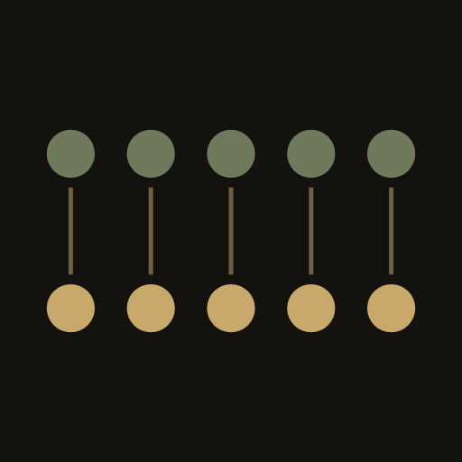
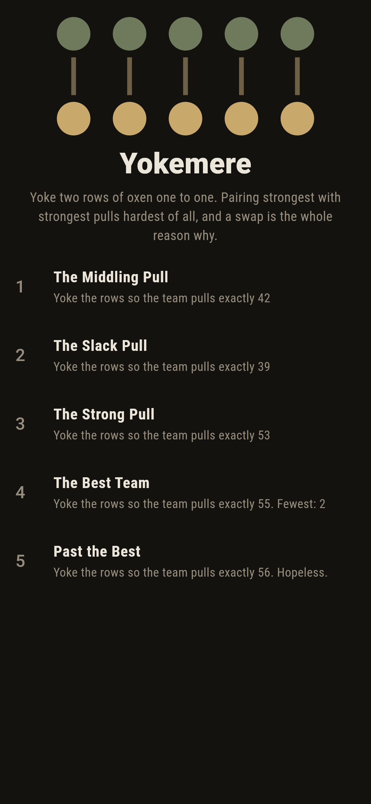
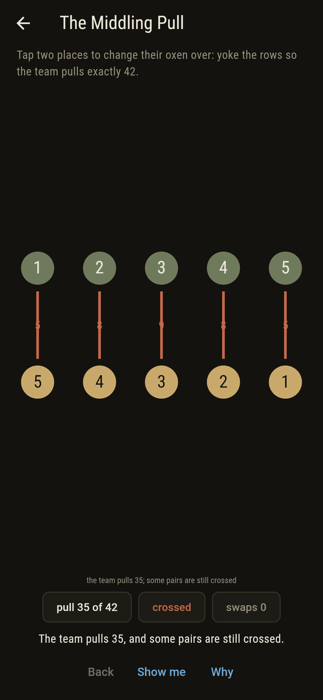
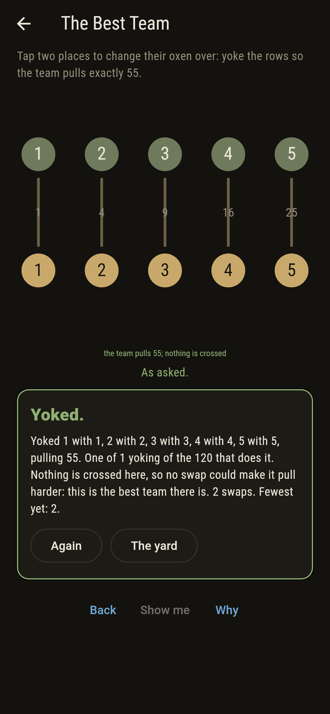
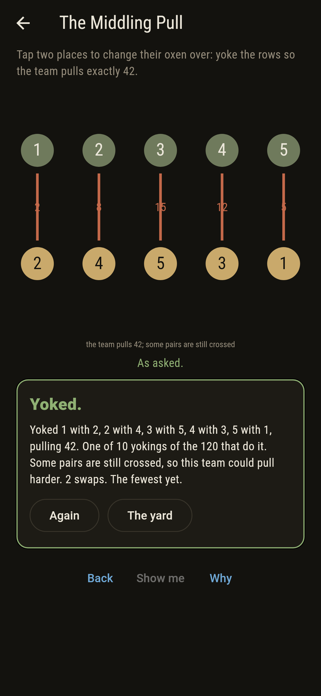
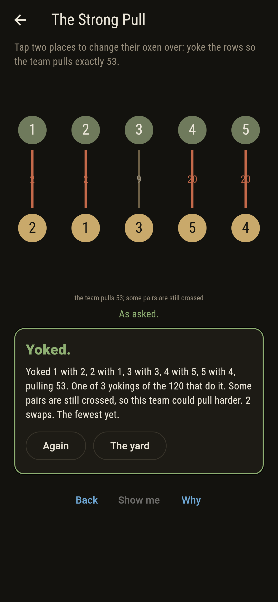
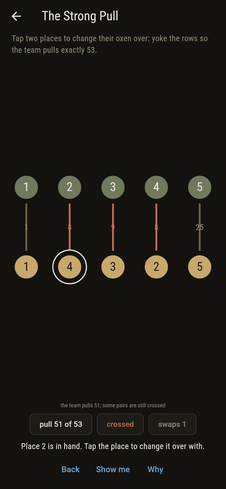
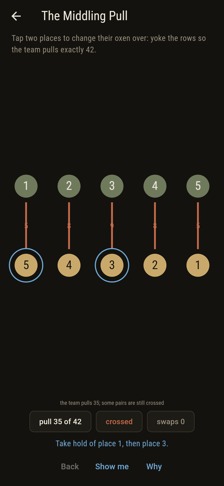
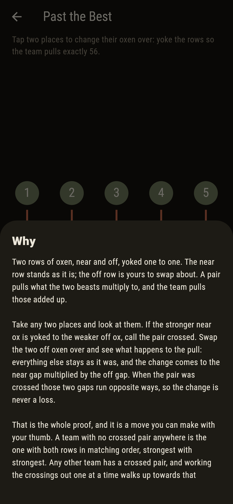
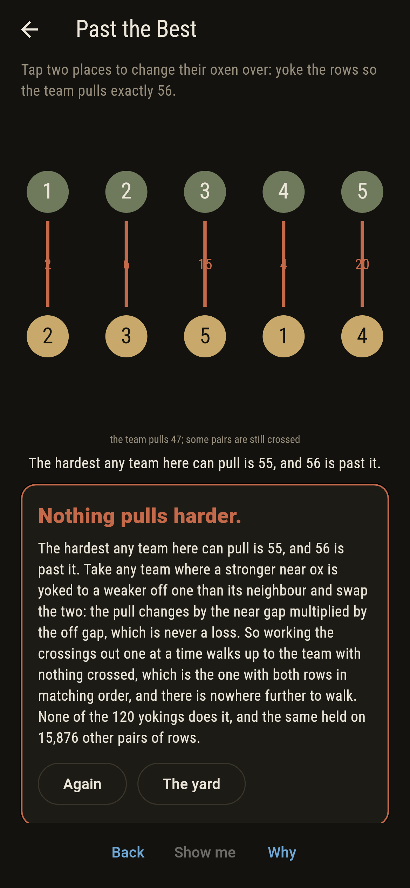

# Yokemere



Two rows of oxen, near and off, yoked one to one. The near row stands
as it is; the off row is yours to swap about. A pair pulls what the
two beasts multiply to, and the team pulls those added up. Take any
two places and look at them: if the stronger near ox is yoked to the
weaker off ox, the pair is crossed. Swap the two off oxen over and
everything else stays as it was, so the change in the pull comes to
the near gap multiplied by the off gap. When the pair was crossed
those two gaps run opposite ways, and the change is never a loss.
That is the whole proof and it is a move you can make with your
thumb. A team with nothing crossed anywhere is the one with both rows
in matching order, strongest with strongest, and working the
crossings out one at a time walks any team up to it and never walks
back. So matching order pulls hardest, and opposite order softest.

## The asks

1. **The Middling Pull** - yoke the rows so the team pulls exactly 42
2. **The Slack Pull** - yoke the rows so the team pulls exactly 39
3. **The Strong Pull** - yoke the rows so the team pulls exactly 53
4. **The Best Team** - yoke the rows so the team pulls exactly 55
5. **Past the Best** - yoke the rows so the team pulls exactly 56

The team starts turned back to front, which pulls 35, the softest
there is, so every ask is a matter of tightening. They land 10, 7, 3
and 1 of the 120 yokings, the nearest 2, 1, 2 and 2 swaps away. The
pulls run from 35 to 55 and the yokings crowd in the middle, which is
why 42 is the loosest ask and 53 already thin. The Best Team is the
single yoking with nothing crossed. Past the Best is labeled hopeless
on its tile, and the swap is the why: there is nowhere above 55 to
walk to.

## Two voices

The game never asserts what it has not computed, and it computes
everything at least twice:

* **The trying** takes all 120 yokings in turn, works each team's pull
  out pair by pair, and reads the hardest and softest off the lot.
  Every count on the tile and the card is its.
* **The sorting** yokes nobody. It sorts the two rows and multiplies
  them place by place, together for the hardest pull and opposite ways
  for the softest, and never has a team in its hand at all.

`tool/check_yokes.dart` runs the lot and refuses the bake on any
disagreement. It also holds the swap itself to account: on every pair
of every yoking, 1,200 of them, the change in the pull came to the
near gap multiplied by the off gap, never a loss when the pair was
crossed and never a gain when it was not. Exactly one yoking of the
120 has nothing crossed, it is the one that pulls 55, and working the
crossings out one at a time walks every one of the 120 up to it
without ever walking back. The same was asked of 15,876 other pairs
of rows, every five beasts of nine against every five of nine, which
is 1,905,120 yokings, and sorting together was hardest on every one.

Loadwick in this collection is Efron's dice, where A beats B beats C
beats D beats A and there is no best die at all. This is the opposite
case: here there is a best team, and the game is about why nothing
gets past it.

## The checker's ledger

What `dart run tool/check_yokes.dart` printed for the build this
README shipped with, word for word:

```
every yoking of the two rows tried, all 120 of them, each near ox against the off ox yoked to it and the products added: the pulls run from 35 to 55; a second voice yokes nobody and gets the same two ends by sorting the rows and multiplying place by place, together for the hardest and opposite ways for the softest, and it agrees; the swap that carries the proof was tried on every pair of every yoking, 1,200 of them: the change in the pull came to the near gap multiplied by the off gap every time, never a loss when the pair was crossed and never a gain when it was not; exactly one yoking of the 120 has no crossed pair anywhere and it is the one that pulls 55, and working the crossings out one at a time walks every one of the 120 up to it without ever walking back; the same was asked of 15,876 other pairs of rows, every five beasts of nine against every five of nine, 1,905,120 yokings in all, and sorting together was hardest on every one and sorting opposite softest on every one; the team starts turned back to front, which pulls 35, and the asks want 42, 39, 53, 55, 56

 1 The Middling Pull yoke the rows so the team pulls exactly 42: 10 of the 120 yokings do it, the nearest 2 swaps away
 2 The Slack Pull    yoke the rows so the team pulls exactly 39: 7 of the 120 yokings do it, the nearest 1 swap away
 3 The Strong Pull   yoke the rows so the team pulls exactly 53: 3 of the 120 yokings do it, the nearest 2 swaps away
 4 The Best Team     yoke the rows so the team pulls exactly 55: 1 of the 120 yokings do it, the nearest 2 swaps away
 5 Past the Best     yoke the rows so the team pulls exactly 56: none of the 120, and the crossings said so first
```

## Screenshots

| The yard | An ask as it opens | The best team |
| --- | --- | --- |
|  |  |  |

| The middling pull | The strong pull | A place in hand | Show me | The why | Nothing pulls harder |
| --- | --- | --- | --- | --- | --- |
|  |  |  |  |  |  |

Each yoke carries the pull of its own pair, and a crossed pair is
drawn in rust, so the thing to fix is the thing that is marked.

Screenshots are drawn by `test/showcase_test.dart` at real phone
sizes with the app's own painter, then copied into `docs/` as they
came out; every ox in them was changed over a tap at a time, so
nothing pictured is a team the game could not reach. The logo and
every launcher icon come out of `test/mark_test.dart` the same way:
the mark is the team in matching order, the one that pulls hardest.

## Building

```
flutter test          # 53 tests, both voices among them
dart run tool/check_yokes.dart
flutter build apk     # or: flutter build ios
```
